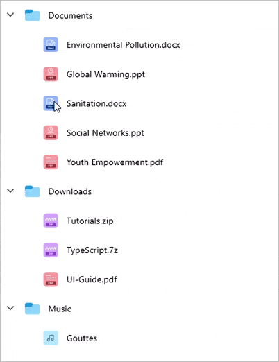
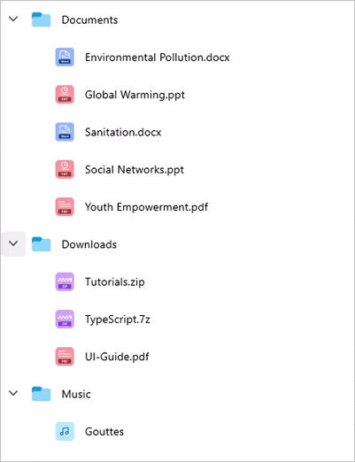
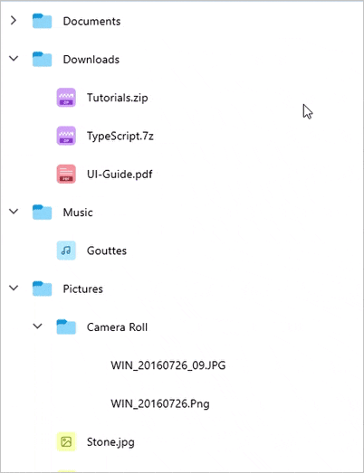

# Drag and Drop in .NET MAUI TreeView (SfTreeView)

The [SfTreeView](https://help.syncfusion.com/cr/maui/Syncfusion.Maui.TreeView.SfTreeView.html) allows items to be dragged and dropped within the TreeView control by setting the [AllowDragging](https://help.syncfusion.com/cr/maui/Syncfusion.Maui.TreeView.SfTreeView.html#Syncfusion_Maui_TreeView_SfTreeView_AllowDragging) property to `true`.



<syncfusion:SfTreeView x:Name="treeView" 
                       ItemsSource="{Binding Folders}"
                       AllowDragging="True" />


using Syncfusion.Maui.TreeView;

public class MainPage : ContentPage
{
    SfTreeView treeView;
    public MainPage()
    {
        InitializeComponent();
        treeView = new SfTreeView();
        treeView.AllowDragging = true;
        treeView.SetBinding(SfTreeView.ItemsSourceProperty, new Binding("Folders"));
        this.Content = treeView;
    }
}



When dropping, dragged items can be placed above, below, or as a child of the target item, based on the drag indicator's position.

N> The drag-and-drop operation is not supported when Load on Demand is enabled.

## Dragging multiple items

`SfTreeView` allows dragging of multiple selected items. To enable multiple selection, set the [SfTreeView.SelectionMode](https://help.syncfusion.com/cr/maui/Syncfusion.Maui.TreeView.SfTreeView.html#Syncfusion_Maui_TreeView_SfTreeView_SelectionMode) to `Multiple` or `Extended`.



<syncfusion:SfTreeView x:Name="treeView" 
                       ItemsSource="{Binding Folders}"
                       SelectionMode="Multiple"
                       AllowDragging="True" />


using Syncfusion.Maui.TreeView;

public class MainPage : ContentPage
{
    SfTreeView treeView;
    public MainPage()
    {
        InitializeComponent();
        treeView = new SfTreeView();
        treeView.AllowDragging = true;
        treeView.SelectionMode = TreeViewSelectionMode.Multiple;
        treeView.SetBinding(SfTreeView.ItemsSourceProperty, new Binding("Folders"));
        this.Content = treeView;
    }
}



## Drag item customization

By defining the [DragItemTemplate](https://help.syncfusion.com/cr/maui/Syncfusion.Maui.TreeView.SfTreeView.html#Syncfusion_Maui_TreeView_SfTreeView_DragItemTemplate) property of the `SfTreeView`, you can display a custom user interface (UI) during drag-and-drop operations.



<ContentPage.BindingContext>
    <local:FileManagerViewModel x:Name="viewModel"/>
</ContentPage.BindingContext>
<syncfusion:SfTreeView x:Name="treeView" 
                       ItemsSource="{Binding Folders}"
                       AllowDragging="True" >
    <syncfusion:SfTreeView.DragItemTemplate>
        <DataTemplate>
            <Border x:Name="grid" Padding="8" StrokeThickness="1" Stroke="#6750A4">
                <Border.StrokeShape>
                    <RoundRectangle CornerRadius="8"/>
                </Border.StrokeShape>
                <Grid RowSpacing="0" ColumnSpacing="0">
                    <Grid.ColumnDefinitions>
                        <ColumnDefinition Width="Auto"/>
                        <ColumnDefinition Width="40"/>
                        <ColumnDefinition Width="*"/>
                    </Grid.ColumnDefinitions>
                    <Label Text="&#xe70E;"
                           TextColor="#B3261E"
                           VerticalOptions="Center"
                           HorizontalOptions="Center"
                           FontSize="20"
                           FontFamily="MauiMaterialAssets"
                           IsVisible="{Binding Source={x:Reference viewModel}, Path=BlockIconVisible}"/>
                    <Image Grid.Column="1" Source="{Binding ImageIcon}"
                           VerticalOptions="Center"
                           HorizontalOptions="Center"
                           HeightRequest="24"
                           WidthRequest="24"/>
                    <Label LineBreakMode="NoWrap" Grid.Column="2"
                           Margin="5,0,0,0"
                           Text="{Binding FolderName}"
                           CharacterSpacing="0.25"
                           FontSize="14"
                           VerticalTextAlignment="Center"/>
                </Grid>
            </Border>
        </DataTemplate>
    </syncfusion:SfTreeView.DragItemTemplate>
</syncfusion:SfTreeView>


using Syncfusion.Maui.TreeView;

public class MainPage : ContentPage
{
    SfTreeView treeView;
    public MainPage()
    {
        InitializeComponent();
        treeView = new SfTreeView();
        FileManagerViewModel viewModel = new FileManagerViewModel();
        treeView.AllowDragging = true;
        treeView.SetBinding(SfTreeView.ItemsSourceProperty, new Binding("Folders"));
        treeView.DragItemTemplate = new DataTemplate(() =>
        {
            var border = new Border
            {
                Padding = 8,
                StrokeThickness = 1,
                Stroke = Color.FromArgb("#6750A4"),
                Background = Colors.White,
                StrokeShape = new RoundRectangle { CornerRadius = 8 }
            };
            var grid = new Grid
            {
                RowSpacing = 0,
                ColumnSpacing = 0
            };
            grid.ColumnDefinitions.Add(new ColumnDefinition { Width = GridLength.Auto });
            grid.ColumnDefinitions.Add(new ColumnDefinition { Width = new GridLength(40) });
            grid.ColumnDefinitions.Add(new ColumnDefinition { Width = GridLength.Star });
            var iconLabel = new Label
            {
                Text = "\uE70E",
                TextColor = Color.FromArgb("#B3261E"),
                VerticalOptions = LayoutOptions.Center,
                HorizontalOptions = LayoutOptions.Center,
                FontSize = 20,
                FontFamily = "MauiMaterialAssets",
                IsVisible = viewModel.BlockIconVisible
            };
            var image = new Image
            {
                VerticalOptions = LayoutOptions.Center,
                HorizontalOptions = LayoutOptions.Center,
                HeightRequest = 24,
                WidthRequest = 24
            };
            image.SetBinding(Image.SourceProperty, "ImageIcon");
            Grid.SetColumn(image, 1);
            var nameLabel = new Label
            {
                Margin = new Thickness(5, 0, 0, 0),
                LineBreakMode = LineBreakMode.NoWrap,
                CharacterSpacing = 0.25,
                FontSize = 14,
                VerticalTextAlignment = TextAlignment.Center
            };
            nameLabel.SetBinding(Label.TextProperty, "FolderName");
            Grid.SetColumn(nameLabel, 2);
            grid.Children.Add(iconLabel);
            grid.Children.Add(image);
            grid.Children.Add(nameLabel);
            border.Content = grid;
            return border;
        });
        this.Content = treeView;
    }
}



N> View sample in [GitHub](https://github.com/SyncfusionExamples/how-to-customize-the-drag-item-view).

## ItemDragging event

The [ItemDragging](https://help.syncfusion.com/cr/maui/Syncfusion.Maui.TreeView.SfTreeView.html#Syncfusion_Maui_TreeView_SfTreeView_ItemDragging) event is raised while an item is being dragged or dropped in the `SfTreeView`. The [ItemDraggingEventArgs](https://help.syncfusion.com/cr/maui/Syncfusion.Maui.TreeView.ItemDraggingEventArgs.html) has the following members which provide the information for the ItemDragging event:

* [Action](https://help.syncfusion.com/cr/maui/Syncfusion.Maui.TreeView.ItemDraggingEventArgs.html#Syncfusion_Maui_TreeView_ItemDraggingEventArgs_Action): Returns the drag `Action` such as start, dragging, dropping, and drop.
* [Handled](https://help.syncfusion.com/cr/maui/Syncfusion.Maui.TreeView.ItemDraggingEventArgs.html#Syncfusion_Maui_TreeView_ItemDraggingEventArgs_Handled): Set to true to handle the dragging operation. Applicable only when Action is `Dragging`.
* [DraggingNodes](https://help.syncfusion.com/cr/maui/Syncfusion.Maui.TreeView.ItemDraggingEventArgs.html#Syncfusion_Maui_TreeView_ItemDraggingEventArgs_DraggingNodes): Returns the list of nodes being dragged.
* [DropPosition](https://help.syncfusion.com/cr/maui/Syncfusion.Maui.TreeView.ItemDraggingEventArgs.html#Syncfusion_Maui_TreeView_ItemDraggingEventArgs_DropPosition): Returns the position where dragged nodes are going to be dropped.
* [Position](https://help.syncfusion.com/cr/maui/Syncfusion.Maui.TreeView.ItemDraggingEventArgs.html#Syncfusion_Maui_TreeView_ItemDraggingEventArgs_Position): Returns the touch position of the dragged item in screen coordinates.
* `Cancel`: Set to true to cancel the drag-and-drop operation.

## Auto scroll options

Auto-scrolling automatically scrolls the view when dragging an item near the edges.

### Auto scroll margin

To adjust the auto-scroll margin in `SfTreeView`, set the [ScrollMargin](https://help.syncfusion.com/cr/maui/Syncfusion.Maui.TreeView.AutoScroller.html#Syncfusion_Maui_TreeView_AutoScroller_ScrollMargin) property of the [AutoScroller](https://help.syncfusion.com/cr/maui/Syncfusion.Maui.TreeView.AutoScroller.html). The default value is `15`. Auto-scrolling triggers when the drag item is within the `ScrollMargin` from the view's bounds.

N> To disable auto-scrolling, set the `ScrollMargin` to `0`.



using Syncfusion.Maui.TreeView;

public class MainPage : ContentPage
{
    SfTreeView treeView;
    public MainPage()
    {
        InitializeComponent();
        treeView = new SfTreeView();
        treeView.AllowDragging = true;
        treeView.AutoScroller.ScrollMargin = 20;
        this.Content = treeView;
    }
}



### Auto scroll interval

Adjust the auto-scroll interval during dragging by setting the [Interval](https://help.syncfusion.com/cr/maui/Syncfusion.Maui.TreeView.AutoScroller.html#Syncfusion_Maui_TreeView_AutoScroller_Interval) property of the [AutoScroller](https://help.syncfusion.com/cr/maui/Syncfusion.Maui.TreeView.AutoScroller.html). The default interval is `150 milliseconds`.



using Syncfusion.Maui.TreeView;

public class MainPage : ContentPage
{
    SfTreeView treeView;
    public MainPage()
    {
        InitializeComponent();
        treeView = new SfTreeView();
        treeView.AllowDragging = true;
        treeView.AutoScroller.Interval = new TimeSpan(0, 0, 0, 0, 200);
        this.Content = treeView;
    }
}



### Disable outside scroll

To prevent auto-scrolling when the dragged item is moved outside the `SfTreeView` during a drag, set the [AllowOutsideScroll](https://help.syncfusion.com/cr/maui/Syncfusion.Maui.TreeView.AutoScroller.html#Syncfusion_Maui_TreeView_AutoScroller_AllowOutsideScroll) property of the [AutoScroller](https://help.syncfusion.com/cr/maui/Syncfusion.Maui.TreeView.AutoScroller.html) to `false`. The default value is `true`.



using Syncfusion.Maui.TreeView;

public class MainPage : ContentPage
{
    SfTreeView treeView;
    public MainPage()
    {
        InitializeComponent();
        treeView = new SfTreeView();
        treeView.AllowDragging = true;
        treeView.AutoScroller.AllowOutsideScroll = false;
        this.Content = treeView;
    }
}



## Auto expand

### Enable auto expand

To enable auto-expanding of nodes when dragging items over them, set the [CanAutoExpand](https://help.syncfusion.com/cr/maui/Syncfusion.Maui.TreeView.DragAndDropController.html#Syncfusion_Maui_TreeView_DragAndDropController_CanAutoExpand) property to `true`. The default value is `false`.



<syncfusion:SfTreeView x:Name="treeView" 
                       ItemsSource="{Binding Folders}"
                       AllowDragging="True">
    <syncfusion:SfTreeView.DragAndDropController>
        <treeviewengine:DragAndDropController CanAutoExpand="True"/>
    </syncfusion:SfTreeView.DragAndDropController>
</syncfusion:SfTreeView>


using Syncfusion.Maui.TreeView;

public class MainPage : ContentPage
{
    SfTreeView treeView;
    public MainPage()
    {
        InitializeComponent();
        treeView = new SfTreeView();
        treeView.AllowDragging = true;
        treeView.SetBinding(SfTreeView.ItemsSourceProperty, new Binding("Folders"));
        treeView.DragAndDropController.CanAutoExpand = true;
        this.Content = treeView;
    }
}



### Auto expand delay

To set the delay for auto-expanding nodes, use the [AutoExpandDelay](https://help.syncfusion.com/cr/maui/Syncfusion.Maui.TreeView.DragAndDropController.html#Syncfusion_Maui_TreeView_DragAndDropController_AutoExpandDelay) property. The default value is `3 seconds`.



<syncfusion:SfTreeView x:Name="treeView" 
                       ItemsSource="{Binding Folders}"
                       AllowDragging="True">
    <syncfusion:SfTreeView.DragAndDropController>
        <treeviewengine:DragAndDropController CanAutoExpand="True" 
                                              AutoExpandDelay="0:0:1"/>
    </syncfusion:SfTreeView.DragAndDropController>
</syncfusion:SfTreeView>


using Syncfusion.Maui.TreeView;

public class MainPage : ContentPage
{
    SfTreeView treeView;
    public MainPage()
    {
        InitializeComponent();
        treeView = new SfTreeView();
        treeView.AllowDragging = true;
        treeView.SetBinding(SfTreeView.ItemsSourceProperty, new Binding("Folders"));
        treeView.DragAndDropController.CanAutoExpand = true;
        treeView.DragAndDropController.AutoExpandDelay = new TimeSpan(0, 0, 1);
        this.Content = treeView;
    }
}



## Disable dragging for particular item

To disable dragging for a particular item, handle the `ItemDragging` event based on the conditions of the `Action` event argument.

You can cancel the dragging action for a particular item by setting the `Cancel` property of the `ItemDraggingEventArgs`.



using Syncfusion.Maui.TreeView;

public class MainPage : ContentPage
{
    SfTreeView treeView;
    public MainPage()
    {
        InitializeComponent();
        treeView = new SfTreeView();
        FileManagerViewModel viewModel = new FileManagerViewModel();
        treeView.AllowDragging = true;
        treeView.SetBinding(SfTreeView.ItemsSourceProperty, new Binding("Folders"));
        treeView.ItemDragging += TreeView_ItemDragging;
        this.Content = treeView;
    }

    private void TreeView_ItemDragging(object sender, ItemDraggingEventArgs e)
    {
        if (e.Action == DragAction.Start)
        {
            var item = e.DraggingNodes[0].Content as File;
            if (item.FolderName == "Sanitation.docx")
            {
                e.Cancel = true;
            }
        }
    }
}



## Cancel dropping for the dragged item

To cancel dropping for the dragged item, handle the `ItemDragging` event based on the conditions of the `Action` event argument.

You can cancel the dropping action for an item by setting the `Cancel` property of the `ItemDraggingEventArgs`.



using Syncfusion.Maui.TreeView;

public class MainPage : ContentPage
{
    SfTreeView treeView;
    public MainPage()
    {
        InitializeComponent();
        treeView = new SfTreeView();
        FileManagerViewModel viewModel = new FileManagerViewModel();
        treeView.AllowDragging = true;
        treeView.SetBinding(SfTreeView.ItemsSourceProperty, new Binding("Folders"));
        treeView.ItemDragging += TreeView_ItemDragging;
        this.Content = treeView;
    }

    private void TreeView_ItemDragging(object sender, ItemDraggingEventArgs e)
    {
        if (e.Action == DragAction.Dropping)
        {
            var item = e.TargetNode.Content as Folder;
            if (item != null && item.FolderName == "Documents")
            {
                e.Cancel = true;
            }
        }
    }
}



## Limitations

Drag-and-drop operations are not executed in the following scenarios. When this occurs, the default drag item view displays an "Invalid drop" indicator to inform users that the action is not permitted.

* `Drop as child into same node`: An indicator appears if you attempt to drop an item as a child of the same node.

* `Incompatible child node type`: An indicator appears if you attempt to drop an item as a child where the target node's child and the dragged item's types are incompatible. It is applicable only when `SfTreeView` has [HierarchyPropertyDescriptor](https://help.syncfusion.com/cr/maui/Syncfusion.Maui.TreeView.SfTreeView.html#Syncfusion_Maui_TreeView_SfTreeView_HierarchyPropertyDescriptors).

* `Drop below or above with different type`: An indicator appears if you attempt to drop an item below or above another node where the parent node's existing child's type differs from the dragged item's type. It is applicable only when `SfTreeView` has `HierarchyPropertyDescriptor`.
