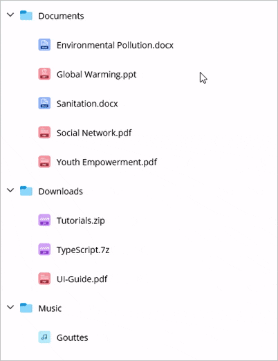

# Drag and drop in .NET MAUI TreeView (SfTreeView)
The [SfTreeView](https://help.syncfusion.com/cr/maui/Syncfusion.Maui.TreeView.SfTreeView.html) allows drag and drop the items within the treeview control by setting the `AllowDragging` property as `true`. 



<ContentPage xmlns:treeView="clr-namespace:Syncfusion.Maui.TreeView;assembly=Syncfusion.Maui.TreeView">
  <syncfusion:SfTreeView x:Name="treeView" 
                         ItemsSource="{Binding Folders}"
                         AllowDragging="True" />
</ContentPage>


var treeView = new SfTreeView();
treeView.AllowDragging = true;
treeView.SetBinding(SfTreeView.ItemsSourceProperty, new Binding("Folders"));



While dropping, the dragged items can be added above, below, or as a child of the target item, depending on the position of the drag indicator.

N> The drag and drop operation is not supported when Load on Demand is enabled.

## Dragging multiple items

`SfTreeView` allows to drag multiple selected items. To enable multiple selection, set the [SfTreeView.SelectionMode](https://help.syncfusion.com/cr/maui/Syncfusion.Maui.TreeView.SfTreeView.html#Syncfusion_Maui_TreeView_SfTreeView_SelectionMode) as `Multiple` or `Extended`.

## Drag item customization
By defining the `SfTreeView.DragItemTemplate` property of the `SfTreeView`, a custom user interface (UI) is displayed during drag-and-drop operations.



<ContentPage xmlns:treeView="clr-namespace:Syncfusion.Maui.TreeView;assembly=Syncfusion.Maui.TreeView">
  <syncfusion:SfTreeView x:Name="treeView" 
                         ItemsSource="{Binding Folders}"
                         AllowDragging="True" >
        <treeView:SfTreeView.DragItemTemplate>
            <DataTemplate>
                <Border x:Name="grid" Padding="8" StrokeThickness="1"  Stroke="#6750A4">
                    <Border.StrokeShape>
                        <RoundRectangle CornerRadius="8"/>
                    </Border.StrokeShape>
                    <Grid RowSpacing="0" Grid.Row="0">
                        <Grid.ColumnDefinitions>
                            <ColumnDefinition Width="Auto"/>
                            <ColumnDefinition Width="40" />
                            <ColumnDefinition Width="*" />
                        </Grid.ColumnDefinitions>
                        <Label Text="&#xe70E;" 
                            TextColor="#B3261E"
                            VerticalOptions="Center" 
                            HorizontalOptions="Center"
                            FontSize="20"
                            FontFamily="MauiMaterialAssets" 
                            IsVisible="{Binding Source={x:Reference viewModel}, Path=BlockIconVisible}"/>
                        <Image Grid.Column="1" Source="{Binding ImageIcon}"
                            VerticalOptions="Center"
                            HorizontalOptions="Center"
                            HeightRequest="24" 
                            WidthRequest="24"/>
                        <Label LineBreakMode="NoWrap" Grid.Column="2"
                            Margin="5,0,0,0"
                            Text="{Binding FolderName}"
                            CharacterSpacing="0.25" 
                            FontSize="14"
                            VerticalTextAlignment="Center" />
                    </Grid>
                </Border>
            </DataTemplate>
        </treeView:SfTreeView.DragItemTemplate>
    </treeView:SfTreeView>
</ContentPage>


var treeView = new SfTreeView();
treeView.AllowDragging = true;
treeView.SetBinding(SfTreeView.ItemsSourceProperty, new Binding("Folders"));
treeView.DragItemTemplate = new DataTemplate(() =>
{
    var border = new Border
    {
        Padding = 8,
        StrokeThickness = 1,
        Stroke = Color.FromArgb("#6750A4"),
        Background = Colors.White,
        StrokeShape = new RoundRectangle { CornerRadius = 8 }
    };
    var grid = new Grid
    {
        RowSpacing = 0
    };
    grid.ColumnDefinitions.Add(new ColumnDefinition { Width = GridLength.Auto });
    grid.ColumnDefinitions.Add(new ColumnDefinition { Width = new GridLength(40) });
    grid.ColumnDefinitions.Add(new ColumnDefinition { Width = GridLength.Star });
    var iconLabel = new Label
    {
        Text = "\uE70E",
        TextColor = Color.FromArgb("#B3261E"),
        VerticalOptions = LayoutOptions.Center,
        HorizontalOptions = LayoutOptions.Center,
        FontSize = 20,
        FontFamily = "MauiMaterialAssets"
    };
    iconLabel.SetBinding(Label.IsVisibleProperty, new Binding("BlockIconVisible", source: new RelativeBindingSource(RelativeBindingSourceMode.FindAncestorBindingContext, typeof(YourViewModelType), null)));
    var image = new Image
    {
        VerticalOptions = LayoutOptions.Center,
        HorizontalOptions = LayoutOptions.Center,
        HeightRequest = 24,
        WidthRequest = 24
    };
    image.SetBinding(Image.SourceProperty, "ImageIcon");
    Grid.SetColumn(image, 1);
    var nameLabel = new Label
    {
        Margin = new Thickness(5, 0, 0, 0),
        LineBreakMode = LineBreakMode.NoWrap,
        CharacterSpacing = 0.25,
        FontSize = 14,
        VerticalTextAlignment = TextAlignment.Center
    };
    nameLabel.SetBinding(Label.TextProperty, "FolderName");
    Grid.SetColumn(nameLabel, 2);
    grid.Children.Add(iconLabel);
    grid.Children.Add(image);
    grid.Children.Add(nameLabel);
    border.Content = grid;
    return border;
});



N> View sample in [GitHub](https://github.com/SyncfusionExamples/how-to-customize-the-drag-item-view).

## Event

The `ItemDragging` event is raised while dragging and dropping the item in the `SfTreeView`. The `ItemDraggingEventArgs` has the following members which provide the information for the ItemDragging event:

* `Action`: Returns the drag `Action` such as start, dragging, dropping and drop.
* `Handled`: If this member is set to true, dragging can be handled. It is applicable only if Action is `Dragging`.
* `Cancel` : If this member is set to true, the drag and drop operation will be canceled.
* `DraggingNode`: Returns the `DraggingNodes`.
* `DropPosition`: Returns the position where dragged nodes are going to be dropped.
* `Position`: Returns the touch position of the drag item from the screen coordinates.

## Auto scroll options

Auto-scrolling during drag-and-drop operations in the `SfTreeView` enhances the user experience by automatically scrolling the view when dragging an item near the edges.

### Auto Scroll Margin

To adjust the auto-scroll margin in `SfTreeView`, set the `ScrollMargin` property of the `AutoScroller` to enable auto-scrolling while dragging. The default value is `15`. Auto-scrolling will be triggered when the drag item is within the `ScrollMargin` from the view's bounds.

N> To disable auto-scrolling, set the `ScrollMargin` to `0`.



var treeView = new SfTreeView();
treeView.AllowDragging = true;
treeView.AutoScroller.ScrollMargin = 20;



### Auto Scroll Interval

Adjust the auto-scroll interval during dragging by setting the `Interval` property of the `AutoScroller`. The default interval is `150 milliseconds`.



var treeView = new SfTreeView();
treeView.AllowDragging = true;
treeView.AutoScroller.Interval = new TimeSpan(0, 0, 0, 0, 200);



### Disable Outside Scroll

To prevent auto-scrolling when the dragged item is moved outside the `SfTreeView` during a drag, set the `AllowOutsideScroll` property of the `AutoScroller` to `false`. The default value is `true`.



var treeView = new SfTreeView();
treeView.AllowDragging = true;
treeView.AutoScroller.AllowOutsideScroll = false;



## Auto Expand

### Enable Auto Expand

To enable auto-expanding of nodes when dragging items over them, set the `CanAutoExpand` property to `true`. The default value is `false`.



<ContentPage xmlns:treeView="clr-namespace:Syncfusion.Maui.TreeView;assembly=Syncfusion.Maui.TreeView">
  <treeView:SfTreeView x:Name="treeView" 
                       ItemsSource="{Binding Folders}"
                       AllowDragging="True">
        <treeView:SfTreeView.DragAndDropController>
            <treeView:DragAndDropController CanAutoExpand="True"/>
        </treeView:SfTreeView.DragAndDropController>
   </treeView:SfTreeView>
</ContentPage>


var treeView = new SfTreeView();
treeView.AllowDragging = true;
treeView.SetBinding(SfTreeView.ItemsSourceProperty, new Binding("Folders"));
treeView.DragAndDropController.CanAutoExpand = true;



### Auto Expand Delay

To set the delay for auto-expanding nodes, use the `AutoExpandDelay` property. The default value is `3 seconds`.



<ContentPage xmlns:treeView="clr-namespace:Syncfusion.Maui.TreeView;assembly=Syncfusion.Maui.TreeView">
  <treeView:SfTreeView x:Name="treeView" 
                       ItemsSource="{Binding Folders}"
                       AllowDragging="True">
        <treeView:SfTreeView.DragAndDropController>
            <treeView:DragAndDropController CanAutoExpand="True" AutoExpandDelay="0:0:1"/>
        </treeView:SfTreeView.DragAndDropController>
   </treeView:SfTreeView>
</ContentPage>


var treeView = new SfTreeView();
treeView.AllowDragging = true;
treeView.SetBinding(SfTreeView.ItemsSourceProperty, new Binding("Folders"));
treeView.DragAndDropController.CanAutoExpand = true;
treeView.DragAndDropController.AutoExpandDelay = new TimeSpan(0, 0, 0, 1);



## Disable dragging for particular item

To disable dragging for a particular item, handle the `ItemDragging` event based on the conditions of the `Action` event argument.

You can cancel the dragging action for a particular item by setting the `Cancel` property of the `ItemDraggingEventArgs`.



private void TreeView_ItemDragging(object sender, ItemDraggingEventArgs e)
{
    if (e.Action == DragAction.Start)
    {
       var item = e.DraggingNodes[0].Content as File;
       if (item.FolderName == "Sanitation.docx")
       {
          e.Cancel = true;
       }
    }
}



## Cancel dropping for the dragged item

To cancel dropping for the dragged item, handle the `ItemDragging` event based on the conditions of the Action event argument.

You can cancel the dropping action for an item by setting the `Cancel` property of the `ItemDraggingEventArgs`.



private void TreeView_ItemDragging(object sender, ItemDraggingEventArgs e)
{
   if (e.Action == DragAction.Dropping)
   {
      var item = e.TargetNode.Content as Folder;
      if (item != null && item.FolderName == "Documents")
      {
        e.Cancel = true;
      }
   }
}



## Limitations

Drag and drop operations will not be executed in the following scenarios. When this occurs, the default drag item view will display an "Invalid drop" indicator to inform users that the action is not permitted.

* `Drop as child into same node`: An indicator appears if you attempt to drop an item as a child of the same node.

* `Incompatible child node type`: When trying to drop an item as a child where the target node's child and the dragged item's types are incompatible. It is only applicable when `SfTreeView` has `HierarchyPropertyDescriptor`.

* `Drop below or above with different type`: If attempting to drop an item below or above another node where the parent node's existing child's type is different from the dragged item's type. It is only applicable when `SfTreeView` has `HierarchyPropertyDescriptor`.