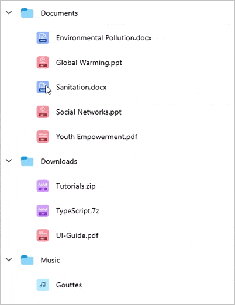
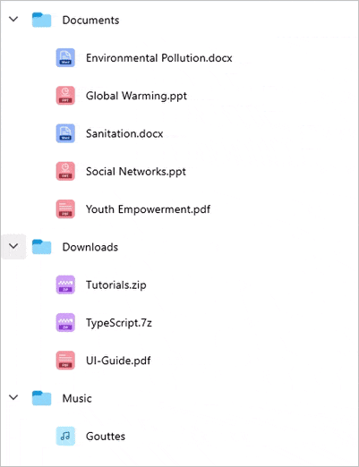

# Item Reordering in .NET MAUI TreeView (SfTreeView)
The [SfTreeView](https://help.syncfusion.com/cr/maui/Syncfusion.Maui.TreeView.SfTreeView.html) allows drag and drop the items within the treeview control by setting the [AllowDragging]() property as `true`. 



<ContentPage xmlns:treeView="clr-namespace:Syncfusion.Maui.TreeView;assembly=Syncfusion.Maui.TreeView">
  <syncfusion:SfTreeView x:Name="treeView" 
                         ItemsSource="{Binding Folders}"
                         AllowDragging="True" />
</ContentPage>


treeView.AllowDragging= "true" 



While dropping, the dragged items can be added above or below to the target item based on drag indicator position.

N> The drag and drop operation is not supported when Load on Demand is enabled.

### Invalid Drop Label

An "Invalid drop" label is shown when the following conditions are met:

`Drop As Child into Same Node`: The label appears if you attempt to drop an item as a child of the same node.

`Incompatible Child Node Type`: When trying to drop an item as a child where the target node's child and the dragged item's types are incompatible.

`Drop Below or Above with Different Type`: If attempting to drop an item below or above another node where the parent node's existing child's type is different from the dragged item's type.

## Dragging multiple items

`SfTreeView` allows to drag multiple selected items. To enable multiple selection, set the [SfTreeView.SelectionMode](https://help.syncfusion.com/cr/maui/Syncfusion.Maui.TreeView.SfTreeView.html#Syncfusion_Maui_TreeView_SfTreeView_SelectionMode) as `Multiple` or `Extended`.

## Drag item customization
By defining the [SfTreeView.DragItemTemplate]() property of the `SfTreeView`, you can display a custom user interface (UI) when performing drag and drop operations. The template can be defined either in code or XAML.



<ContentPage xmlns:treeView="clr-namespace:Syncfusion.Maui.TreeView;assembly=Syncfusion.Maui.TreeView">
  <syncfusion:SfTreeView x:Name="treeView" 
                         ItemsSource="{Binding Folders}"
                         AllowDragging="True" >
        <treeView:SfTreeView.DragItemTemplate>
            <DataTemplate>
                <Grid Background="LightGray" Padding="8">
                    <Grid.ColumnDefinitions>
                        <ColumnDefinition Width="Auto"/>
                        <ColumnDefinition Width="40" />
                        <ColumnDefinition Width="*" />
                    </Grid.ColumnDefinitions>
                    <Label Text="&#xe739;" 
                            TextColor="#90080B"
                            VerticalOptions="Center" 
                            HorizontalOptions="Center"
                            FontSize="20"
                            FontFamily="MauiMaterialAssets"                                     
                            IsVisible="{Binding Source={x:Reference viewModel}, Path=BlockIconVisible}"/>
                    <Image Grid.Column="1" Source="{Binding ImageIcon}"
                            VerticalOptions="Center"
                            HorizontalOptions="Center"
                            HeightRequest="24" 
                            WidthRequest="24"/>                    
                        <Label LineBreakMode="NoWrap" 
                            Grid.Column="2"
                            Margin="5,0,0,0"
                            Text="{Binding FolderName}"
                            CharacterSpacing="0.25" 
                            FontSize="14"
                            VerticalTextAlignment="Center"/>
                </Grid>
            </DataTemplate>
        </treeView:SfTreeView.DragItemTemplate>
    </treeView:SfTreeView>
</ContentPage>


treeView.DragItemTemplate = new DataTemplate(() =>
{
    var grid = new Grid
    {
        BackgroundColor = Colors.LightGray,
        Padding = 8,
        ColumnDefinitions =
        {
            new ColumnDefinition { Width = GridLength.Auto },
            new ColumnDefinition { Width = new GridLength(40) },
            new ColumnDefinition { Width = GridLength.Star }
        }
    };

    var blockIconLabel = new Label
    {
        Text = "\ue739",
        TextColor = Color.FromArgb("#90080B"),
        VerticalOptions = LayoutOptions.Center,
        HorizontalOptions = LayoutOptions.Center,
        FontSize = 20,
        FontFamily = "MauiMaterialAssets"
    };

    blockIconLabel.SetBinding(Label.IsVisibleProperty, new Binding("BlockIconVisible", 
        source: new RelativeBindingSource(RelativeBindingSourceMode.FindAncestorBindingContext, typeof(ViewModelType))));

    var image = new Image
    {
        VerticalOptions = LayoutOptions.Center,
        HorizontalOptions = LayoutOptions.Center,
        HeightRequest = 24,
        WidthRequest = 24
    };
    image.SetBinding(Image.SourceProperty, "ImageIcon");

    var folderNameLabel = new Label
    {
        LineBreakMode = LineBreakMode.NoWrap,
        Margin = new Thickness(5, 0, 0, 0),
        CharacterSpacing = 0.25,
        FontSize = 14,
        VerticalTextAlignment = TextAlignment.Center
    };
    folderNameLabel.SetBinding(Label.TextProperty, "FolderName");

    // Add elements to grid
    grid.Add(blockIconLabel, 0, 0);
    grid.Add(image, 1, 0);
    grid.Add(folderNameLabel, 2, 0);

    return grid;
});



Download the sample from GitHub [here]().

## Event

The [ItemDragging]() event is raised while dragging and dropping the item in the `SfTreeView`. The [ItemDraggingEventArgs]() has the following members which provide the information for the ItemDragging event:

[Action](): Returns the drag Action such as start, dragging, dropping and drop.
[Handled](): If this member is set to true, dragging can be handled. It is applicable only if Action is Dragging.
[Cancel]() : If this member is set to true, the drag and drop operation will be canceled.
[DraggingNode](): Returns the DraggingNodes.
[DropPosition](): Returns the position where dragged nodes are going to be dropped.
[Position](): Returns the touch position of the drag item from the screen coordinates.

## Auto scroll options

Auto-scrolling during drag-and-drop operations in the `SfTreeView` enhances the user experience by automatically scrolling the view when dragging an item near the edges.

### Auto Scroll Margin

To adjust the auto-scroll margin in `SfTreeView`, set the [ScrollMargin]() property of the [AutoScroller]() to enable auto-scrolling while dragging. The default value is 15. Auto-scrolling will be triggered when the drag item is within the `ScrollMargin` from the view's bounds.

To disable auto-scrolling, set the `ScrollMargin` to `0`.



this.treeView.AutoScroller.ScrollMargin = 20;



### Auto Scroll Interval

Adjust the auto-scroll interval during dragging by setting the [Interval]() property of the `AutoScroller`. The default interval is `150 milliseconds`.



this.treeView.AutoScroller.Interval = new TimeSpan(0, 0, 0, 0, 200);



### Disable Outside Scroll

To prevent auto-scrolling when the dragged item is moved outside the `SfTreeView` during a drag, set the [AllowOutsideScroll]() property of the `AutoScroller` to `false`. The default value is `true`.



this.treeView.AutoScroller.AllowOutsideScroll = false;



## Auto Expand

### Enable Auto Expand

To enable auto-expanding of nodes when dragging items over them, set the [CanAutoExpand]() property to `true`. The default value is `false`.



<ContentPage xmlns:treeView="clr-namespace:Syncfusion.Maui.TreeView;assembly=Syncfusion.Maui.TreeView">
  <treeView:SfTreeView x:Name="treeView" 
                       ItemsSource="{Binding Folders}"
                       AllowDragging="True">
        <treeView:SfTreeView.DragAndDropController>
            <treeView:DragAndDropController CanAutoExpand="True"/>
        </treeView:SfTreeView.DragAndDropController>
   </treeView:SfTreeView>
</ContentPage>


treeView.DragAndDropController.CanAutoExpand = true;



### Auto Expand Delay

To set the delay for auto-expanding nodes, use the [AutoExpandDelay]() property. The default value is `3 seconds`.



<ContentPage xmlns:treeView="clr-namespace:Syncfusion.Maui.TreeView;assembly=Syncfusion.Maui.TreeView">
  <treeView:SfTreeView x:Name="treeView" 
                       ItemsSource="{Binding Folders}"
                       AllowDragging="True">
        <treeView:SfTreeView.DragAndDropController>
            <treeView:DragAndDropController CanAutoExpand="True" AutoExpandDelay="0:0:1"/>
        </treeView:SfTreeView.DragAndDropController>
   </treeView:SfTreeView>
</ContentPage>


treeView.DragAndDropController.CanAutoExpand = true;
treeView.DragAndDropController.AutoExpandDelay = new TimeSpan(0, 0, 0, 1);



## Disable dragging for particular item

To disable dragging for a particular item, handle the [ItemDragging]() event based on the conditions of the Action event argument.

You can cancel the dragging action for a particular item by setting the [Cancel]() property of the `ItemDraggingEventArgs`.



private void TreeView_ItemDragging(object sender, ItemDraggingEventArgs e)
{
  var item = e.DraggingNodes[0].Content as File;
  if (item.FolderName == "Sanitation.docx")
  {
    e.Cancel = true;
  }
}



## Cancel dropping for the dragged item

To cancel dropping for the dragged item, handle the `ItemDragging` event based on the conditions of the Action event argument.

You can cancel the dropping action for an item by setting the `Cancel` property of the `ItemDraggingEventArgs`.Cancel property of the ItemDraggingEventArgs.



private void TreeView_ItemDragging(object sender, ItemDraggingEventArgs e)
{
   if (e.Action == DragAction.Dropping)
   {
      var item = e.TargetNode.Content as Folder;
      if (item != null && item.FolderName == "Documents")
      {
        e.Cancel = true;
      }
   }
}

