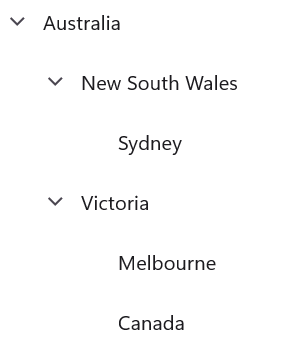

# Getting Started with .NET MAUI TreeView

This section guides you through setting up and configuring a [TreeView](https://help.syncfusion.com/cr/maui/Syncfusion.Maui.TreeView.SfTreeView.html) in your .NET MAUI application. Follow the steps below to add a basic TreeView to your project.




## Prerequisites
Before proceeding, ensure the following are set up:

1. Install [.NET 9 SDK](https://dotnet.microsoft.com/en-us/download/dotnet/9.0) or later.
2. Set up a .NET MAUI environment with Visual Studio 2022 v17.12 or later.

## Step 1: Create a new .NET MAUI Project

1. Go to **File > New > Project** and choose the **.NET MAUI App** template.
2. Name the project and choose a location. Then, click **Next.**
3. Select the .NET framework version and click **Create.**

## Step 2: Install the Syncfusion® MAUI TreeView NuGet package

1. In **Solution Explorer,** right-click the project and choose **Manage NuGet Packages.**
2. Search for [Syncfusion.Maui.TreeView](https://www.nuget.org/packages/Syncfusion.Maui.TreeView/) and install the latest version.
3. Ensure the necessary dependencies are installed correctly, and the project is restored. If not, Open the Terminal in Rider and manually run: `dotnet restore`

## Step 3: Register the handler

The [Syncfusion.Maui.Core](https://www.nuget.org/packages/Syncfusion.Maui.Core) is a dependent package for all the Syncfusion controls of .NET MAUI. In the `MauiProgram.cs` file, register the handler for Syncfusion core.



using Microsoft.Maui.Controls.Hosting;
using Microsoft.Maui.Controls.Xaml;
using Microsoft.Maui.Hosting;
using Syncfusion.Maui.Core.Hosting;

namespace GettingStarted
{
    public class MauiProgram 
    {
        public static MauiApp CreateMauiApp()
        {
            var builder = MauiApp.CreateBuilder();
            builder
                .UseMauiApp<App>()
                .ConfigureFonts(fonts =>
                {
                    fonts.AddFont("OpenSans-Regular.ttf", "OpenSansRegular");
                });

            builder.ConfigureSyncfusionCore();
            return builder.Build();
        }
    }
}
 

 
## Step 4: Add a basic TreeView

 1. To initialize the control, import the `Syncfusion.Maui.TreeView` namespace into your code.
 2. Initialize [SfTreeView](https://help.syncfusion.com/cr/maui/Syncfusion.Maui.TreeView.SfTreeView.html).




<ContentPage   
    . . .
    xmlns:syncfusion="clr-namespace:Syncfusion.Maui.TreeView;assembly=Syncfusion.Maui.TreeView">

    <syncfusion:SfTreeView />
</ContentPage>




using Syncfusion.Maui.TreeView;
. . .

public partial class MainPage : ContentPage
{
    public MainPage()
    {
        InitializeComponent();
        SfTreeView treeView = new SfTreeView();
        this.Content = treeView;
    }
}







## Prerequisites

Before proceeding, ensure the following are set up:

1. Install [.NET 9 SDK](https://dotnet.microsoft.com/en-us/download/dotnet/9.0) or later.
2. Set up a .NET MAUI environment with Visual Studio Code.
3. Ensure that the .NET MAUI workloads are installed and configured as described [here](https://learn.microsoft.com/en-us/dotnet/maui/get-started/installation?view=net-maui-9.0&tabs=visual-studio-code).

## Step 1: Create a .NET MAUI project

1. Open the command palette by pressing `Ctrl+Shift+P` and type **.NET:New Project** and enter.
2. Choose the **.NET MAUI App** template.
3. Select the project location, type the project name and press **Enter.**
4. Then choose **Create project.**

## Step 2: Install the Syncfusion® MAUI TreeView NuGet package

1. In **Solution Explorer,** right-click the project and choose **Manage NuGet Packages.**
2. Search for [Syncfusion.Maui.TreeView](https://www.nuget.org/packages/Syncfusion.Maui.TreeView/) and install the latest version.
3. Ensure the necessary dependencies are installed correctly, and the project is restored. If not, Open the Terminal in Rider and manually run: `dotnet restore`

## Step 3: Register the handler

The [Syncfusion.Maui.Core](https://www.nuget.org/packages/Syncfusion.Maui.Core) is a dependent package for all the Syncfusion controls of .NET MAUI. In the `MauiProgram.cs` file, register the handler for Syncfusion core.



using Microsoft.Maui.Controls.Hosting;
using Microsoft.Maui.Controls.Xaml;
using Microsoft.Maui.Hosting;
using Syncfusion.Maui.Core.Hosting;

namespace GettingStarted
{
    public class MauiProgram 
    {
        public static MauiApp CreateMauiApp()
        {
            var builder = MauiApp.CreateBuilder();
            builder
                .UseMauiApp<App>()
                .ConfigureFonts(fonts =>
                {
                    fonts.AddFont("OpenSans-Regular.ttf", "OpenSansRegular");
                });

            builder.ConfigureSyncfusionCore();
            return builder.Build();
        }
    }
}
 

 
## Step 4: Add a basic TreeView

 1. To initialize the control, import the `Syncfusion.Maui.TreeView` namespace into your code.
 2. Initialize [SfTreeView](https://help.syncfusion.com/cr/maui/Syncfusion.Maui.TreeView.SfTreeView.html).




<ContentPage   
    . . .
    xmlns:syncfusion="clr-namespace:Syncfusion.Maui.TreeView;assembly=Syncfusion.Maui.TreeView">

    <syncfusion:SfTreeView />
</ContentPage>




using Syncfusion.Maui.TreeView;
. . .

public partial class MainPage : ContentPage
{
    public MainPage()
    {
        InitializeComponent();
        SfTreeView treeView = new SfTreeView();
        this.Content = treeView;
    }
}








## Prerequisites

Before proceeding, ensure the following are set up:

1. Install [.NET 9 SDK](https://dotnet.microsoft.com/en-us/download/dotnet/9.0) or later.
2. Set up a .NET MAUI environment with JetBrains Rider 2024.3 or later.
3. Make sure the MAUI workloads are installed and configured as described [here.](https://www.jetbrains.com/help/rider/MAUI.html#before-you-start)

## Step 1: Create a new .NET MAUI project

1. Go to **File > New Solution,** Select .NET (C#) and choose the .NET MAUI App template.
2. Enter the Project Name, Solution Name, and Location.
3. Select the .NET framework version and click Create.

## Step 2: Install the Syncfusion® MAUI TreeView NuGet package

1. In **Solution Explorer,** right-click the project and choose **Manage NuGet Packages.**
2. Search for [Syncfusion.Maui.TreeView](https://www.nuget.org/packages/Syncfusion.Maui.TreeView/) and install the latest version.
3. Ensure the necessary dependencies are installed correctly, and the project is restored. If not, Open the Terminal in Rider and manually run: `dotnet restore`

## Step 3: Register the handler

The [Syncfusion.Maui.Core](https://www.nuget.org/packages/Syncfusion.Maui.Core) is a dependent package for all the Syncfusion controls of .NET MAUI. In the `MauiProgram.cs` file, register the handler for Syncfusion core.



using Microsoft.Maui.Controls.Hosting;
using Microsoft.Maui.Controls.Xaml;
using Microsoft.Maui.Hosting;
using Syncfusion.Maui.Core.Hosting;

namespace GettingStarted
{
    public class MauiProgram 
    {
        public static MauiApp CreateMauiApp()
        {
            var builder = MauiApp.CreateBuilder();
            builder
                .UseMauiApp<App>()
                .ConfigureFonts(fonts =>
                {
                    fonts.AddFont("OpenSans-Regular.ttf", "OpenSansRegular");
                });

            builder.ConfigureSyncfusionCore();
            return builder.Build();
        }
    }
}
 

 
## Step 4: Add a basic TreeView

 1. To initialize the control, import the `Syncfusion.Maui.TreeView` namespace into your code.
 2. Initialize [SfTreeView](https://help.syncfusion.com/cr/maui/Syncfusion.Maui.TreeView.SfTreeView.html).




<ContentPage   
    . . .
    xmlns:syncfusion="clr-namespace:Syncfusion.Maui.TreeView;assembly=Syncfusion.Maui.TreeView">

    <syncfusion:SfTreeView />
</ContentPage>




using Syncfusion.Maui.TreeView;
. . .

public partial class MainPage : ContentPage
{
    public MainPage()
    {
        InitializeComponent();
        SfTreeView treeView = new SfTreeView();
        this.Content = treeView;
    }
}







## Step 5: Data population

TreeView can be populated either with the data source by using a [ItemsSource](https://help.syncfusion.com/cr/maui/Syncfusion.Maui.TreeView.SfTreeView.html#Syncfusion_Maui_TreeView_SfTreeView_ItemsSource) or by creating & adding the [TreeViewNode](https://help.syncfusion.com/cr/maui/Syncfusion.TreeView.Engine.TreeViewNode.html) to [Nodes](https://help.syncfusion.com/cr/maui/Syncfusion.Maui.TreeView.SfTreeView.html#Syncfusion_Maui_TreeView_SfTreeView_Nodes) property.

### Populating nodes without data source - unbound mode

You can create and manage the `TreeViewNode` objects by yourself to display the data in a hierarchical view. To create a tree view, you can use a `TreeView` control and a hierarchy of `TreeViewNode` objects. You can create the node hierarchy by adding one or more root nodes to the TreeView control’s Nodes collection. Each `TreeViewNode` can then have more nodes added to its Children collection. You can nest the tree view nodes to any depth you need.

I> `ItemsSource` is an alternative mechanism to `Nodes` for adding content into the TreeView control. You cannot set both `ItemsSource` and `Nodes` at the same time. When you use `ItemsSource`, nodes are created internally, but you cannot access them from the `Nodes` property.




<ContentPage xmlns="http://schemas.microsoft.com/dotnet/2021/maui"
             xmlns:x="http://schemas.microsoft.com/winfx/2009/xaml"
             xmlns:syncfusion="clr-namespace:Syncfusion.Maui.TreeView;assembly=Syncfusion.Maui.TreeView"
             xmlns:treeviewengine="clr-namespace:Syncfusion.TreeView.Engine;assembly=Syncfusion.Maui.TreeView"
             x:Class="GettingStarted.MainPage">
    <ContentPage.Content>
       <syncfusion:SfTreeView x:Name="treeView" ExpandActionTarget="Node" FullRowSelect="True">
            <syncfusion:SfTreeView.Nodes>
                <treeviewengine:TreeViewNode Content="Australia" IsExpanded="True">
                    <treeviewengine:TreeViewNode.ChildNodes>
                        <treeviewengine:TreeViewNode Content="New South Wales" IsExpanded="True">
                            <treeviewengine:TreeViewNode.ChildNodes>
                        <treeviewengine:TreeViewNode Content="Sydney" IsExpanded="True"/>
                    </treeviewengine:TreeViewNode.ChildNodes>
                </treeviewengine:TreeViewNode>
                <treeviewengine:TreeViewNode Content="Victoria" IsExpanded="True">
                    <treeviewengine:TreeViewNode.ChildNodes>
                        <treeviewengine:TreeViewNode Content="Melbourne" IsExpanded="True"/>
                        <treeviewengine:TreeViewNode Content="Canada" IsExpanded="True"/>
                    </treeviewengine:TreeViewNode.ChildNodes>
                </treeviewengine:TreeViewNode>
                </treeviewengine:TreeViewNode.ChildNodes>
            </treeviewengine:TreeViewNode>
        </syncfusion:SfTreeView.Nodes>
    </syncfusion:SfTreeView>
    </ContentPage.Content>
</ContentPage>




using Microsoft.Maui.Controls;
using Syncfusion.Maui.TreeView;
using Syncfusion.TreeView.Engine;
using System;

namespace GettingStarted
{
    public class MainPage : ContentPage
    {
        public MainPage()
        {
            InitializeComponent();
            SfTreeView treeView = new SfTreeView();

            var australia = new TreeViewNode() { Content = "Australia" };
            var nsw = new TreeViewNode() { Content = "New South Wales" };
            var sydney = new TreeViewNode{ Content = "Sydney", IsExpanded = true };
            var canberra = new TreeViewNode{ Content = "Canberra",IsExpanded = true };
            var newcastle = new TreeViewNode{ Content = "Newcastle–Maitland", IsExpanded = true};
            newSouthWales.ChildNodes.Add(sydney);
            newSouthWales.ChildNodes.Add(canberra);
            newSouthWales.ChildNodes.Add(newcastle);
            australia.ChildNodes.Add(newSouthWales);
            treeView.Nodes.Add(australia);

            this.Content = treeView;
        }
    }
}




Download the entire source code from GitHub [here](https://github.com/SyncfusionExamples/populate-the-nodes-in-unbound-mode-in-.net-maui-treeview).
