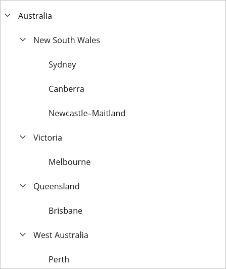

# Getting Started with .NET MAUI TreeView

This section guides you through setting up and configuring a [TreeView](https://help.syncfusion.com/cr/maui/Syncfusion.Maui.TreeView.SfTreeView.html) in your .NET MAUI application. Follow the steps below to add a basic TreeView to your project.

## Prerequisites
Before proceeding, ensure the following are in place:

 1. Install [.NET 7 SDK](https://dotnet.microsoft.com/en-us/download/dotnet/7.0) or later.
 2. Set up a .NET MAUI environment with Visual Studio 2022 (v17.3 or later) or VS Code. For VS Code users, ensure that the .NET MAUI workload is installed and configured as described [here](https://learn.microsoft.com/en-us/dotnet/maui/get-started/installation?view=net-maui-8.0&tabs=visual-studio-code).

## Step 1: Create a .NET MAUI project




1. Go to **File > New > Project** and choose the **.NET MAUI App** template.
2. Name the project and choose a location. Then, click **Next.**
3. Select the .NET framework version and click **Create.**




1. Open the command palette by pressing `Ctrl+Shift+P` and type **.NET:New Project** and enter.
2. Choose the **.NET MAUI App** template.
3. Select the project location, type the project name and press **Enter.**
4. Then choose **Create project.**





## Prerequisites

Before proceeding, ensure the following are set up:

1. Ensure you have the latest version of JetBrains Rider.
2. Install [.NET 8 SDK](https://dotnet.microsoft.com/en-us/download/dotnet/8.0) or later is installed.
3. Make sure the MAUI workloads are installed and configured as described [here.](https://www.jetbrains.com/help/rider/MAUI.html#before-you-start)

## Step 1: Create a new .NET MAUI project

1. Go to **File > New Solution,** Select .NET (C#) and choose the .NET MAUI App template.
2. Enter the Project Name, Solution Name, and Location.
3. Select the .NET framework version and click Create.

## Step 2: Install the Syncfusion® MAUI TreeView NuGet package

1. In **Solution Explorer,** right-click the project and choose **Manage NuGet Packages.**
2. Search for [Syncfusion.Maui.TreeView](https://www.nuget.org/packages/Syncfusion.Maui.TreeView/) and install the latest version.
3. Ensure the necessary dependencies are installed correctly, and the project is restored. If not, Open the Terminal in Rider and manually run: `dotnet restore`

## Step 3: Register the handler

The [Syncfusion.Maui.Core](https://www.nuget.org/packages/Syncfusion.Maui.Core) is a dependent package for all the Syncfusion controls of .NET MAUI. In the `MauiProgram.cs` file, register the handler for Syncfusion core.



using Microsoft.Maui.Controls.Hosting;
using Microsoft.Maui.Controls.Xaml;
using Microsoft.Maui.Hosting;
using Syncfusion.Maui.Core.Hosting;

namespace GettingStarted
{
    public class MauiProgram 
    {
        public static MauiApp CreateMauiApp()
        {
            var builder = MauiApp.CreateBuilder();
            builder
                .UseMauiApp<App>()
                .ConfigureFonts(fonts =>
                {
                    fonts.AddFont("OpenSans-Regular.ttf", "OpenSansRegular");
                });

            builder.ConfigureSyncfusionCore();
            return builder.Build();
        }
    }
}
 

 
## Step 4: Add a basic TreeView

 1. To initialize the control, import the `Syncfusion.Maui.TreeView` namespace into your code.
 2. Initialize [SfTreeView](https://help.syncfusion.com/cr/maui/Syncfusion.Maui.TreeView.SfTreeView.html).




<ContentPage   
    . . .
    xmlns:syncfusion="clr-namespace:Syncfusion.Maui.TreeView;assembly=Syncfusion.Maui.TreeView">

    <syncfusion:SfTreeView />
</ContentPage>




using Syncfusion.Maui.TreeView;
. . .

public partial class MainPage : ContentPage
{
    public MainPage()
    {
        InitializeComponent();
        SfTreeView treeView = new SfTreeView();
        this.Content = treeView;
    }
}






 
## Step 2: Install the Syncfusion® MAUI TreeView NuGet package
 
 1. In **Solution Explorer**, right-click the project and choose **Manage NuGet Packages**.
 2. Search for [Syncfusion.Maui.TreeView](https://www.nuget.org/packages/Syncfusion.Maui.TreeView) and install the latest version.
 3. Ensure the necessary dependencies are installed correctly, and the project is restored.

## Step 3: Register the handler

The [Syncfusion.Maui.Core](https://www.nuget.org/packages/Syncfusion.Maui.Core) is a dependent package for all the Syncfusion controls of .NET MAUI. In the `MauiProgram.cs` file, register the handler for Syncfusion core.



using Microsoft.Maui.Controls.Hosting;
using Microsoft.Maui.Controls.Xaml;
using Microsoft.Maui.Hosting;
using Syncfusion.Maui.Core.Hosting;

namespace GettingStarted
{
    public class MauiProgram 
    {
        public static MauiApp CreateMauiApp()
        {
            var builder = MauiApp.CreateBuilder();
            builder
                .UseMauiApp<App>()
                .ConfigureFonts(fonts =>
                {
                    fonts.AddFont("OpenSans-Regular.ttf", "OpenSansRegular");
                });

            builder.ConfigureSyncfusionCore();
            return builder.Build();
        }
    }
}
 

 
## Step 4: Add a basic TreeView

 1. To initialize the control, import the `Syncfusion.Maui.TreeView` namespace into your code.
 2. Initialize [SfTreeView](https://help.syncfusion.com/cr/maui/Syncfusion.Maui.TreeView.SfTreeView.html).




<ContentPage   
    . . .
    xmlns:syncfusion="clr-namespace:Syncfusion.Maui.TreeView;assembly=Syncfusion.Maui.TreeView">

    <syncfusion:SfTreeView />
</ContentPage>




using Syncfusion.Maui.TreeView;
. . .

public partial class MainPage : ContentPage
{
    public MainPage()
    {
        InitializeComponent();
        SfTreeView treeView = new SfTreeView();
        this.Content = treeView;
    }
}




## Step 5: Data population

TreeView can be populated either with the data source by using a [ItemsSource](https://help.syncfusion.com/cr/maui/Syncfusion.Maui.TreeView.SfTreeView.html#Syncfusion_Maui_TreeView_SfTreeView_ItemsSource) or by creating & adding the [TreeViewNode](https://help.syncfusion.com/cr/maui/Syncfusion.TreeView.Engine.TreeViewNode.html) to [Nodes](https://help.syncfusion.com/cr/maui/Syncfusion.Maui.TreeView.SfTreeView.html#Syncfusion_Maui_TreeView_SfTreeView_Nodes) property.

### Populating nodes without data source - unbound mode

You can create and manage the `TreeViewNode` objects by yourself to display the data in a hierarchical view. To create a tree view, you can use a `TreeView` control and a hierarchy of `TreeViewNode` objects. You can create the node hierarchy by adding one or more root nodes to the TreeView control’s Nodes collection. Each `TreeViewNode` can then have more nodes added to its Children collection. You can nest the tree view nodes to any depth you need.

I> `ItemsSource` is an alternative mechanism to `Nodes` for adding content into the TreeView control. You cannot set both `ItemsSource` and `Nodes` at the same time. When you use `ItemsSource`, nodes are created internally, but you cannot access them from the `Nodes` property.




<ContentPage xmlns="http://schemas.microsoft.com/dotnet/2021/maui"
             xmlns:x="http://schemas.microsoft.com/winfx/2009/xaml"
             xmlns:syncfusion="clr-namespace:Syncfusion.Maui.TreeView;assembly=Syncfusion.Maui.TreeView"
             xmlns:treeviewengine="clr-namespace:Syncfusion.TreeView.Engine;assembly=Syncfusion.Maui.TreeView"
             x:Class="GettingStarted.MainPage">
    <ContentPage.Content>
       <syncfusion:SfTreeView x:Name="treeView">
            <syncfusion:SfTreeView.Nodes>
                <treeviewengine:TreeViewNode Content="Australia">
                    <treeviewengine:TreeViewNode.ChildNodes>
                        <treeviewengine:TreeViewNode Content="New South Wales">
                            <treeviewengine:TreeViewNode.ChildNodes>
                                <treeviewengine:TreeViewNode Content="Sydney"/>
                            </treeviewengine:TreeViewNode.ChildNodes>
                        </treeviewengine:TreeViewNode>
                    </treeviewengine:TreeViewNode.ChildNodes>
                </treeviewengine:TreeViewNode>
                <treeviewengine:TreeViewNode Content="United States of America">
                    <treeviewengine:TreeViewNode.ChildNodes>
                        <treeviewengine:TreeViewNode Content="New York"/>
                        <treeviewengine:TreeViewNode Content="California">
                            <treeviewengine:TreeViewNode.ChildNodes>
                                <treeviewengine:TreeViewNode Content="San Francisco"/>
                            </treeviewengine:TreeViewNode.ChildNodes>
                        </treeviewengine:TreeViewNode>
                    </treeviewengine:TreeViewNode.ChildNodes>
                </treeviewengine:TreeViewNode>
            </syncfusion:SfTreeView.Nodes>
        </syncfusion:SfTreeView>
    </ContentPage.Content>
</ContentPage>




using Microsoft.Maui.Controls;
using Syncfusion.Maui.TreeView;
using Syncfusion.TreeView.Engine;
using System;

namespace GettingStarted
{
    public class MainPage : ContentPage
    {
        public MainPage()
        {
            InitializeComponent();
            SfTreeView treeView = new SfTreeView();

            var australia = new TreeViewNode() { Content = "Australia" };
            var nsw = new TreeViewNode() { Content = "New South Wales" };
            var sydney = new TreeViewNode() { Content = "Sydney" };
            australia.ChildNodes.Add(nsw);
            nsw.ChildNodes.Add(sydney);
 
            var usa = new TreeViewNode() { Content = "United States of America" };
            var newYork = new TreeViewNode() { Content = "New York," };
            var california = new TreeViewNode() { Content = "California" };
            var sanFrancisco = new TreeViewNode() { Content = "San Francisco" };
            usa.ChildNodes.Add(newYork);
            usa.ChildNodes.Add(california);
            California.ChildNodes.Add(sanFrancisco);
            treeView.Nodes.Add(australia);
            treeView.Nodes.Add(usa);

            this.Content = treeView;
        }
    }
}




## Step 6: Running the application

Press **F5** to build and run the application. Once compiled, the TreeView will be displayed with the data provided.

Here is the result of the previous codes,

Download the entire source code from GitHub [here](https://github.com/SyncfusionExamples/populate-the-nodes-in-unbound-mode-in-.net-maui-treeview).

## Populating nodes by data binding - bound mode

### Define the model

Create a simple data model as shown in the following code example, and save it as `FileManager.cs` file: 



public class FileManager : INotifyPropertyChanged
{
   private string itemName;
   private ImageSource imageIcon;
   private ObservableCollection<FileManager> subFiles;

   public ObservableCollection<FileManager> SubFiles
   {
      get { return subFiles; }
      set
      {
         subFiles = value;
         RaisedOnPropertyChanged("SubFiles");
      }
   }

   public string ItemName
   {
      get { return itemName; }
      set
      {
         itemName = value;
         RaisedOnPropertyChanged("ItemName");
      }
   }
 
   public ImageSource ImageIcon
   {
       get { return imageIcon; }
       set
       {
          imageIcon = value;
          RaisedOnPropertyChanged("ImageIcon");
       }
   }

   public event PropertyChangedEventHandler PropertyChanged;

   public void RaisedOnPropertyChanged(string propertyName)
   {
      if (PropertyChanged != null)
      {
         PropertyChanged(this, new PropertyChangedEventArgs(propertyName));
      }
   }
}




N> If you want your data model to respond to property changes, then implement [INotifyPropertyChanged](https://learn.microsoft.com/en-us/dotnet/api/system.componentmodel.inotifypropertychanged?view=net-7.0) interface in your model class.

### Define the view model

Create a model repository class with `ImageNodeInfo` collection property initialized with required number of data objects in a new class file as shown in the following code example, and save it as `FileManagerViewModel.cs` file:



public class FileManagerViewModel
{
   private ObservableCollection<FileManager> imageNodeInfo;

   public FileManagerViewModel()
   {
      GenerateSource();
   }

   public ObservableCollection<FileManager> ImageNodeInfo
   {
      get { return imageNodeInfo; }
      set { this.imageNodeInfo = value; }
   }

   private void GenerateSource()
   {
      var nodeImageInfo = new ObservableCollection<FileManager>();
      var doc = new FileManager() { ItemName = "Documents", ImageIcon = "folder.png" };
      var download = new FileManager() { ItemName = "Downloads", ImageIcon = "folder.png" };
      var mp3 = new FileManager() { ItemName = "Music", ImageIcon ="folder.png" };
      var pictures = new FileManager() { ItemName = "Pictures", ImageIcon = "folder.png" };
      var video = new FileManager() { ItemName = "Videos", ImageIcon ="folder.png" };

      var pollution = new FileManager() { ItemName = "Environmental Pollution.docx", ImageIcon = "word.png" };
      var globalWarming = new FileManager() { ItemName = "Global Warming.ppt", ImageIcon = "ppt.png" };
      var sanitation = new FileManager() { ItemName = "Sanitation.docx", ImageIcon = "word.png"};
      var socialNetwork = new FileManager() { ItemName = "Social Network.pdf", ImageIcon ="pdfimage.png" };
      var youthEmpower = new FileManager() { ItemName = "Youth Empowerment.pdf", ImageIcon = "pdfimage.png" };
          
      var tutorials = new FileManager() { ItemName = "Tutorials.zip", ImageIcon = "zip.png" };
      var typeScript = new FileManager() { ItemName = "TypeScript.7z", ImageIcon ="zip.png" };
      var uiGuide = new FileManager() { ItemName = "UI-Guide.pdf", ImageIcon = "pdfimage.png"};

      var song = new FileManager() { ItemName = "Gouttes", ImageIcon = "audio.png" };

      var camera = new FileManager() { ItemName = "Camera Roll", ImageIcon = "folder.png" };
      var stone = new FileManager() { ItemName = "Stone.jpg", ImageIcon = "image.png" };
      var wind = new FileManager() { ItemName = "Wind.jpg", ImageIcon = "image.png"};

      var img0 = new FileManager() { ItemName = "WIN_20160726_094117.JPG", ImageIcon = "people_circle23.png" };
      var img1 = new FileManager() { ItemName = "WIN_20160726_094118.JPG", ImageIcon = "people_circle2.png" };

      var video1 = new FileManager() { ItemName = "Naturals.mp4", ImageIcon = "video.png" };
      var video2 = new FileManager() { ItemName = "Wild.mpeg", ImageIcon = "video.png" };

      doc.SubFiles = new ObservableCollection<FileManager>
      {
         pollution,
         globalWarming,
         sanitation,
         socialNetwork,
         youthEmpower
      };

      download.SubFiles = new ObservableCollection<FileManager>
      {
         tutorials,
         TypeScript,
         uiGuide
      };

      mp3.SubFiles = new ObservableCollection<FileManager>
      {
         song
      };

      pictures.SubFiles = new ObservableCollection<FileManager>
      {
         camera,
         stone,
         wind
      };
      
      camera.SubFiles = new ObservableCollection<FileManager>
      {
         img0,
         img1
      };

      video.SubFiles = new ObservableCollection<FileManager>
      {
         video1,
         video2
      };

      nodeImageInfo.Add(doc);
      nodeImageInfo.Add(download);
      nodeImageInfo.Add(mp3);
      nodeImageInfo.Add(pictures);
      nodeImageInfo.Add(video);
      imageNodeInfo = nodeImageInfo;
  }
}




### Bind the data source

Create a `ViewModel` instance and set it as the ListView's `BindingContext`. This enables property binding from `ViewModel` class.

To populate the TreeView by binding the [ItemsSource](https://help.syncfusion.com/cr/maui/Syncfusion.Maui.TreeView.SfTreeView.html#Syncfusion_Maui_TreeView_SfTreeView_ItemsSource) to a hierarchical data source. To create a tree view using data binding, set a hierarchical collection to the `ItemsSource` property. Then in the [ItemTemplate](https://help.syncfusion.com/cr/maui/Syncfusion.Maui.TreeView.SfTreeView.html#Syncfusion_Maui_TreeView_SfTreeView_ItemTemplate) and [ExpanderTemplate](https://help.syncfusion.com/cr/maui/Syncfusion.Maui.TreeView.SfTreeView.html#Syncfusion_Maui_TreeView_SfTreeView_ExpanderTemplate), set the child items collection to the `ItemsSource` property.

I> ItemsSource is an alternative mechanism to [Nodes](https://help.syncfusion.com/cr/maui/Syncfusion.Maui.TreeView.SfTreeView.html#Syncfusion_Maui_TreeView_SfTreeView_Nodes) for adding content into the TreeView control. You cannot set both ItemsSource and Nodes at the same time. When you use ItemsSource, nodes are created internally, but you cannot access them from the Nodes property.



<ContentPage xmlns="http://schemas.microsoft.com/dotnet/2021/maui"
             xmlns:x="http://schemas.microsoft.com/winfx/2009/xaml"
             xmlns:syncfusion="clr-namespace:Syncfusion.Maui.TreeView;assembly=Syncfusion.Maui.TreeView"
             xmlns:local="clr-namespace:GettingStarted;assembly=GettingStarted"
             x:Class="GettingStarted.MainPage">

  <ContentPage.BindingContext>
    <local:FileManagerViewModel x:Name="viewModel" />
  </ContentPage.BindingContext>
   <syncfusion:SfTreeView x:Name="treeView" 
                   ItemsSource="{Binding ImageNodeInfo}" 
                   ChildPropertyName="SubFiles"/>
</ContentPage>


using Syncfusion.Maui.TreeView;

namespace GettingStarted;

public partial class MainPage : ContentPage
{
    public MainPage()
    {
        InitializeComponent();
        SfTreeView treeView = new SfTreeView();
        FileManagerViewModel viewModel = new FileManagerViewModel();
        treeView.ItemsSource = viewModel.ImageNodeInfo; 
        treeView.ChildPropertyName = "SubFiles";
        this.Content = treeView;
    }
}



