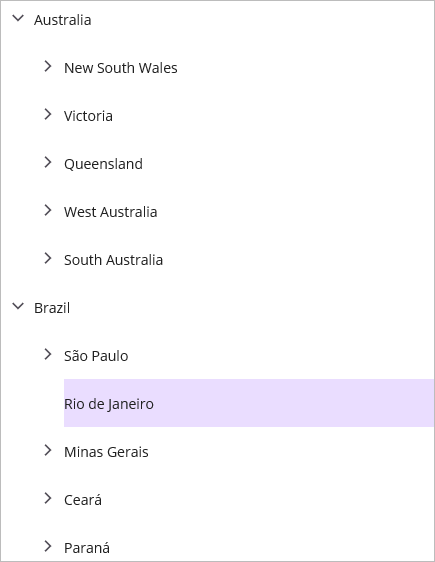

# Working with MVVM in .NET MAUI TreeView (SfTreeView)

This section explains about how to work with MVVM pattern in TreeView.

## Binding properties in MVVM pattern

### Binding SelectedItem

TreeView support to select the items through binding the `SelectedItem` property from view model by implementing the `INotifyPropertyChanged` interface that gives the call back notification to UI.



<syncfusion:SfTreeView x:Name="treeView" 
                       SelectedItem="{Binding SelectedPlace}"
                       ChildPropertyName="States"
                       ItemsSource="{Binding CountriesInfo}"/>


SfTreeView treeView = new SfTreeView();
treeView.SetBinding(SfTreeView.SelectedItemProperty, new Binding("SelectedPlace", BindingMode.TwoWay));






public class CountriesViewModel
{
    public CountriesViewModel()
    {
        GenerateCountriesInfo();
    }
    public ObservableCollection<Countries> CountriesInfo { get; set; }

    public object SelectedPlace { get; set; }

    private void GenerateCountriesInfo()
    {
        var australia = new Countries() { Name = "Australia" };
        var nsw = new Countries() { Name = "New South Wales" };
        var sydney = new Countries() { Name = "Sydney" };
        australia.States = new ObservableCollection<Countries>();
        australia.States.Add(nsw);
        nsw.States = new ObservableCollection<Countries>();
        nsw.States.Add(sydney);
        var usa = new Countries() { Name = "United States of America" };
        var california = new Countries() { Name = "California" };
        var losAngeles = new Countries() { Name = "Los Angeles" };
        usa.States = new ObservableCollection<Countries>();
        usa.States.Add(california);
        california.States = new ObservableCollection<Countries>();
        california.States.Add(losAngeles);
         
        this.CountriesInfo = new ObservableCollection<Countries>();
        CountriesInfo.Add(australia);
        CountriesInfo.Add(usa);

        SelectedPlace = nsw;
    }
}




### Binding SelectedItems

The TreeView supports selecting multiple items by binding the `SelectedItems` property from the view model with the `ObservableCollection<object>` type.



<syncfusion:SfTreeView x:Name="treeView"
                       SelectionMode="Multiple"
                       SelectedItems="{Binding SelectedCountries}"
                       ChildPropertyName="States"
                       ItemsSource="{Binding CountriesInfo}"/>


SfTreeView treeView = new SfTreeView();
treeView.SelectionMode = TreeViewSelectionMode.Multiple;
treeView.SetBinding(SfTreeView.SelectedItemsProperty, new Binding("SelectedCountries", BindingMode.TwoWay));






public class CountriesViewModel
{
    public CountriesViewModel()
    {
        GenerateCountriesInfo();
    }

    public ObservableCollection<Countries> CountriesInfo { get; set; }

    public ObservableCollection<object> SelectedCountries { get; set; }

    private void GenerateCountriesInfo()
    {
        var australia = new Countries() { Name = "Australia" };
        var nsw = new Countries() { Name = "New South Wales" };
        var sydney = new Countries() { Name = "Sydney" };
        var victoria = new Countries() { Name = "Victoria" };
        australia.States = new ObservableCollection<Countries>();
        australia.States.Add(nsw);
        australia.States.Add(victoria);
        nsw.States = new ObservableCollection<Countries>();
        nsw.States.Add(sydney);
        var usa = new Countries() { Name = "United States of America" };
        var california = new Countries() { Name = "California" };
        usa.States = new ObservableCollection<Countries>();
        usa.States.Add(california);
      
        this.CountriesInfo = new ObservableCollection<Countries>();
        CountriesInfo.Add(australia);
        CountriesInfo.Add(usa);

        SelectedCountries = new ObservableCollection<object>();
        SelectedCountries.Add(nsw);
        SelectedCountries.Add(victoria);
    }
}




Download the entire source code from GitHub [here](https://github.com/SyncfusionExamples/binding-selected-items-in-.net-maui-treeview).

## Commands

### Tap command

The `TapCommand` will be triggered whenever tapping the item and passing the `TreeViewNode` as command a parameter.




treeView.TapCommand = viewModel.TappedCommand;

public class CommandViewModel
{
    private Command<object> tappedCommand;

    public Command<object> TappedCommand
    {
        get { return tappedCommand; }
        set { tappedCommand = value; }
    }

    public CommandViewModel()
    {            
        TappedCommand = new Command<object>(TappedCommandMethod);
    }

    private void TappedCommandMethod(object obj)
    {
        App.Current.MainPage.DisplayAlert("Alert", ((obj as TreeViewNode).Content as FileManager).ItemName+ "  is Tapped","OK");
    }   
}



### LongPressCommand

The `LongPressCommand` will be triggered whenever an item is long pressed and passing the `TreeViewNode` as command parameter.




treeView.LongPressCommand = viewModel.LongPressCommand;

public class CommandViewModel
{
    private Command<Object> longPressCommand;

    public Command<object> LongPressCommand
    {
        get { return longPressCommand; }
        set { longPressCommand = value; }
    }

    public CommandViewModel()
    {            
        LongPressCommand = new Command<object>(LongPressCommandMethod);
    }

    private void LongPressCommandMethod(object obj)
    {          
        App.Current.MainPage.DisplayAlert("Alert", ((obj as TreeViewNode).Content as FileManager).ItemName+ "  is LongPressed","OK");
    }   
}



### Expand command

The `ExpandCommand` will be triggered while expanding the node and passing the `TreeViewNode` as a command parameter. TreeView expands the node based on the return value of the `CanExecute` method implementation of `ExpandCommand`. If you return false, then expand action will be canceled. Execute method implementation of `ExpandCommand` will get called after expanding the node.



<ContentPage xmlns="http://schemas.microsoft.com/dotnet/2021/maui"
             xmlns:x="http://schemas.microsoft.com/winfx/2009/xaml"
             xmlns:syncfusion="clr-namespace:Syncfusion.Maui.TreeView;assembly=Syncfusion.Maui.TreeView"
             xmlns:local="clr-namespace:Selection"
             x:Class="Selection.MainPage">
    <ContentPage.BindingContext>
        <local:CommandViewModel x:Name="viewModel"/>
    </ContentPage.BindingContext>
    <ContentPage.Content>
        <syncfusion:SfTreeView x:Name="treeView"
                               ExpandCommand="{Binding ExpandingCommand}"/> 
    </ContentPage.Content>
</ContentPage>  
  

/// 

/// CommandViewModel class that implements command. 
/// 

public class CommandViewModel
{
    private Command<Object> expandingCommand;

    public Command<object> ExpandingCommand
    {
        get { return expandingCommand; }
        set { expandingCommand = value; }
    }

    public CommandViewModel()
    {            
        ExpandingCommand = new Command<object>(ExpandCommandAction, CanExecute);
    }

    /// 

    /// CanExecute method is called before expanding of node.
    /// 

    /// <returns>Handle expand action by returning true or false. </returns>
    /// <param name="obj">TreeViewNode is passed as command parameter. </param>
    public bool CanExecute(object obj)
    {
        //You can also return false to cancel the expand action.
        return true;
    }

    /// 

    /// Method gets called after expanding action performed.
    /// 

    /// <param name="obj">TreeViewNode is passed as command parameter. </param>
    private void ExpandCommandAction(object obj)
    {
        App.Current.MainPage.DisplayAlert("Alert", ((obj as TreeViewNode).Content as FileManager).ItemName+ "  is Expanded","OK");
    }   
}



### Collapse command

The `CollapseCommand` will be triggered while collapsing the node and passing the `TreeViewNode` as a command parameter. TreeView collapses the node based on the return value of the `CanExecute` method implementation of `CollapseCommand`. If you return false, then collapse action will be canceled. Execute method implementation of `CollapseCommand` will be called after the node has collapsed.



<ContentPage xmlns="http://schemas.microsoft.com/dotnet/2021/maui"
             xmlns:x="http://schemas.microsoft.com/winfx/2009/xaml"
             xmlns:syncfusion="clr-namespace:Syncfusion.Maui.TreeView;assembly=Syncfusion.Maui.TreeView"
             xmlns:local="clr-namespace:Selection"
             x:Class="Selection.MainPage">
    <ContentPage.BindingContext>
        <local:CommandViewModel x:Name="viewModel"/>
    </ContentPage.BindingContext>
    <ContentPage.Content>
        <syncfusion:SfTreeView x:Name="treeView"
                               CollapseCommand="{Binding CollapsingCommand}"/> 
    </ContentPage.Content>
</ContentPage>


/// 

/// CommandViewModel class that implements command.
/// 

public class CommandViewModel
{
    private Command<object> collapsingCommand;
    
    public Command<object> CollapsingCommand
    {
        get { return collapsingCommand; }
        set { collapsingCommand = value; }
    }
    
    public CommandViewModel()
    {
        CollapsingCommand = new Command<object>(CollapseCommandAction, CanExecute);
    }
    
    /// 

    /// CanExecute method is called before collapsing of node. 
    /// 

    /// <returns>Handle collapse action by returning true or false. </returns>
    /// <param name="obj">TreeViewNode is passed as command parameter. </param>
    public bool CanExecute(object obj)
    {
        //You can also return false to cancel the collapse action.
        return true;
    }

    /// 

    /// Method gets called after collapsing action performed.
    /// 

    /// <param name="obj">TreeViewNode is passed as command parameter. </param>
    private void CollapseCommandAction(object obj)
    {
        App.Current.MainPage.DisplayAlert("Alert", ((obj as TreeViewNode).Content as FileManager).ItemName+ "  is Collapsed","OK");
    }
}



## Event to command

The `TreeView` event can be converted into commands using `Behaviors`. To achieve this, create a command in the `ViewModel` class and associate it to the TreeView event using `Behaviors`.



<syncfusion:SfTreeView x:Name="treeView"
                       SelectionMode="Multiple"
                       SelectedItems="{Binding SelectedCountries}"
                       ChildPropertyName="States"
                       ItemsSource="{Binding CountriesInfo}">
    <syncfusion:SfTreeView.Behaviors>
        <local:EventToCommandBehavior EventName="SelectionChanged" 
                                      Command="{Binding SelectionChangedCommand}"/>
    </syncfusion:SfTreeView.Behaviors>
</syncfusion:SfTreeView>


public class CountriesViewModel : INotifyPropertyChanged
{
     private Command<object> selectionChangedCommand;

    public CountriesViewModel()
    {
        SelectionChangedCommand = new Command<object>(OnSelectionChanged);
        GenerateCountriesInfo();
    }

    public ObservableCollection<Countries> CountriesInfo { get; set; }

    public ObservableCollection<object> SelectedCountries { get; set; }

    public Command<object> SelectionChangedCommand
    {
        get { return selectionChangedCommand; }
        protected set { selectionChangedCommand = value; }
    }

    private void OnSelectionChanged(object obj)
    {
        App.Current.MainPage.DisplayAlert("Alert", ((obj as ItemSelectionChangedEventArgs).AddedItems[0] as Countries).Name + " is selected", "OK");
    }

    public event PropertyChangedEventHandler PropertyChanged;

    public void OnPropertyChanged(string name)
    {
        if (this.PropertyChanged != null)
            this.PropertyChanged(this, new PropertyChangedEventArgs(name));
    }

    private void GenerateCountriesInfo()
    {
        var australia = new Countries() { Name = "Australia" };
        var nsw = new Countries() { Name = "New South Wales" };
        var victoria = new Countries() { Name = "Victoria" };
        australia.States = new ObservableCollection<Countries>();
        australia.States.Add(nsw);
        australia.States.Add(victoria);
        var usa = new Countries() { Name = "United States of America" };
        var california = new Countries() { Name = "California" };
        usa.States = new ObservableCollection<Countries>();
        usa.States.Add(california);
      
        this.CountriesInfo = new ObservableCollection<Countries>();
        CountriesInfo.Add(australia);
        CountriesInfo.Add(usa);
    }
}



Download the entire source code from GitHub [here](https://github.com/SyncfusionExamples/event-to-command-binding-in-.net-maui-treeview).

For more information regarding the EventToCommand behavior in .NET MAUI, you can refer [this](https://learn.microsoft.com/en-us/dotnet/communitytoolkit/maui/behaviors/event-to-command-behavior) link.