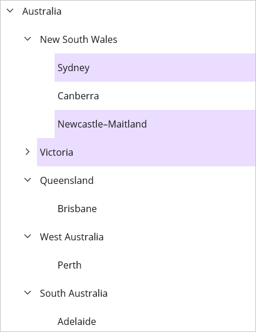
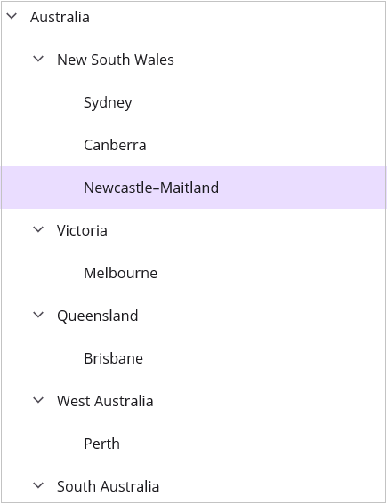

# Selection in .NET MAUI TreeView (SfTreeView)

This section explains how to perform selection and its related operations in the TreeView.

## UI selection
The TreeView allows selecting items programmatically or via touch interactions by setting the [SelectionMode](https://help.syncfusion.com/cr/maui/Syncfusion.Maui.TreeView.SfTreeView.html#Syncfusion_Maui_TreeView_SfTreeView_SelectionMode) property value to other than `None`. The control has different selection modes to perform selection operations as listed as follows.

* [None](https://help.syncfusion.com/cr/maui/Syncfusion.Maui.TreeView.TreeViewSelectionMode.html#Syncfusion_Maui_TreeView_TreeViewSelectionMode_None): Disables the selection.
* [Single](https://help.syncfusion.com/cr/maui/Syncfusion.Maui.TreeView.TreeViewSelectionMode.html#Syncfusion_Maui_TreeView_TreeViewSelectionMode_Single): Allows selecting only a single item. When clicking on the selected item, the selection will not be cleared. This is the default value for `SelectionMode`.
* [SingleDeselect](https://help.syncfusion.com/cr/maui/Syncfusion.Maui.TreeView.TreeViewSelectionMode.html#Syncfusion_Maui_TreeView_TreeViewSelectionMode_SingleDeselect): Allows selecting only a single item. When clicking on the selected item, the selection is cleared.
* [Multiple](https://help.syncfusion.com/cr/maui/Syncfusion.Maui.TreeView.TreeViewSelectionMode.html#Syncfusion_Maui_TreeView_TreeViewSelectionMode_Multiple): Allows selecting more than one item. Selection is not cleared when selecting more than one item. When clicking on the selected item, the selection is cleared.
* [Extended](https://help.syncfusion.com/cr/maui/Syncfusion.Maui.TreeView.TreeViewSelectionMode.html#Syncfusion_Maui_TreeView_TreeViewSelectionMode_Extended): Allows selecting multiple items using the common key modifiers.



<syncfusion:SfTreeView x:Name="treeView" SelectionMode="Multiple"/>


using Syncfusion.Maui.TreeView;

public class MainPage : ContentPage
{
   public MainPage()
   {
      InitializeComponent();

      treeView.SelectionMode = TreeViewSelectionMode.Multiple;
   }
}



## Programmatic selection

When the [SelectionMode](https://help.syncfusion.com/cr/maui/Syncfusion.Maui.TreeView.SfTreeView.html#Syncfusion_Maui_TreeView_SfTreeView_SelectionMode) is other than `None`, an item or items in the TreeView can be selected from code by setting the [SelectedItem](https://help.syncfusion.com/cr/maui/Syncfusion.Maui.TreeView.SfTreeView.html#Syncfusion_Maui_TreeView_SfTreeView_SelectedItem), or by adding items to the [SelectedItems](https://help.syncfusion.com/cr/maui/Syncfusion.Maui.TreeView.SfTreeView.html#Syncfusion_Maui_TreeView_SfTreeView_SelectedItems) property based on the `SelectionMode`. Ensure `SelectionMode` is configured before performing programmatic selection; selecting items while `SelectionMode` is `None` is not supported.

When the selection mode is `Single` or `SingleDeselect`, programmatically select an item by setting the underlying object to the `SelectedItem` property. The `SelectedItem` can also be bound from a view model.




using Syncfusion.Maui.TreeView;

public class MainPage : ContentPage
{
   public MainPage()
   {
      InitializeComponent();

      treeView.SelectedItem = viewModel.CountriesInfo[2];
   }
}




When the selection mode is `Multiple`, programmatically select more than one item by adding the underlying object to the `SelectedItems` property.




using Syncfusion.Maui.TreeView;

public class MainPage : ContentPage
{
   public MainPage()
   {
      InitializeComponent();

      treeView.SelectedItems.Add(viewModel.CountriesInfo[2]);
      treeView.SelectedItems.Add(viewModel.CountriesInfo[3]);
   }
}




W> If an item is selected programmatically when `SelectionMode` is `None`, or if multiple items are programmatically selected when `SelectionMode` is `Single` or `SingleDeselect`, an exception will be thrown internally.

## Manage selected items 

### Get selected items
The TreeView exposes all selected items through the `SelectedItems` property, and exposes the single selected item through the `SelectedItem` property.

### Clear selected items
The selected items can be cleared based on the selection mode. When the selection mode is `Multiple` or `Extended`, call the `SelectedItems.Clear()` method to clear all selected items.



using Syncfusion.Maui.TreeView;

public class MainPage : ContentPage
{
   public MainPage()
   {
      InitializeComponent();

      treeView.SelectedItems.Clear();
   }
}



When the selection mode is `Single` or `SingleDeselect`, clear the selection by setting the `SelectedItem` property to `null` since `SelectedItems` does not track these selections.



using Syncfusion.Maui.TreeView;

public class MainPage : ContentPage
{
   public MainPage()
   {
      InitializeComponent();

      treeView.SelectedItem = null;
   }
}


 
### CurrentItem vs SelectedItem

The TreeView exposes the selected item through the [SelectedItem](https://help.syncfusion.com/cr/maui/Syncfusion.Maui.TreeView.SfTreeView.html#Syncfusion_Maui_TreeView_SfTreeView_SelectedItem) and [CurrentItem](https://help.syncfusion.com/cr/maui/Syncfusion.Maui.TreeView.SfTreeView.html#Syncfusion_Maui_TreeView_SfTreeView_CurrentItem) properties. Both `SelectedItem` and `CurrentItem` return the same data object when a single item is selected. When more than one item is selected, `SelectedItem` returns the first item in the `SelectedItems` collection (that is, the earliest added item), and `CurrentItem` returns the most recently selected item.

## Select an entire row

By default, selection applies only within the content area of the item (after the indent), not across the full width of the control. You can select the full row by enabling the [FullRowSelect](https://help.syncfusion.com/cr/maui/Syncfusion.Maui.TreeView.SfTreeView.html#Syncfusion_Maui_TreeView_SfTreeView_FullRowSelect) property. When `FullRowSelect` is set to `true`, the selection spans the entire width of the TreeView control.



<syncfusion:SfTreeView x:Name="treeView" FullRowSelect="True" />


using Syncfusion.Maui.TreeView;

public class MainPage : ContentPage
{
   public MainPage()
   {
      InitializeComponent();

      treeView.FullRowSelect = true;
   }
}



## Selected item style

### Selection background

The TreeView allows you to change the selection background color for selected items by using the [SelectionBackground](https://help.syncfusion.com/cr/maui/Syncfusion.Maui.TreeView.SfTreeView.html#Syncfusion_Maui_TreeView_SfTreeView_SelectionBackground) property. You can also change the selection background color at runtime.



<syncfusion:SfTreeView x:Name="treeView" SelectionBackground="LightBlue" />


using Syncfusion.Maui.TreeView;

public class MainPage : ContentPage
{
   public MainPage()
   {
      InitializeComponent();

      treeView.SelectionBackground = Colors.LightBlue;
   }
}



### Selection foreground

The TreeView allows you to change the selection foreground color for selected items by using the [SelectionForeground](https://help.syncfusion.com/cr/maui/Syncfusion.Maui.TreeView.SfTreeView.html#Syncfusion_Maui_TreeView_SfTreeView_SelectionForeground) property. You can also change the selection foreground color at runtime.



<syncfusion:SfTreeView x:Name="treeView" SelectionForeground="Red" />


using Syncfusion.Maui.TreeView;

public class MainPage : ContentPage
{
   public MainPage()
   {
      InitializeComponent();

      treeView.SelectionForeground = Colors.Red;
   }
}



## Events

N> `SelectionChanging` and `SelectionChanged` events are triggered only on UI interactions. To detect programmatic selection changes, observe the `SelectedItem` or `CurrentItem` property changes instead.

### SelectionChanging Event

The [SelectionChanging](https://help.syncfusion.com/cr/maui/Syncfusion.Maui.TreeView.SfTreeView.html#Syncfusion_Maui_TreeView_SfTreeView_SelectionChanging) event is raised while selecting an item at runtime. The [ItemSelectionChangingEventArgs](https://help.syncfusion.com/cr/maui/Syncfusion.Maui.TreeView.ItemSelectionChangingEventArgs.html) has the following members, which provide information for the `SelectionChanging` event:

* [AddedItems](https://help.syncfusion.com/cr/maui/Syncfusion.Maui.TreeView.ItemSelectionChangingEventArgs.html#Syncfusion_Maui_TreeView_ItemSelectionChangingEventArgs_AddedItems): Gets the collection of underlying data objects that are about to be selected.
* [RemovedItems](https://help.syncfusion.com/cr/maui/Syncfusion.Maui.TreeView.ItemSelectionChangingEventArgs.html#Syncfusion_Maui_TreeView_ItemSelectionChangingEventArgs_RemovedItems): Gets the collection of underlying data objects that are about to be deselected (removed from selection).

You can cancel the selection process within this event by setting the `ItemSelectionChangingEventArgs.Cancel` property to true.



using Syncfusion.Maui.TreeView;

public class MainPage : ContentPage
{
   public MainPage()
   {
      InitializeComponent();

      treeView.SelectionChanging += TreeView_SelectionChanging;
   }

   private void TreeView_SelectionChanging(object sender, ItemSelectionChangingEventArgs e)
   {
      if (e.AddedItems.Count > 0 && e.AddedItems[0] == ViewModel.Items[0])
      {
         e.Cancel = true;
      }
   }
}



You can also wire the event handler declaratively in XAML.



   <syncfusion:SfTreeView x:Name="treeView" 
                          SelectionChanging="TreeView_SelectionChanging" />



### SelectionChanged Event

The [SelectionChanged](https://help.syncfusion.com/cr/maui/Syncfusion.Maui.TreeView.SfTreeView.html#Syncfusion_Maui_TreeView_SfTreeView_SelectionChanged) event occurs once the selection process has been completed for the selected item in the TreeView. The [ItemSelectionChangedEventArgs](https://help.syncfusion.com/cr/maui/Syncfusion.Maui.TreeView.ItemSelectionChangedEventArgs.html) has the following members, which provide information for the `SelectionChanged` event:

* [AddedItems](https://help.syncfusion.com/cr/maui/Syncfusion.Maui.TreeView.ItemSelectionChangedEventArgs.html#Syncfusion_Maui_TreeView_ItemSelectionChangedEventArgs_AddedItems): Gets the collection of underlying data objects that have been selected.
* [RemovedItems](https://help.syncfusion.com/cr/maui/Syncfusion.Maui.TreeView.ItemSelectionChangedEventArgs.html#Syncfusion_Maui_TreeView_ItemSelectionChangedEventArgs_RemovedItems): Gets the collection of underlying data objects that have been deselected (removed from selection).



using Syncfusion.Maui.TreeView;

public class MainPage : ContentPage
{
   public MainPage()
   {
      InitializeComponent();

      treeView.SelectionChanged += TreeView_SelectionChanged;
   }

   private void TreeView_SelectionChanged(object sender, ItemSelectionChangedEventArgs e)
   {
      treeView.SelectedItems.Clear();
   }
}



W> Avoid calling `SelectedItems.Clear()` directly inside the `SelectionChanged` handler without a guard, as clearing selection again raises `SelectionChanging` and `SelectionChanged`, which can lead to recursive calls.

## Key navigation

The TreeView allows selecting items through keyboard interactions. The key navigation behavior is explained as follows:

* When the [SelectionMode](https://help.syncfusion.com/cr/maui/Syncfusion.Maui.TreeView.SfTreeView.html#Syncfusion_Maui_TreeView_SfTreeView_SelectionMode) is `Single` or `SingleDeselect`, the selected item is highlighted with a focus border around the item during key navigation.

* When the `SelectionMode` is `Multiple` or `Extended`, the focus border is set on the `CurrentItem`.

The following keys are supported for navigation and selection:

| Key | Behavior |
|-----|----------|
| `Up Arrow` | Moves the selection to the previous item. |
| `Down Arrow` | Moves the selection to the next item. |
| `Left Arrow` | Collapses the current node if it has children and is expanded; otherwise moves to the parent item. |
| `Right Arrow` | Expands the current node if it has children and is collapsed; otherwise moves to the first child. |
| `Home` | Moves the selection to the first item in the TreeView. |
| `End` | Moves the selection to the last visible item in the TreeView. |
| `Ctrl + Up/Down Arrow` | Moves focus without changing selection (Extended mode). |
| `Shift + Up/Down Arrow` | Selects a contiguous range of items (Extended mode). |
| `Space` | Toggles the selection of the focused item (Multiple and Extended modes). |
| `Ctrl + Space` | Toggles the selection of the focused item without affecting other selections (Extended mode). |

## Limitations

* When a grid is loaded inside the [ItemTemplate](https://help.syncfusion.com/cr/maui/Syncfusion.Maui.TreeView.SfTreeView.html#Syncfusion_Maui_TreeView_SfTreeView_ItemTemplate) with a background color, the [SelectionBackground](https://help.syncfusion.com/cr/maui/Syncfusion.Maui.TreeView.SfTreeView.html#Syncfusion_Maui_TreeView_SfTreeView_SelectionBackground) will not be displayed because the grid background overlaps the `SelectionBackground`. In this case, set the background color on the TreeView instead of the grid in the `ItemTemplate`.