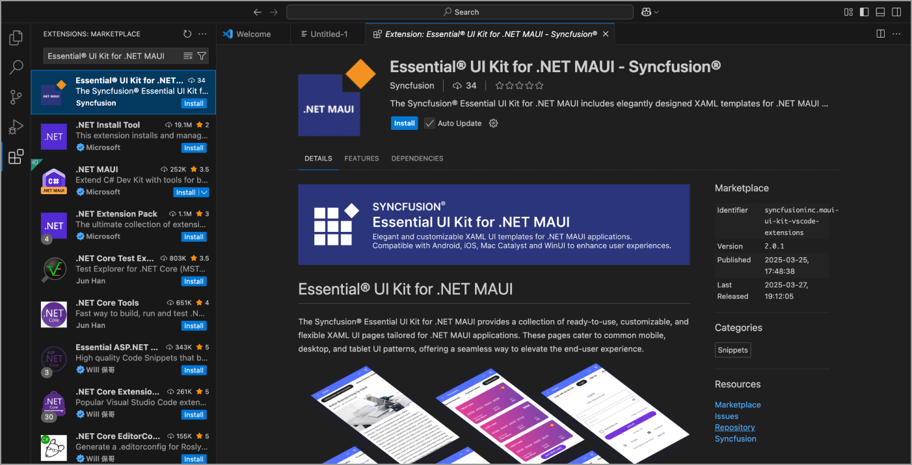

# Getting Started with Essential® UI Kit for .NET MAUI

There are two ways for including the UI Kit screens into your application:

1. Using the Visual Studio/Visual Studio Code extension's **Essential® UI Kit for .NET MAUI**.

2. Copying the files from our [GitHub repository](https://github.com/syncfusion/essential-ui-kit-for-.net-maui), which is open source.

To get start quickly with our **Essential® UI Kit for .NET MAUI**, you can check the below video.



## Essential® UI Kit for .NET MAUI Extension

This is the simplest way to integrate pre-defined screens into your application. Follow these steps to add screens to your app using our extension:




1. Open Visual Studio.

2. Go to **Extension**, and then click **Manage Extensions** as shown in the following screenshot.

   

3. Search for **Essential® UI Kit for .NET MAUI**, and then install it.

   

4. Restart the Visual Studio and allow it to complete the installation. 

5. Now, open an existing MAUI application or create a new application as per your requirements.
 
6. Right-click the MAUI [NETStandard] project, and you can see the **Essential® UI Kit for .NET MAUI** option.

N> The **Essential® UI Kit for .NET MAUI** add-in will be shown when the project have the **MAUI** NuGet package as a reference and also, MAUI project should be a NETStandard project.

7. Select the category and pages you need to add in your application. In the following screenshot, the **Login with Social Icon** screen has been selected from the **Forms** category. 

   
8. Clicking the 'Next' button will navigate to the following page to add page name : 

   

9. Clicking the 'Add' button will include the selected page to your project. The necessary class files, resources, and NuGet package references will automatically be added to your project as shown in the following screenshot.

   





1. Open Visual Studio Code.

2. Navigate to **View > Extensions**, and the Manage Extensions option will appear on the left side of the window. Alternatively, you can access the extensions by pressing **Ctrl+Shift+X**

    

3. By entering the keyword **Essential® UI Kit for .NET MAUI** in the search box, you can find the **Essential® UI Kit for .NET MAUI - Syncfusion®** Visual Studio Code extension in the Visual Studio Code Marketplace.

    

4. Install the **Essential® UI Kit for .NET MAUI - Syncfusion®** extension by clicking the Install button.

5. After installation, reload Visual Studio Code using the **Reload Window** command in the Visual Studio Code command palette. You can access the command palette by pressing **Ctrl+Shift+P** and searching for Reload Window command.

    

6. Now, open a new or existing MAUI application.

7. In File Explorer, right-click on your MAUI project's **.csproj** file and select **Essential®  UI Kit for .NET MAUI - Syncfusion®**. Alternatively, in **Solution Explorer**, right-click on your MAUI project's file, then select the same option for your MAUI project. Before launching the UI, ensure that the project is fully loaded, as this option will only be available if the project is fully loaded.

8. Choose the pages you want to add, enter a name for the page, and then click **Add**.

9. The selected pages will be added, including **View, ViewModel, Model** classes, resource files, and the **Syncfusion® NuGet package** reference.

   




## How to Render the Added Page?

In a MAUI demo application, to set the added page as the startup page, you need to define it in the **App.xaml.cs** file. For instance, if you’ve added the **Login with Social Icon Page**, you can set it as the startup page using the following code snippet:




// For NET 8 Use this Below Code Snippet

MainPage = new LoginWithSocialIcon();

// For NET 9 Use this Below Code Snippet

protected override Window CreateWindow(IActivationState? activationState)
{
    return new Window(new LoginWithSocialIcon());
}




In real-world applications, you may need to do the following to use these XAML pages:
1. Update the services to fetch data from a remote server or local database.
2. Wire up the navigation and update the business logic in the view models.

## Requesting Screens and Reporting Bugs

If you would like to request a new screen or report a bug in existing screens, create a feature request or submit a bug through our [feedback portal](https://www.syncfusion.com/feedback/maui?control=ui-kit)
