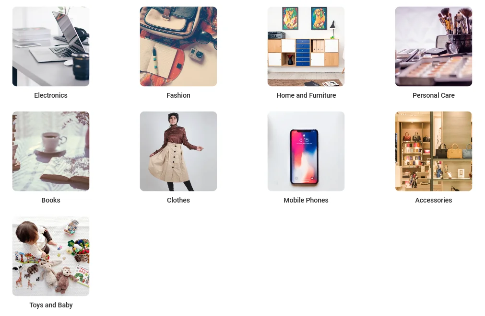
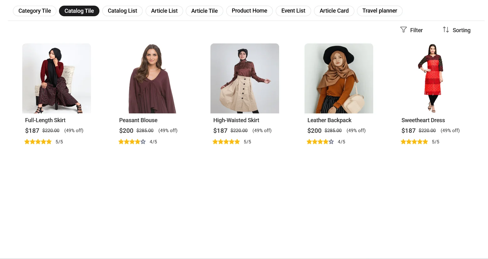
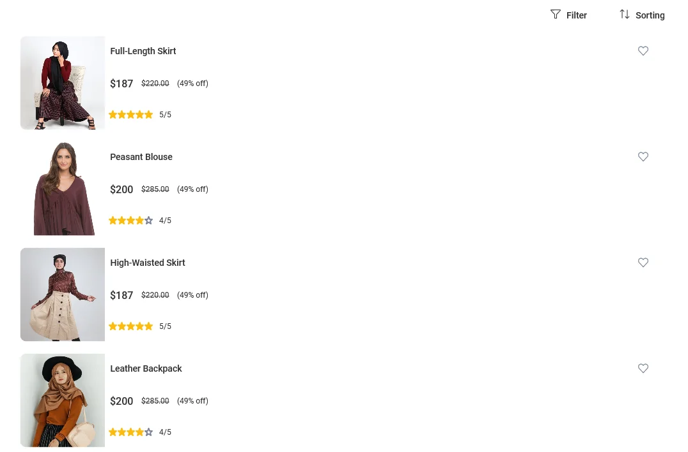
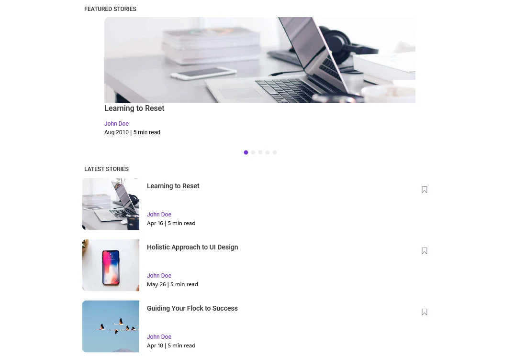
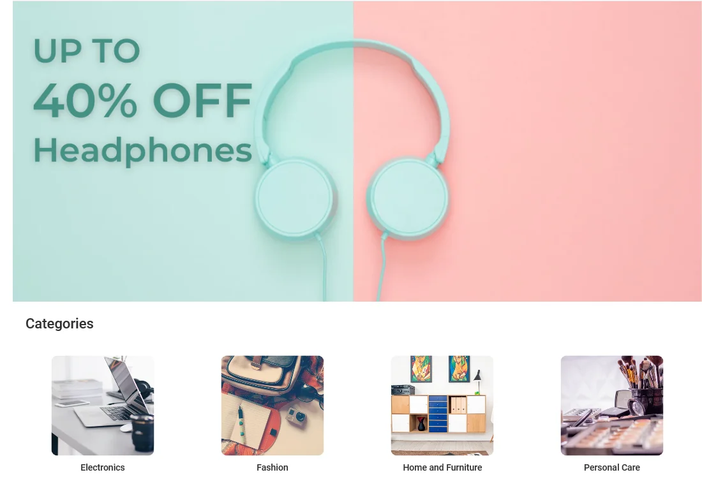
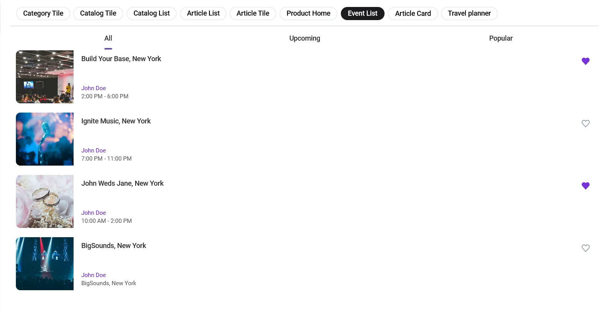
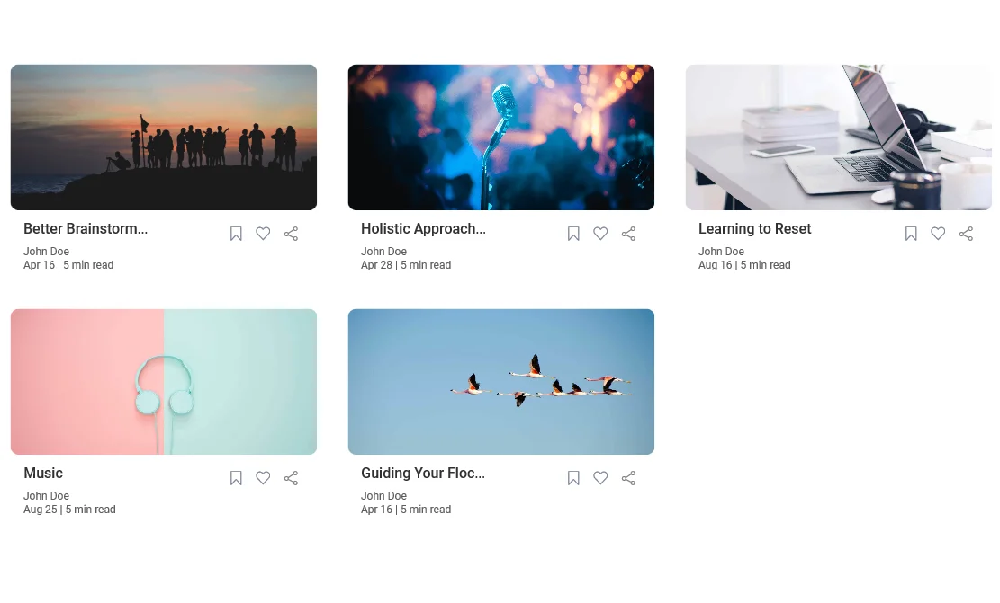
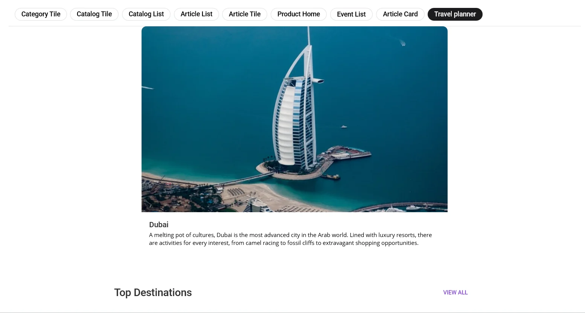

# Syncfusion® UI Kit for .NET MAUI Catalog Designs
The Essential® UI Kit for .NET MAUI Catalog offers a collection of **9 screens**, designed to streamline your development process and elevate your application’s user experience.
## Catalog

<!-- Card 1 -->

<h3 class="catalog-title">Category Tile Grid
<a href="https://github.com/syncfusion/essential-ui-kit-for-.net-maui/blob/master/EssentialMAUIUIKit/EssentialMAUIUIKit/Views/Catalog/CategoryTilePage.xaml"
              target="_blank"
              class="source-icon"
              title="View Source">
<svg xmlns="http://www.w3.org/2000/svg"
                    width="18"
                    height="18"
                    fill="currentColor"
                    viewBox="0 0 16 16">
<path d="M8 0C3.58 0 0 3.58 0 8c0 3.54 2.29 6.53 5.47 7.59.4.07.55-.17.55-.38
                   0-.19-.01-.82-.01-1.49-2.01.37-2.53-.49-2.69-.94-.09-.23-.48-.94-.82-1.13-.28-.15-.68-.52
                   -.01-.53.63-.01 1.08.58 1.23.82.72 1.21 1.87.87 2.33.66.07-.52.28-.87.51-1.07
                   -1.78-.2-3.64-.89-3.64-3.95 0-.87.31-1.59.82-2.15-.08-.2-.36-1.02.08-2.12
                   0 0 .67-.21 2.2.82a7.56 7.56 0 0 1 2-.27c.68 0 1.36.09 2 .27 1.53-1.04
                   2.2-.82 2.2-.82.44 1.1.16 1.92.08 2.12.51.56.82 1.27.82 2.15
                   0 3.07-1.87 3.75-3.65 3.95.29.25.54.73.54 1.48
                   0 1.07-.01 1.93-.01 2.2 0 .21.15.46.55.38A8.013 8.013 0 0 0 16 8
                   c0-4.42-3.58-8-8-8z"/>
</svg>
</a>
</h3>

               Explore product categories through visual tiles for quick browsing and easy navigation.

<!-- Card 2 -->

<h3 class="catalog-title">Product Catalog Tiles
<a href="https://github.com/syncfusion/essential-ui-kit-for-.net-maui/blob/master/EssentialMAUIUIKit/EssentialMAUIUIKit/Views/Catalog/CatalogTilePage.xaml"
              target="_blank"
              class="source-icon"
              title="View Source">
<svg xmlns="http://www.w3.org/2000/svg"
                    width="18"
                    height="18"
                    fill="currentColor"
                    viewBox="0 0 16 16">
<path d="M8 0C3.58 0 0 3.58 0 8c0 3.54 2.29 6.53 5.47 7.59.4.07.55-.17.55-.38
                   0-.19-.01-.82-.01-1.49-2.01.37-2.53-.49-2.69-.94-.09-.23-.48-.94-.82-1.13-.28-.15-.68-.52
                   -.01-.53.63-.01 1.08.58 1.23.82.72 1.21 1.87.87 2.33.66.07-.52.28-.87.51-1.07
                   -1.78-.2-3.64-.89-3.64-3.95 0-.87.31-1.59.82-2.15-.08-.2-.36-1.02.08-2.12
                   0 0 .67-.21 2.2.82a7.56 7.56 0 0 1 2-.27c.68 0 1.36.09 2 .27 1.53-1.04
                   2.2-.82 2.2-.82.44 1.1.16 1.92.08 2.12.51.56.82 1.27.82 2.15
                   0 3.07-1.87 3.75-3.65 3.95.29.25.54.73.54 1.48
                   0 1.07-.01 1.93-.01 2.2 0 .21.15.46.55.38A8.013 8.013 0 0 0 16 8
                   c0-4.42-3.58-8-8-8z"/>
</svg>
</a>
</h3>

               Browse products in a grid with images, prices, discounts, ratings, and quick filter or sort options.

<!-- Card 3 -->

<h3 class="catalog-title">Product Catalog List
<a href="https://github.com/syncfusion/essential-ui-kit-for-.net-maui/blob/master/EssentialMAUIUIKit/EssentialMAUIUIKit/Views/Catalog/CatalogListPage.xaml"
              target="_blank"
              class="source-icon"
              title="View Source">
<svg xmlns="http://www.w3.org/2000/svg"
                    width="18"
                    height="18"
                    fill="currentColor"
                    viewBox="0 0 16 16">
<path d="M8 0C3.58 0 0 3.58 0 8c0 3.54 2.29 6.53 5.47 7.59.4.07.55-.17.55-.38
                   0-.19-.01-.82-.01-1.49-2.01.37-2.53-.49-2.69-.94-.09-.23-.48-.94-.82-1.13-.28-.15-.68-.52
                   -.01-.53.63-.01 1.08.58 1.23.82.72 1.21 1.87.87 2.33.66.07-.52.28-.87.51-1.07
                   -1.78-.2-3.64-.89-3.64-3.95 0-.87.31-1.59.82-2.15-.08-.2-.36-1.02.08-2.12
                   0 0 .67-.21 2.2.82a7.56 7.56 0 0 1 2-.27c.68 0 1.36.09 2 .27 1.53-1.04
                   2.2-.82 2.2-.82.44 1.1.16 1.92.08 2.12.51.56.82 1.27.82 2.15
                   0 3.07-1.87 3.75-3.65 3.95.29.25.54.73.54 1.48
                   0 1.07-.01 1.93-.01 2.2 0 .21.15.46.55.38A8.013 8.013 0 0 0 16 8
                   c0-4.42-3.58-8-8-8z"/>
</svg>
</a>
</h3>

               View products in a vertical list with images, prices, ratings, and quick wishlist actions.

<!-- Card 1 -->

<h3 class="catalog-title">Article List View
<a href="https://github.com/syncfusion/essential-ui-kit-for-.net-maui/blob/master/EssentialMAUIUIKit/EssentialMAUIUIKit/Views/Catalog/ArticleListPage.xaml"
              target="_blank"
              class="source-icon"
              title="View Source">
<svg xmlns="http://www.w3.org/2000/svg"
                    width="18"
                    height="18"
                    fill="currentColor"
                    viewBox="0 0 16 16">
<path d="M8 0C3.58 0 0 3.58 0 8c0 3.54 2.29 6.53 5.47 7.59.4.07.55-.17.55-.38
                   0-.19-.01-.82-.01-1.49-2.01.37-2.53-.49-2.69-.94-.09-.23-.48-.94-.82-1.13-.28-.15-.68-.52
                   -.01-.53.63-.01 1.08.58 1.23.82.72 1.21 1.87.87 2.33.66.07-.52.28-.87.51-1.07
                   -1.78-.2-3.64-.89-3.64-3.95 0-.87.31-1.59.82-2.15-.08-.2-.36-1.02.08-2.12
                   0 0 .67-.21 2.2.82a7.56 7.56 0 0 1 2-.27c.68 0 1.36.09 2 .27 1.53-1.04
                   2.2-.82 2.2-.82.44 1.1.16 1.92.08 2.12.51.56.82 1.27.82 2.15
                   0 3.07-1.87 3.75-3.65 3.95.29.25.54.73.54 1.48
                   0 1.07-.01 1.93-.01 2.2 0 .21.15.46.55.38A8.013 8.013 0 0 0 16 8
                   c0-4.42-3.58-8-8-8z"/>
</svg>
</a>
</h3>

               Browse featured and latest articles with images, authors, and read time for quick discovery.

<!-- Card 2 -->

<h3 class="catalog-title">Featured Article Tile <a href="(https://github.com/syncfusion/essential-ui-kit-for-.net-maui/blob/master/EssentialMAUIUIKit/EssentialMAUIUIKit/Views/Catalog/ArticleTilePage.xaml"
              target="_blank"
              class="source-icon"
              title="View Source">
<svg xmlns="http://www.w3.org/2000/svg"
                    width="18"
                    height="18"
                    fill="currentColor"
                    viewBox="0 0 16 16">
<path d="M8 0C3.58 0 0 3.58 0 8c0 3.54 2.29 6.53 5.47 7.59.4.07.55-.17.55-.38
                   0-.19-.01-.82-.01-1.49-2.01.37-2.53-.49-2.69-.94-.09-.23-.48-.94-.82-1.13-.28-.15-.68-.52
                   -.01-.53.63-.01 1.08.58 1.23.82.72 1.21 1.87.87 2.33.66.07-.52.28-.87.51-1.07
                   -1.78-.2-3.64-.89-3.64-3.95 0-.87.31-1.59.82-2.15-.08-.2-.36-1.02.08-2.12
                   0 0 .67-.21 2.2.82a7.56 7.56 0 0 1 2-.27c.68 0 1.36.09 2 .27 1.53-1.04
                   2.2-.82 2.2-.82.44 1.1.16 1.92.08 2.12.51.56.82 1.27.82 2.15
                   0 3.07-1.87 3.75-3.65 3.95.29.25.54.73.54 1.48
                   0 1.07-.01 1.93-.01 2.2 0 .21.15.46.55.38A8.013 8.013 0 0 0 16 8
                   c0-4.42-3.58-8-8-8z"/>
</svg>
</a>
</h3>

               Highlight a main article with a large visual and quick access to related reads.

<!-- Card 3 -->

<h3 class="catalog-title">Product Home
<a href="https://github.com/syncfusion/essential-ui-kit-for-.net-maui/blob/master/EssentialMAUIUIKit/EssentialMAUIUIKit/Views/Catalog/ProductHomePage.xaml"
              target="_blank"
              class="source-icon"
              title="View Source">
<svg xmlns="http://www.w3.org/2000/svg"
                    width="18"
                    height="18"
                    fill="currentColor"
                    viewBox="0 0 16 16">
<path d="M8 0C3.58 0 0 3.58 0 8c0 3.54 2.29 6.53 5.47 7.59.4.07.55-.17.55-.38
                   0-.19-.01-.82-.01-1.49-2.01.37-2.53-.49-2.69-.94-.09-.23-.48-.94-.82-1.13-.28-.15-.68-.52
                   -.01-.53.63-.01 1.08.58 1.23.82.72 1.21 1.87.87 2.33.66.07-.52.28-.87.51-1.07
                   -1.78-.2-3.64-.89-3.64-3.95 0-.87.31-1.59.82-2.15-.08-.2-.36-1.02.08-2.12
                   0 0 .67-.21 2.2.82a7.56 7.56 0 0 1 2-.27c.68 0 1.36.09 2 .27 1.53-1.04
                   2.2-.82 2.2-.82.44 1.1.16 1.92.08 2.12.51.56.82 1.27.82 2.15
                   0 3.07-1.87 3.75-3.65 3.95.29.25.54.73.54 1.48
                   0 1.07-.01 1.93-.01 2.2 0 .21.15.46.55.38A8.013 8.013 0 0 0 16 8
                   c0-4.42-3.58-8-8-8z"/>
</svg>
</a>
</h3>

               Discover featured deals and categories from a visually rich home page with promotional highlights.

<!-- Card 1 -->

<h3 class="catalog-title">Event List View
<a href="https://github.com/syncfusion/essential-ui-kit-for-.net-maui/blob/master/EssentialMAUIUIKit/EssentialMAUIUIKit/Views/Catalog/EventListPage.xaml"
              target="_blank"
              class="source-icon"
              title="View Source">
<svg xmlns="http://www.w3.org/2000/svg"
                    width="18"
                    height="18"
                    fill="currentColor"
                    viewBox="0 0 16 16">
<path d="M8 0C3.58 0 0 3.58 0 8c0 3.54 2.29 6.53 5.47 7.59.4.07.55-.17.55-.38
                   0-.19-.01-.82-.01-1.49-2.01.37-2.53-.49-2.69-.94-.09-.23-.48-.94-.82-1.13-.28-.15-.68-.52
                   -.01-.53.63-.01 1.08.58 1.23.82.72 1.21 1.87.87 2.33.66.07-.52.28-.87.51-1.07
                   -1.78-.2-3.64-.89-3.64-3.95 0-.87.31-1.59.82-2.15-.08-.2-.36-1.02.08-2.12
                   0 0 .67-.21 2.2.82a7.56 7.56 0 0 1 2-.27c.68 0 1.36.09 2 .27 1.53-1.04
                   2.2-.82 2.2-.82.44 1.1.16 1.92.08 2.12.51.56.82 1.27.82 2.15
                   0 3.07-1.87 3.75-3.65 3.95.29.25.54.73.54 1.48
                   0 1.07-.01 1.93-.01 2.2 0 .21.15.46.55.38A8.013 8.013 0 0 0 16 8
                   c0-4.42-3.58-8-8-8z"/>
</svg>
</a>
</h3>

               Browse upcoming and popular events with images, times, locations, and quick favorites.

<!-- Card 2 -->

<h3 class="catalog-title">Article Card Grid
<a href="https://github.com/syncfusion/essential-ui-kit-for-.net-maui/blob/master/EssentialMAUIUIKit/EssentialMAUIUIKit/Views/Catalog/ArticleCardPage.xaml"
              target="_blank"
              class="source-icon"
              title="View Source">
<svg xmlns="http://www.w3.org/2000/svg"
                    width="18"
                    height="18"
                    fill="currentColor"
                    viewBox="0 0 16 16">
<path d="M8 0C3.58 0 0 3.58 0 8c0 3.54 2.29 6.53 5.47 7.59.4.07.55-.17.55-.38
                   0-.19-.01-.82-.01-1.49-2.01.37-2.53-.49-2.69-.94-.09-.23-.48-.94-.82-1.13-.28-.15-.68-.52
                   -.01-.53.63-.01 1.08.58 1.23.82.72 1.21 1.87.87 2.33.66.07-.52.28-.87.51-1.07
                   -1.78-.2-3.64-.89-3.64-3.95 0-.87.31-1.59.82-2.15-.08-.2-.36-1.02.08-2.12
                   0 0 .67-.21 2.2.82a7.56 7.56 0 0 1 2-.27c.68 0 1.36.09 2 .27 1.53-1.04
                   2.2-.82 2.2-.82.44 1.1.16 1.92.08 2.12.51.56.82 1.27.82 2.15
                   0 3.07-1.87 3.75-3.65 3.95.29.25.54.73.54 1.48
                   0 1.07-.01 1.93-.01 2.2 0 .21.15.46.55.38A8.013 8.013 0 0 0 16 8
                   c0-4.42-3.58-8-8-8z"/>
</svg>
</a>
</h3>

               Browse articles in a clean card layout with images, authors, read time, and quick save or share actions.

<!-- Card 3 -->

<h3 class="catalog-title">Travel Planner
<a href="https://github.com/syncfusion/essential-ui-kit-for-.net-maui/blob/master/EssentialMAUIUIKit/EssentialMAUIUIKit/Views/Catalog/TravelPlannerPage.xaml"
              target="_blank"
              class="source-icon"
              title="View Source">
<svg xmlns="http://www.w3.org/2000/svg"
                    width="18"
                    height="18"
                    fill="currentColor"
                    viewBox="0 0 16 16">
<path d="M8 0C3.58 0 0 3.58 0 8c0 3.54 2.29 6.53 5.47 7.59.4.07.55-.17.55-.38
                   0-.19-.01-.82-.01-1.49-2.01.37-2.53-.49-2.69-.94-.09-.23-.48-.94-.82-1.13-.28-.15-.68-.52
                   -.01-.53.63-.01 1.08.58 1.23.82.72 1.21 1.87.87 2.33.66.07-.52.28-.87.51-1.07
                   -1.78-.2-3.64-.89-3.64-3.95 0-.87.31-1.59.82-2.15-.08-.2-.36-1.02.08-2.12
                   0 0 .67-.21 2.2.82a7.56 7.56 0 0 1 2-.27c.68 0 1.36.09 2 .27 1.53-1.04
                   2.2-.82 2.2-.82.44 1.1.16 1.92.08 2.12.51.56.82 1.27.82 2.15
                   0 3.07-1.87 3.75-3.65 3.95.29.25.54.73.54 1.48
                   0 1.07-.01 1.93-.01 2.2 0 .21.15.46.55.38A8.013 8.013 0 0 0 16 8
                   c0-4.42-3.58-8-8-8z"/>
</svg>
</a>
</h3> 

               Discover destinations with rich visuals, highlights, and inspiration to plan memorable trips easily.

<!-- Popup Modal -->

&times;

