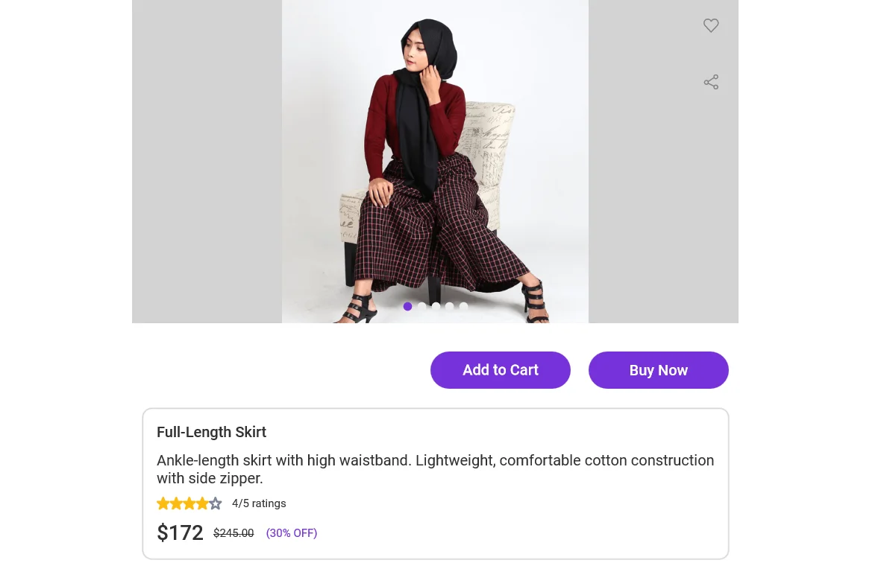
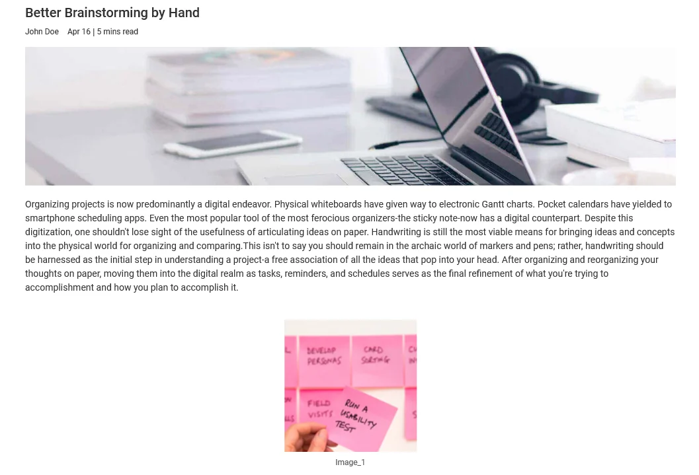
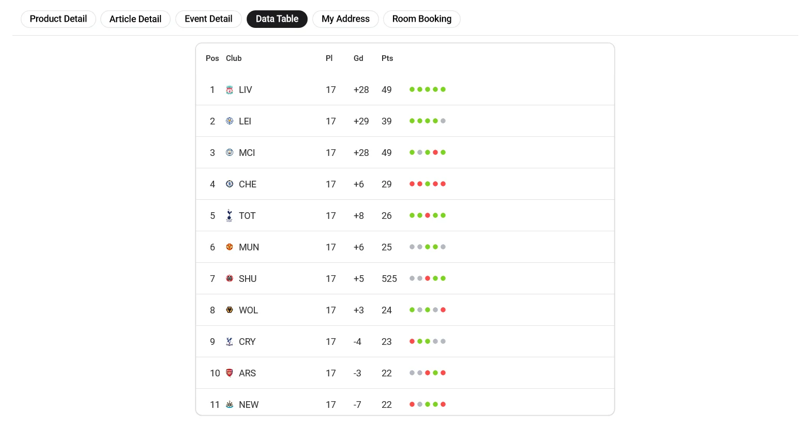
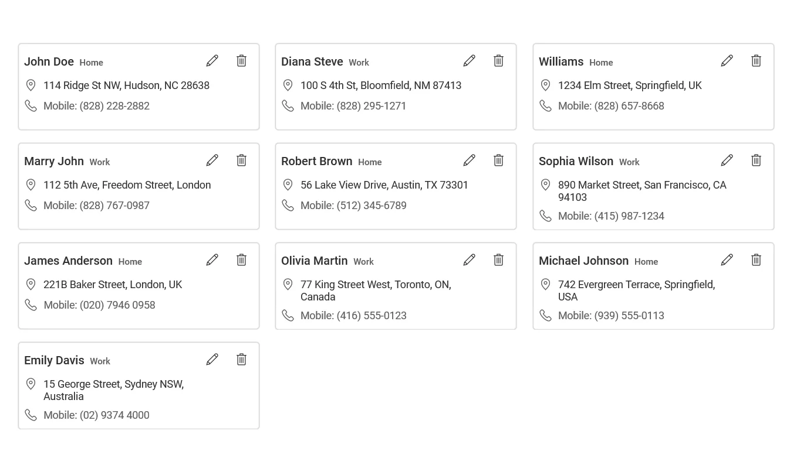
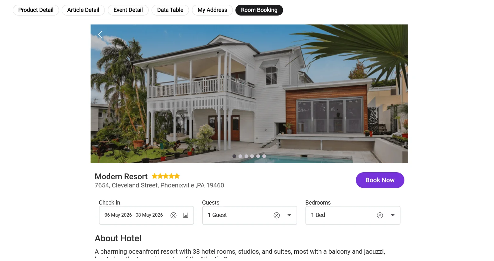

# Syncfusion® UI Kit for .NET MAUI Detail Designs

The Essential® UI Kit for .NET MAUI Details offers a collection of **6 screens**, designed to streamline your development process and elevate your application’s user experience.

## Detail	
 

<!-- Card 1 -->

<h3 class="form-title">Product Detail Page
<a href="https://github.com/syncfusion/essential-ui-kit-for-.net-maui/blob/master/EssentialMAUIUIKit/EssentialMAUIUIKit/Views/Detail/ProductDetailPage.xaml"
              target="_blank"
              class="source-icon"
              title="View Source">
<svg xmlns="http://www.w3.org/2000/svg"
                    width="18"
                    height="18"
                    fill="currentColor"
                    viewBox="0 0 16 16">
<path d="M8 0C3.58 0 0 3.58 0 8c0 3.54 2.29 6.53 5.47 7.59.4.07.55-.17.55-.38
                   0-.19-.01-.82-.01-1.49-2.01.37-2.53-.49-2.69-.94-.09-.23-.48-.94-.82-1.13-.28-.15-.68-.52
                   -.01-.53.63-.01 1.08.58 1.23.82.72 1.21 1.87.87 2.33.66.07-.52.28-.87.51-1.07
                   -1.78-.2-3.64-.89-3.64-3.95 0-.87.31-1.59.82-2.15-.08-.2-.36-1.02.08-2.12
                   0 0 .67-.21 2.2.82a7.56 7.56 0 0 1 2-.27c.68 0 1.36.09 2 .27 1.53-1.04
                   2.2-.82 2.2-.82.44 1.1.16 1.92.08 2.12.51.56.82 1.27.82 2.15
                   0 3.07-1.87 3.75-3.65 3.95.29.25.54.73.54 1.48
                   0 1.07-.01 1.93-.01 2.2 0 .21.15.46.55.38A8.013 8.013 0 0 0 16 8
                   c0-4.42-3.58-8-8-8z"/>
</svg>
</a>
</h3>

               View product images, price, ratings, and details with quick options to add to cart or buy.

<!-- Card 2 -->

<h3 class="form-title">Article Detail Page
<a href="https://github.com/syncfusion/essential-ui-kit-for-.net-maui/blob/master/EssentialMAUIUIKit/EssentialMAUIUIKit/Views/Detail/ArticleDetailPage.xaml"
              target="_blank"
              class="source-icon"
              title="View Source">
<svg xmlns="http://www.w3.org/2000/svg"
                    width="18"
                    height="18"
                    fill="currentColor"
                    viewBox="0 0 16 16">
<path d="M8 0C3.58 0 0 3.58 0 8c0 3.54 2.29 6.53 5.47 7.59.4.07.55-.17.55-.38
                   0-.19-.01-.82-.01-1.49-2.01.37-2.53-.49-2.69-.94-.09-.23-.48-.94-.82-1.13-.28-.15-.68-.52
                   -.01-.53.63-.01 1.08.58 1.23.82.72 1.21 1.87.87 2.33.66.07-.52.28-.87.51-1.07
                   -1.78-.2-3.64-.89-3.64-3.95 0-.87.31-1.59.82-2.15-.08-.2-.36-1.02.08-2.12
                   0 0 .67-.21 2.2.82a7.56 7.56 0 0 1 2-.27c.68 0 1.36.09 2 .27 1.53-1.04
                   2.2-.82 2.2-.82.44 1.1.16 1.92.08 2.12.51.56.82 1.27.82 2.15
                   0 3.07-1.87 3.75-3.65 3.95.29.25.54.73.54 1.48
                   0 1.07-.01 1.93-.01 2.2 0 .21.15.46.55.38A8.013 8.013 0 0 0 16 8
                   c0-4.42-3.58-8-8-8z"/>
</svg>
</a>
</h3>

               Read a full article with cover image, author details, publish date, and distraction‑free content view.

<!-- Card 3 -->

<h3 class="form-title">Event Detail Page
<a href="https://github.com/syncfusion/essential-ui-kit-for-.net-maui/blob/master/EssentialMAUIUIKit/EssentialMAUIUIKit/Views/Detail/EventDetailPage.xaml"
              target="_blank"
              class="source-icon"
              title="View Source">
<svg xmlns="http://www.w3.org/2000/svg"
                    width="18"
                    height="18"
                    fill="currentColor"
                    viewBox="0 0 16 16">
<path d="M8 0C3.58 0 0 3.58 0 8c0 3.54 2.29 6.53 5.47 7.59.4.07.55-.17.55-.38
                   0-.19-.01-.82-.01-1.49-2.01.37-2.53-.49-2.69-.94-.09-.23-.48-.94-.82-1.13-.28-.15-.68-.52
                   -.01-.53.63-.01 1.08.58 1.23.82.72 1.21 1.87.87 2.33.66.07-.52.28-.87.51-1.07
                   -1.78-.2-3.64-.89-3.64-3.95 0-.87.31-1.59.82-2.15-.08-.2-.36-1.02.08-2.12
                   0 0 .67-.21 2.2.82a7.56 7.56 0 0 1 2-.27c.68 0 1.36.09 2 .27 1.53-1.04
                   2.2-.82 2.2-.82.44 1.1.16 1.92.08 2.12.51.56.82 1.27.82 2.15
                   0 3.07-1.87 3.75-3.65 3.95.29.25.54.73.54 1.48
                   0 1.07-.01 1.93-.01 2.2 0 .21.15.46.55.38A8.013 8.013 0 0 0 16 8
                   c0-4.42-3.58-8-8-8z"/>
</svg>
</a>
</h3>

               View event details, date, time, location, attendees, and book tickets instantly.

<!-- Card 4 -->

<h3 class="form-title">Data Table View
<a href="https://github.com/syncfusion/essential-ui-kit-for-.net-maui/blob/master/EssentialMAUIUIKit/EssentialMAUIUIKit/Views/Detail/DataTablePage.xaml"
              target="_blank"
              class="source-icon"
              title="View Source">
<svg xmlns="http://www.w3.org/2000/svg"
                    width="18"
                    height="18"
                    fill="currentColor"
                    viewBox="0 0 16 16">
<path d="M8 0C3.58 0 0 3.58 0 8c0 3.54 2.29 6.53 5.47 7.59.4.07.55-.17.55-.38
                   0-.19-.01-.82-.01-1.49-2.01.37-2.53-.49-2.69-.94-.09-.23-.48-.94-.82-1.13-.28-.15-.68-.52
                   -.01-.53.63-.01 1.08.58 1.23.82.72 1.21 1.87.87 2.33.66.07-.52.28-.87.51-1.07
                   -1.78-.2-3.64-.89-3.64-3.95 0-.87.31-1.59.82-2.15-.08-.2-.36-1.02.08-2.12
                   0 0 .67-.21 2.2.82a7.56 7.56 0 0 1 2-.27c.68 0 1.36.09 2 .27 1.53-1.04
                   2.2-.82 2.2-.82.44 1.1.16 1.92.08 2.12.51.56.82 1.27.82 2.15
                   0 3.07-1.87 3.75-3.65 3.95.29.25.54.73.54 1.48
                   0 1.07-.01 1.93-.01 2.2 0 .21.15.46.55.38A8.013 8.013 0 0 0 16 8
                   c0-4.42-3.58-8-8-8z"/>
</svg>
</a>
</h3>

               View structured data in a clear table with rankings, stats, and quick performance indicators.

<!-- Card 5 -->

<h3 class="form-title">Saved Addresses
<a href="https://github.com/syncfusion/essential-ui-kit-for-.net-maui/blob/master/EssentialMAUIUIKit/EssentialMAUIUIKit/Views/Detail/MyAddressPage.xaml"
              target="_blank"
              class="source-icon"
              title="View Source">
<svg xmlns="http://www.w3.org/2000/svg"
                    width="18"
                    height="18"
                    fill="currentColor"
                    viewBox="0 0 16 16">
<path d="M8 0C3.58 0 0 3.58 0 8c0 3.54 2.29 6.53 5.47 7.59.4.07.55-.17.55-.38
                   0-.19-.01-.82-.01-1.49-2.01.37-2.53-.49-2.69-.94-.09-.23-.48-.94-.82-1.13-.28-.15-.68-.52
                   -.01-.53.63-.01 1.08.58 1.23.82.72 1.21 1.87.87 2.33.66.07-.52.28-.87.51-1.07
                   -1.78-.2-3.64-.89-3.64-3.95 0-.87.31-1.59.82-2.15-.08-.2-.36-1.02.08-2.12
                   0 0 .67-.21 2.2.82a7.56 7.56 0 0 1 2-.27c.68 0 1.36.09 2 .27 1.53-1.04
                   2.2-.82 2.2-.82.44 1.1.16 1.92.08 2.12.51.56.82 1.27.82 2.15
                   0 3.07-1.87 3.75-3.65 3.95.29.25.54.73.54 1.48
                   0 1.07-.01 1.93-.01 2.2 0 .21.15.46.55.38A8.013 8.013 0 0 0 16 8
                   c0-4.42-3.58-8-8-8z"/>
</svg>
</a>
</h3>

               Manage multiple saved addresses with options to add, edit, or delete for quick use.

<!-- Card 6 -->

<h3 class="form-title">Room Booking Detail
<a href="https://github.com/syncfusion/essential-ui-kit-for-.net-maui/blob/master/EssentialMAUIUIKit/EssentialMAUIUIKit/Views/Detail/RoomBookingPage.xaml"
              target="_blank"
              class="source-icon"
              title="View Source">
<svg xmlns="http://www.w3.org/2000/svg"
                    width="18"
                    height="18"
                    fill="currentColor"
                    viewBox="0 0 16 16">
<path d="M8 0C3.58 0 0 3.58 0 8c0 3.54 2.29 6.53 5.47 7.59.4.07.55-.17.55-.38
                   0-.19-.01-.82-.01-1.49-2.01.37-2.53-.49-2.69-.94-.09-.23-.48-.94-.82-1.13-.28-.15-.68-.52
                   -.01-.53.63-.01 1.08.58 1.23.82.72 1.21 1.87.87 2.33.66.07-.52.28-.87.51-1.07
                   -1.78-.2-3.64-.89-3.64-3.95 0-.87.31-1.59.82-2.15-.08-.2-.36-1.02.08-2.12
                   0 0 .67-.21 2.2.82a7.56 7.56 0 0 1 2-.27c.68 0 1.36.09 2 .27 1.53-1.04
                   2.2-.82 2.2-.82.44 1.1.16 1.92.08 2.12.51.56.82 1.27.82 2.15
                   0 3.07-1.87 3.75-3.65 3.95.29.25.54.73.54 1.48
                   0 1.07-.01 1.93-.01 2.2 0 .21.15.46.55.38A8.013 8.013 0 0 0 16 8
                   c0-4.42-3.58-8-8-8z"/>
</svg>
</a>
</h3>

               Browse hotel details, select dates and guests, and book rooms quickly from one page.

<!-- Popup Modal -->

&times;

