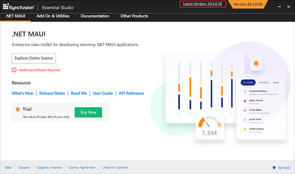

# Upgrading Syncfusion® .NET MAUI Installer to the Latest Version

Syncfusion® releases new volumes every three months, introducing exciting new features. Each volume release is followed by a Service Pack release to address major bug fixes.

You can upgrade your Syncfusion® installation to the latest version from any previously installed version.

Refer to our "[**Upgrade Guide**](https://help.syncfusion.com/upgrade-guide/maui-controls)" for .NET MAUI for detailed information about the "Breaking Changes, Bug Fixes, Features, and Known Issues" between your current version and the latest version.

## Upgrading to the latest version

The most recent version of Syncfusion® .NET MAUI can be downloaded and installed by clicking the "Latest Version: {Version}" link at the top of the Syncfusion® .NET MAUI Control Panel.

You can also upgrade to the latest version just by downloading and installing the platforms you require from this [link](https://www.syncfusion.com/account/downloads). The existing installed versions are not required to be uninstalled.

It is not required to install the Volume release before installing the Service Pack release. As releases for Volume and Service Packs work independently, you can install the latest version with major bug fixes directly.

## Upgrade from trial version to license version

To upgrade from the trial version, there are two possible solutions.

* Uninstall the trial version and install the fully licensed installer from the [License and Downloads](https://www.syncfusion.com/account/downloads) section of our website to upgrade from the trial version.
* If you are using Syncfusion® controls from [nuget.org](https://www.nuget.org/packages?q=syncfusion), replace the currently used trial license key with a paid license key that can be generated from the [License & Downloads](https://www.syncfusion.com/account/downloads) section of our website. Refer to [this](https://help.syncfusion.com/maui/licensing/how-to-register-in-an-application) topic for more information regarding registering the license in the application.

N> License registration is not required if you reference Syncfusion® assemblies from the licensed installer. These licensing changes applicable to all evaluators who refers the Syncfusion® assemblies from the evaluation installer and those who use Syncfusion® NuGet packages from [nuget.org](https://www.nuget.org/).

