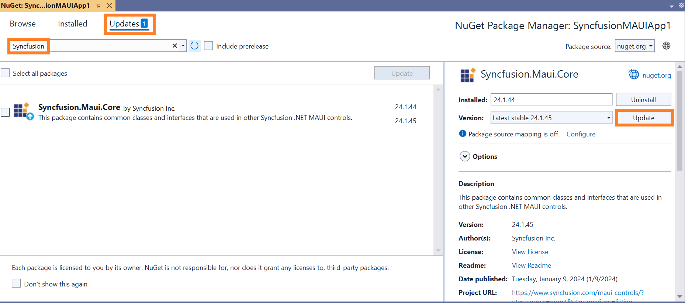
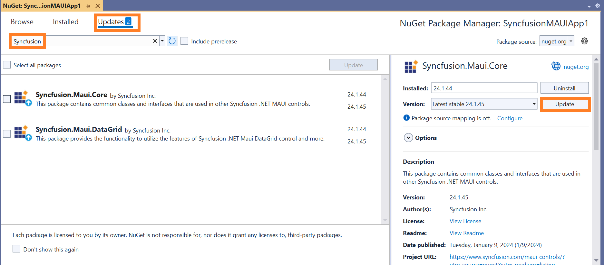
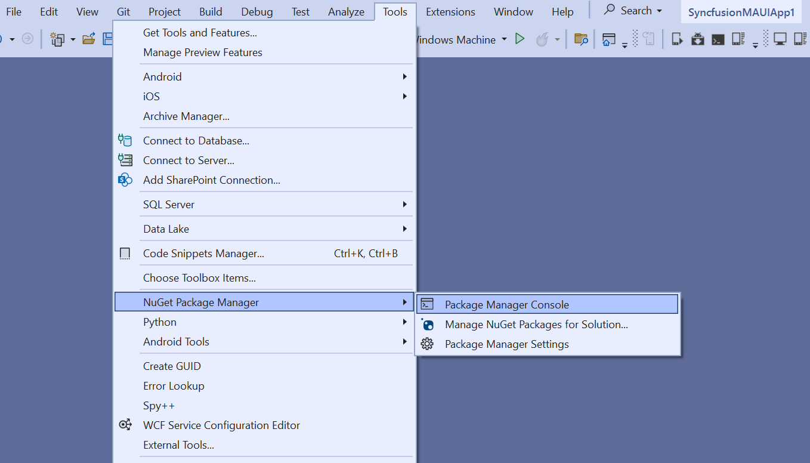
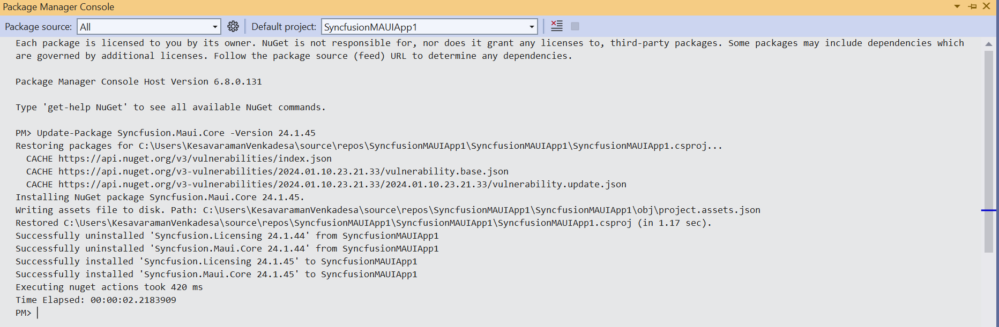

# Upgrading Syncfusion<sup>®</sup> MAUI NuGet Packages to a Latest Version

Every three months, Syncfusion<sup>®</sup> releases new volumes that include exciting new features. For this volume, there will be weekly NuGet releases and a service pack. Syncfusion<sup>®</sup> MAUI NuGet packages are released on a weekly basis to address critical issue fixes.

From any Syncfusion<sup>®</sup> MAUI NuGet version you have installed; you can update to our most recent version.

## Upgrade NuGet packages through Package Manager UI

The NuGet **Package Manager UI** in Visual Studio allows you to easily install, uninstall, and update NuGet packages in applications and solutions. You can find and upgrade the Syncfusion<sup>®</sup> MAUI NuGet packages to the most recent version or to specific version in the MAUI solution or application and this process is easy with the steps below:

1. Right-click on the MAUI application or solution in the Solution Explorer tab and choose **Manage NuGet Packages...**

    

    Alternatively, after opening the MAUI application in Visual Studio, go to the **Tools** menu, hover over **NuGet Package Manager**, select **Manage NuGet Packages for Solution...**

2. In the Manage NuGet Packages window, navigate to the **Updates** tab. Search for the Syncfusion<sup>®</sup> MAUI NuGet packages using a term like **"Syncfusion<sup>®</sup>"** and select the appropriate package for your application.

    N> The [nuget.org](https://api.nuget.org/v3/index.json) package source is selected by default in the Package source drop-down. If your Visual Studio does not have nuget.org configured, follow the instructions in the [Microsoft documents](https://learn.microsoft.com/en-us/nuget/consume-packages/install-use-packages-visual-studio#package-sources) to set up the nuget.org feed URL.

3. By default, the package will be selected with the latest version. Select the required version, click the **Update** button, and accept the license terms. The package will be upgraded to the selected version in your MAUI application.

    

    You can select multiple NuGet packages by selecting the checkbox and click the **Update** button to update the multiple Syncfusion<sup>®</sup> NuGet packages in your application.

    

## Upgrade NuGet packages through Dotnet (.NET) CLI

There is no distinct command for the update procedure in the Dotnet CLI. Unless you specify the package version, Dotnet CLI installs the latest version of the Syncfusion<sup>®</sup> MAUI NuGet packages when you use the dotnet add package command.

To specify a version, add the -v parameter:

```dotnet add package Syncfusion.Maui.Core -v 24.1.44```

## Upgrade NuGet packages through Package Manager Console

The **Package Manager Console** saves NuGet packages upgrade time since you don't have to search for the package to update. Simply type the command to update the appropriate Syncfusion<sup>®</sup> MAUI NuGet package. Follow the steps below to upgrade the installed Syncfusion<sup>®</sup> NuGet packages using the Package Manager Console in your MAUI application.

1. To show the Package Manager Console, open your MAUI application in Visual Studio, navigate to **Tools** in the Visual Studio menu, hover over **NuGet Package Manager**, and select **Package Manager Console**.

    

2. The Package Manager Console will appear at the bottom of the screen. You can install the Syncfusion<sup>®</sup> MAUI NuGet packages by enter the following NuGet update commands.

    ***Update specified Syncfusion<sup>®</sup> MAUI NuGet package***

    The below command will update the Syncfusion<sup>®</sup> MAUI NuGet package in the default MAUI application

    ```Update-Package <Package Name>```

    **For example:** Update-Package Syncfusion.Maui.Core

    ***Update specified Syncfusion<sup>®</sup> MAUI NuGet package in specified MAUI application***

    The below command will update the Syncfusion<sup>®</sup> MAUI NuGet package in the given MAUI application alone

    ```Update-Package <Package Name> -ProjectName <Project Name>```

    **For example:** Update-Package Syncfusion.Maui.Grid -ProjectName MauiApplication

3. By default, the package will be installed with the latest version. You can give the required version with the -Version term like below to install the Syncfusion<sup>®</sup> MAUI NuGet packages in the appropriate version.

    ```Update-Package Syncfusion.Maui.Core -Version 24.1.45```

    

4. The NuGet package manager will update the Syncfusion<sup>®</sup> MAUI NuGet package and any dependencies it has.