# Syncfusion® .NET MAUI Converters

Syncfusion® .NET MAUI provides a range of built-in value converters essential for developing applications with XAML. These converters play a crucial role in a cross-platform framework like .NET MAUI, which enables the creation of native mobile and desktop apps using C# and XAML.

## Adding a Syncfusion® MAUI Core reference

Syncfusion® .NET MAUI Converters are available in [Nuget.org](https://www.nuget.org/). To add [Converters](https://help.syncfusion.com/cr/maui/Syncfusion.Maui.Core.Converters.html?tabs=tabid-1) to your project, open the NuGet package manager in Visual Studio, search for [Syncfusion.Maui.Core](https://www.nuget.org/packages/Syncfusion.Maui.Core/) and then install it.

**Adding a namespace**

Step 1: Add the NuGet to the project as discussed in the above reference section. 

Step 2: Add the namespace as shown in the following code sample.





    xmlns:syncfusionConverters="clr-namespace:Syncfusion.Maui.Core.Converters;assembly=Syncfusion.Maui.Core"
            
	




    using Syncfusion.Maui.Core.Converters;





## Bool To object converter

The `BoolToObjectConverter` is designed to convert a Boolean value into an object. By specifying both a `TrueObject` and a `FalseObject`, the converter determines which object to use based on the binding value.

Refer to the following code example. Here, we’ll set two different font sizes for the text based on the `IsChecked` Boolean property of the `CheckBox` control.





<?xml version="1.0" encoding="utf-8" ?>
<ContentPage xmlns="http://schemas.microsoft.com/dotnet/2021/maui"
            xmlns:x="http://schemas.microsoft.com/winfx/2009/xaml"
            xmlns:syncfusionConverters="clr-namespace:Syncfusion.Maui.Core.Converters;assembly=Syncfusion.Maui.Core"
            x:Class="MAUIValueConverters.BoolToObjectConverterPage">
    <ContentPage.Resources>
        <syncfusionConverters:BoolToObjectConverter x:Key="boolToObjectConverter"  TrueValueObject="16" FalseValueObject="14"/>
    </ContentPage.Resources>
    <VerticalStackLayout WidthRequest="400" HorizontalOptions="Center" VerticalOptions="Center" Spacing="20">
        <Label Text="Select your favorite fruit: "/>
        <Grid>
            <Grid.RowDefinitions>
                <RowDefinition Height="*"/>
                <RowDefinition Height="*"/>
                <RowDefinition Height="*"/>
                <RowDefinition Height="*"/>
            </Grid.RowDefinitions>
            <Grid.ColumnDefinitions>
                <ColumnDefinition Width="40"/>
                <ColumnDefinition Width="*"/>
            </Grid.ColumnDefinitions>

            <CheckBox x:Name="checkBox1" Grid.Row="0" Grid.Column="0" />
            <Label VerticalOptions="Center"  Grid.Row="0" Grid.Column="1"  BindingContext="{x:Reference checkBox1}" Text="Apple" FontSize="{Binding IsChecked, Converter={StaticResource boolToObjectConverter}}"/>

            <CheckBox x:Name="checkBox2" Grid.Row="1" Grid.Column="0" />
            <Label   VerticalOptions="Center"  Grid.Row="1" Grid.Column="1"  BindingContext="{x:Reference checkBox2}" Text="Orange" FontSize="{Binding IsChecked, Converter={StaticResource boolToObjectConverter}}"/>

            <CheckBox x:Name="checkBox3" Grid.Row="2" Grid.Column="0" />
            <Label  VerticalOptions="Center"  Grid.Row="2" Grid.Column="1"  BindingContext="{x:Reference checkBox3}" Text="Mango" FontSize="{Binding IsChecked, Converter={StaticResource boolToObjectConverter}}"/>

            <CheckBox x:Name="checkBox4" Grid.Row="3" Grid.Column="0" />
            <Label  VerticalOptions="Center"  Grid.Row="3" Grid.Column="1"  BindingContext="{x:Reference checkBox4}" Text="Strawberry" FontSize="{Binding IsChecked, Converter={StaticResource boolToObjectConverter}}"/>
        </Grid>
        <Label Text="* The font size of a specific fruit name will increase if it is checked." FontSize="12"/>
    </VerticalStackLayout>
</ContentPage>





The following gif image illustrates the result of the above code.

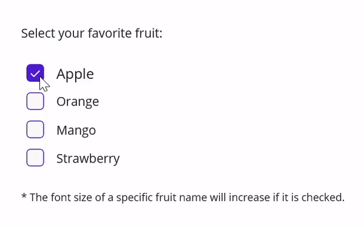

## Bool To opacity converter

The `BoolToOpacityConverter` converts a Boolean value into an opacity value.

Refer to the following code example. Here, the image will be shown if the Boolean value is true.





<?xml version="1.0" encoding="utf-8" ?>
<ContentPage xmlns="http://schemas.microsoft.com/dotnet/2021/maui"
xmlns:x="http://schemas.microsoft.com/winfx/2009/xaml"
xmlns:syncfusionConverters="clr-namespace:Syncfusion.Maui.Core.Converters;assembly=Syncfusion.Maui.Core"
x:Class="MAUIValueConverters.BoolToOpacityConverterPage">

    <ContentPage.Resources>
    <syncfusionConverters:BoolToOpacityConverter x:Key="boolToOpacityConverter"/>
    </ContentPage.Resources>

    <VerticalStackLayout WidthRequest="400">
        <Grid HeightRequest="300">
            <Image BindingContext="{x:Reference visibilitySwitch}"
            IsVisible="{Binding IsToggled, Converter={StaticResource boolToOpacityConverter}}"
            Source="dotnet_bot.png"
            SemanticProperties.Description="Cute dot net bot waving hi to you!"
            HeightRequest="200"
            HorizontalOptions="Center" />
        </Grid>
        <Label Text="Show / Hide image with bool value" HorizontalOptions="Center"/>
        <Switch x:Name="visibilitySwitch" IsToggled="True" HorizontalOptions="Center"/>
    </VerticalStackLayout>
</ContentPage>





The following gif image illustrates the result of the above code.

## Brush To color converter

The `BrushToColorConverter` is also a type converter. It converts any `Brush` into a `Color.` This converter has the ConvertBack method, so it also works in two-way binding mode.

Refer to the following code example. Here, the `Stroke` property is set as the binding value for the `BackgroundColor` property using the `BrushToColorConverter`.





<?xml version="1.0" encoding="utf-8" ?>
<ContentPage xmlns="http://schemas.microsoft.com/dotnet/2021/maui"
            xmlns:x="http://schemas.microsoft.com/winfx/2009/xaml"
            xmlns:syncfusionConverters="clr-namespace:Syncfusion.Maui.Core.Converters;assembly=Syncfusion.Maui.Core"
            x:Class="MAUIValueConverters.BrushToColorConverterPage">
    <ContentPage.Resources>
        <syncfusionConverters:BrushToColorConverter x:Key="brushToColorConverter"/>
    </ContentPage.Resources>
    <VerticalStackLayout WidthRequest="400" Spacing="20" VerticalOptions="Center">
        <Grid RowDefinitions="Auto" ColumnDefinitions="50*,50*" ColumnSpacing="30" Padding="10">
            <Label Text="Stroke (Brush) " FontSize="16" VerticalOptions="Center"  FontAttributes="Bold"/>
            <Rectangle x:Name="brushProperty" Grid.Column="1" HeightRequest="50" Stroke="Green" StrokeThickness="5" WidthRequest="50" HorizontalOptions="Start"/>

        </Grid>
        <Grid RowDefinitions="Auto" ColumnDefinitions="50*,50*" ColumnSpacing="30" Padding="10">
            <Label Text="BackgroundColor (Color)" FontSize="16" VerticalOptions="Center"  FontAttributes="Bold"/>
            <StackLayout Grid.Column="1"
                        BindingContext="{x:Reference brushProperty}"
                        HeightRequest="50"
                        WidthRequest="50"
                        BackgroundColor="{Binding Stroke,Converter={StaticResource brushToColorConverter}}" 
                        HorizontalOptions="Start"/>
        </Grid>

        <Label FontSize="12" Text="* Stroke property is set to a binding value for the BackgroundColor property."/>
    </VerticalStackLayout>
</ContentPage>





The following screenshot illustrates the result of the above code.

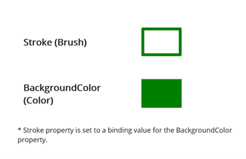

## Color To brush converter

The `ColorToBrushConverter` is a type converter. It converts any `Color` to a `Brush.` This converter has the `ConvertBack` method, so it also works in two-way binding mode.

Refer to the following code example. Here, the `BackgroundColor` property is set as the binding value for the `Stroke` (Brush) property using the `ColorToBrushConverter`.





<?xml version="1.0" encoding="utf-8" ?>
<ContentPage xmlns="http://schemas.microsoft.com/dotnet/2021/maui"
            xmlns:x="http://schemas.microsoft.com/winfx/2009/xaml"
            xmlns:syncfusionConverters="clr-namespace:Syncfusion.Maui.Core.Converters;assembly=Syncfusion.Maui.Core"
            x:Class="MAUIValueConverters.ColorToBrushConverterPage">
    <ContentPage.Resources>
        <syncfusionConverters:ColorToBrushConverter x:Key="colorToBrushConverter"/>
    </ContentPage.Resources>
    <VerticalStackLayout WidthRequest="400" Spacing="20" VerticalOptions="Center">
        
        <Grid RowDefinitions="Auto" ColumnDefinitions="50*,50*" ColumnSpacing="30" Padding="10">
            <Label Text="BackgroundColor (Color)" FontSize="16" VerticalOptions="Center"  FontAttributes="Bold"/>
            <StackLayout Grid.Column="1" x:Name="colorProperty" 
                        HeightRequest="50"
                        WidthRequest="50"
                        BackgroundColor="Green" HorizontalOptions="Start"/>
        </Grid>

        <Grid RowDefinitions="Auto" ColumnDefinitions="50*,50*" ColumnSpacing="30" Padding="10">
            <Label Text="Stroke (Brush) " FontSize="16" VerticalOptions="Center" FontAttributes="Bold"/>
            <Rectangle BindingContext="{x:Reference colorProperty}" Grid.Column="1" HeightRequest="50" Stroke="{Binding BackgroundColor, Converter= {StaticResource colorToBrushConverter}}" StrokeThickness="5" WidthRequest="50" HorizontalOptions="Start"/>

        </Grid>
        <Label FontSize="12" Text="* BackgroundColor property is set to a binding value for the Rectangle Stroke property."/>
    </VerticalStackLayout>
</ContentPage>





The following screenshot illustrates the result of the above code.

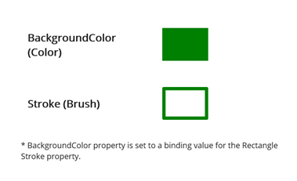

## Color to on color converter

The `ColorToOnColorConverter` can convert the text color to white or black based on its background color density.

Refer to the following code example. Here, the `TextColor` property is set based on the `BackgroundColor` property using the `ColorToOnColorConverter`.





<?xml version="1.0" encoding="utf-8" ?>
<ContentPage xmlns="http://schemas.microsoft.com/dotnet/2021/maui"
            xmlns:x="http://schemas.microsoft.com/winfx/2009/xaml"
            xmlns:syncfusionConverters="clr-namespace:Syncfusion.Maui.Core.Converters;assembly=Syncfusion.Maui.Core"
            x:Class="MAUIValueConverters.ColorToOnColorConverterPage">
    <ContentPage.Resources>
        <syncfusionConverters:ColorToOnColorConverter x:Key="colorToOnColorConverter"/>
    </ContentPage.Resources>
    <VerticalStackLayout WidthRequest="400" Spacing="20" VerticalOptions="Center" HorizontalOptions="Center">
        <HorizontalStackLayout Spacing="20" HorizontalOptions="Center">
            <Grid x:Name="parentGrid" HeightRequest="80" WidthRequest="190" BackgroundColor="MediumVioletRed">
                <Label BindingContext="{x:Reference parentGrid}" HorizontalOptions="Center" VerticalOptions="Center" FontSize="16" Text="Text Color" TextColor="{Binding BackgroundColor, Converter={StaticResource colorToOnColorConverter}}" />
            </Grid>
            <Grid x:Name="parentGrid1" HeightRequest="80" WidthRequest="190" BackgroundColor="LightPink">

                <Label BindingContext="{x:Reference parentGrid1}" HorizontalOptions="Center" VerticalOptions="Center" FontSize="16" Text="Text Color" TextColor="{Binding BackgroundColor, Converter={StaticResource colorToOnColorConverter}}" />
            </Grid>
        </HorizontalStackLayout>
        <Label Text="* White color text for dark background and black color text for light background" HorizontalOptions="Center" FontSize="12"/>
    </VerticalStackLayout>
</ContentPage>





The following screenshot illustrates the result of the above code.

## Color to grayscale color converter

The `ColorToGrayScaleColorConverter` converts a color into its grayscale value color.

Refer to the following code example. Here, the first content has a yellow background color, whereas the second content’s background color is set based on the `BackgroundColor` property of the first content using the `ColorToGrayScaleColorConverter`.
 




<?xml version="1.0" encoding="utf-8" ?>
<ContentPage xmlns="http://schemas.microsoft.com/dotnet/2021/maui"
            xmlns:x="http://schemas.microsoft.com/winfx/2009/xaml"
            xmlns:syncfusionConverters="clr-namespace:Syncfusion.Maui.Core.Converters;assembly=Syncfusion.Maui.Core"
            x:Class="MAUIValueConverters.ColorToGrayScaleColorConverterPage">
    <ContentPage.Resources>
        <syncfusionConverters:ColorToGrayScaleColorConverter x:Key="colorToGrayScaleColorConverter"/>
    </ContentPage.Resources>
    <VerticalStackLayout WidthRequest="400" Spacing="20" VerticalOptions="Center" HorizontalOptions="Center">
        <HorizontalStackLayout Spacing="20" HorizontalOptions="Center">
            <Grid x:Name="parentGrid" HeightRequest="80" WidthRequest="190" BackgroundColor="Yellow">
                <Label HorizontalOptions="Center" VerticalOptions="Center" FontSize="16" Text="Color" TextColor="Black" />
            </Grid>
            <Grid BindingContext="{x:Reference parentGrid}" HeightRequest="80" WidthRequest="190" BackgroundColor="{Binding BackgroundColor, Converter={StaticResource colorToGrayScaleColorConverter}}">
                <Label HorizontalOptions="Center" VerticalOptions="Center" FontSize="16" Text="GrayScale Color" TextColor="Black" />
            </Grid>
        </HorizontalStackLayout>
        <Label Text="* The first content has a yellow background color, whereas the second content's background color is the grayscale color of the first." HorizontalOptions="Center" FontSize="12"/>
    </VerticalStackLayout>
</ContentPage>





The following screenshot illustrates the result of the above code.

## Color to inverse color converter

The `ColorToInverseColorConverter` is used to convert a color into its inverse color.

Refer to the following code example. Here, the first content has a yellow background color, whereas the second content’s background color is set based on the `BackgroundColor` property of the first content.





<?xml version="1.0" encoding="utf-8" ?>
<ContentPage xmlns="http://schemas.microsoft.com/dotnet/2021/maui"
            xmlns:x="http://schemas.microsoft.com/winfx/2009/xaml"
            xmlns:syncfusionConverters="clr-namespace:Syncfusion.Maui.Core.Converters;assembly=Syncfusion.Maui.Core"
            x:Class="MAUIValueConverters.ColorToInverseColorConverterPage">
    <ContentPage.Resources>
        <syncfusionConverters:ColorToInverseColorConverter x:Key="colorToInverseColorConverter"/>
    </ContentPage.Resources>
    <VerticalStackLayout WidthRequest="400" Spacing="20" VerticalOptions="Center" HorizontalOptions="Center">
        <HorizontalStackLayout Spacing="20" HorizontalOptions="Center">
            <Grid x:Name="parentGrid" HeightRequest="80" WidthRequest="190" BackgroundColor="Yellow">
                <Label HorizontalOptions="Center" VerticalOptions="Center" FontSize="16" Text="Color" TextColor="Black" />
            </Grid>
            <Grid BindingContext="{x:Reference parentGrid}" HeightRequest="80" WidthRequest="190" BackgroundColor="{Binding BackgroundColor, Converter={StaticResource colorToInverseColorConverter}}">
                <Label HorizontalOptions="Center" VerticalOptions="Center" FontSize="16" Text="Inverse Color" TextColor="White" />
            </Grid>
        </HorizontalStackLayout>
        <Label Text="* The first content has a yellow background color, whereas the second content's background color is the inverse of the first." HorizontalOptions="Center" FontSize="12"/>
    </VerticalStackLayout>
</ContentPage>





The following screenshot illustrates the result of the above code.

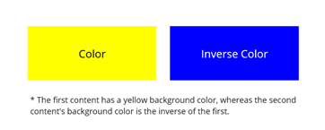

## Compare converter

The CompareConverter can convert an object into another by comparing the `Value` and `ComparingValue` properties using the `ComparisonOperator.` Based on the result, it returns the `TrueObject` or `FalseObject.` If TrueObject and FalseObject are not set by the user, it will return a Boolean value.

Refer to the following code example. Here, we’ll set the TrueObject as "Available", FalseObject as "Not_Available", ComparisonOperator as "GreaterThan", and ComparingValue as double four. If the item count is greater than four, it will return the TrueObject. Otherwise it will return FalseObject.
 





<?xml version="1.0" encoding="utf-8" ?>
<ContentPage xmlns="http://schemas.microsoft.com/dotnet/2021/maui"
            xmlns:x="http://schemas.microsoft.com/winfx/2009/xaml"
            xmlns:syncfusionConverters="clr-namespace:Syncfusion.Maui.Core.Converters;assembly=Syncfusion.Maui.Core"
            x:Class="MAUIValueConverters.CompareConverterPage">
    <ContentPage.Resources>
        <x:Double x:Key="ComparingValue">4</x:Double>
    </ContentPage.Resources>
    
    <VerticalStackLayout WidthRequest="400" VerticalOptions="Center" Spacing="20">
        <Label Text="Laptop Sale!!!" FontSize="16" HorizontalOptions="Center"/>
        
        <HorizontalStackLayout Spacing="10" HorizontalOptions="Center">
            <Label Text="Item count: " VerticalOptions="Center"/>
            <Label BindingContext="{x:Reference stepper}" VerticalOptions="Center" Text="{Binding Value}"/>
            <Stepper x:Name="stepper" Minimum="0" Maximum="10" Value="2" />
        </HorizontalStackLayout>
        <Label Text="* Offer - buy 4 or more get 50% OFF" FontSize="12" HorizontalOptions="Center"/>
        <HorizontalStackLayout Spacing="10" HorizontalOptions="Center">
            <Label Text="Offer : "/>
            <Label BindingContext="{x:Reference stepper}"  Text="{Binding Value,Converter={syncfusionConverters:CompareConverter ComparisonOperator=GreaterOrEqual, ValueForComparing={StaticResource ComparingValue}, FalseValueObject=Not_Available, TrueValueObject=Available}}"
                    TextColor="{Binding Value,Converter={syncfusionConverters:CompareConverter ComparisonOperator=GreaterOrEqual, ValueForComparing={StaticResource ComparingValue}, FalseValueObject=#FF0000, TrueValueObject=#00FF00}}"/>
        </HorizontalStackLayout>
    </VerticalStackLayout>
</ContentPage>





The following gif image illustrates the result of the above code.

## Decimal value converter

The `DecimalValueConverter` is a value converter that converts the input value into a specified number of fractional digits based on the decimal digits that the user provides.

Refer to the following code example. Here, I have assigned the NumberDecimalDigits property as 2. So, the total stock value’s fractional digits will be rounded off at two digits.





<?xml version="1.0" encoding="utf-8" ?>
<ContentPage xmlns="http://schemas.microsoft.com/dotnet/2021/maui"
            xmlns:x="http://schemas.microsoft.com/winfx/2009/xaml"
            xmlns:syncfusionConverters="clr-namespace:Syncfusion.Maui.Core.Converters;assembly=Syncfusion.Maui.Core"
            x:Class="MAUIValueConverters.DecimalValueConverterPage"
            xmlns:local="clr-namespace:MAUIValueConverters">

    <ContentPage.BindingContext>
        <local:DecimalValueConverterViewModel/>
    </ContentPage.BindingContext>

    <ContentPage.Resources>
        <ResourceDictionary>
            <syncfusionConverters:DecimalValueConverter x:Key="DecimalValueConverter" OutputType="String" NumberDecimalDigits="2"/>
            
        </ResourceDictionary>
    </ContentPage.Resources>

    <Grid  HorizontalOptions="Center" VerticalOptions="Center"
        RowSpacing="10" ColumnSpacing="30"
        RowDefinitions="*,*,*" ColumnDefinitions="*,*">

        <Label Grid.Row="0" Grid.Column="0"
            Text="Value of one stock price in numbers"/>

        <Entry  Grid.Row="0" Grid.Column="1" Text="{Binding CostPerStock}"
                HorizontalTextAlignment="Center" VerticalTextAlignment="Center"/>

        <Label Grid.Row="1" Grid.Column="0"
            Text="Quantity purchased"/>

        <Grid Grid.Row="1" Grid.Column="1"
            ColumnDefinitions="*,*" ColumnSpacing="10">

            <Stepper Minimum="1" Maximum="100" Value="{Binding Quantity}"
                    HorizontalOptions="Center" VerticalOptions="Center"/>
            <Label   Text="{Binding Quantity}" Grid.Column="1"/>
        </Grid>

        <Label Grid.Row="2"
            Text="Total stock value"/>

        <Label Grid.Row="2" Grid.Column="1"
            Text="{Binding TotalValue,Converter={StaticResource DecimalValueConverter}}" TextColor="Red"/>
    </Grid>
</ContentPage>





public class DecimalValueConverterViewModel : INotifyPropertyChanged
{
    private double quantity;
    private string totalValue;
    private string costPerStock = "1";

    public double Quantity
    {
        get { return quantity; }
        set 
        {
            quantity = value;
            OnPropertyChanged();
        }
    }

    public string TotalValue
    {
        get { return totalValue; }
        set 
        { 
            totalValue = value;
            OnPropertyChanged();
        }
    }
    public string CostPerStock
    {
        get { return costPerStock; }
        set 
        {
            if (value == "")
                costPerStock = "0";
            else
                costPerStock = value;
            OnPropertyChanged();
            
        }
    }

    public event PropertyChangedEventHandler PropertyChanged;

    public void OnPropertyChanged([CallerMemberName] string propertyName = null)
    {
        PropertyChanged?.Invoke(this, new PropertyChangedEventArgs(propertyName));

        if(propertyName == nameof(CostPerStock) || propertyName == nameof(Quantity))
            TotalValue = (Convert.ToDouble(CostPerStock) * Quantity).ToString();
    }
}





The following gif image illustrates the result of the above code.

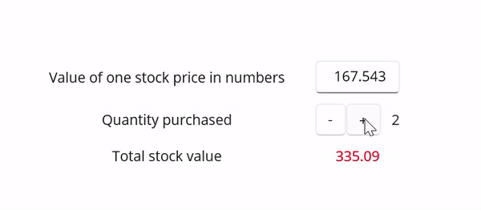

## Double to int converter

The `DoubleToIntConverter` is a value converter that converts a double value into an integer value.

Refer to the following code example. Here, the slider value is converted to an integer value assigned to the selected index of the Picker control.





<?xml version="1.0" encoding="utf-8" ?>
<ContentPage xmlns="http://schemas.microsoft.com/dotnet/2021/maui"
            xmlns:x="http://schemas.microsoft.com/winfx/2009/xaml"
            xmlns:syncfusionConverters="clr-namespace:Syncfusion.Maui.Core.Converters;assembly=Syncfusion.Maui.Core"
            x:Class="MAUIValueConverters.DoubleToIntConverterPage">

    <ContentPage.Resources>
        <syncfusionConverters:DoubleToIntConverter x:Key="DoubleToIntConverter"/>
        <ResourceDictionary>
            <x:Array x:Key="Color" Type="{x:Type x:String}">
                <x:String>Worst</x:String>
                <x:String>Very Poor</x:String>
                <x:String>Poor</x:String>
                <x:String>Below Average</x:String>
                <x:String>Average</x:String>
                <x:String>Above Average</x:String>
                <x:String>Satisfied</x:String>
                <x:String>Very Satisfied</x:String>
                <x:String>Excellent</x:String>
                <x:String>Very Excellent</x:String>
            </x:Array>
        </ResourceDictionary>
    </ContentPage.Resources>

    <VerticalStackLayout Spacing="20"
                            HorizontalOptions="Center"
                            VerticalOptions="Center">
        <Slider  x:Name="sliderValue" Maximum="10" Minimum="0" />

        <Label Text="{Binding Source={x:Reference sliderValue},
                    Path=Value,
                    StringFormat='Your level based on your mark {0:F2}'}" />

        <Picker BindingContext="{x:Reference sliderValue}" 
                ItemsSource="{StaticResource Color}" 
                SelectedIndex="{Binding Value ,Converter={StaticResource DoubleToIntConverter},Mode=TwoWay}"
                WidthRequest="200" />
    </VerticalStackLayout>
</ContentPage>





The following gif image illustrates the result of the above code.

## Enum to int converter

The `EnumToIntConverter` can convert an enum value to its primitive integer data type.

Refer to the following code example. Here, when the user selects a value from the picker, the corresponding integer value will be displayed on the label.





<?xml version="1.0" encoding="utf-8" ?>
<ContentPage xmlns="http://schemas.microsoft.com/dotnet/2021/maui"
            xmlns:x="http://schemas.microsoft.com/winfx/2009/xaml"
            xmlns:syncfusionConverters="clr-namespace:Syncfusion.Maui.Core.Converters;assembly=Syncfusion.Maui.Core"
            x:Class="MAUIValueConverters.EnumToIntConverterPage"
            xmlns:local="clr-namespace:MAUIValueConverters">

    <ContentPage.Resources>
        <ResourceDictionary>
            <syncfusionConverters:EnumToIntConverter x:Key="EnumToIntConverter"/>
        </ResourceDictionary>
    </ContentPage.Resources>

    <ContentPage.BindingContext>
        <local:EnumToIntViewModel/>
    </ContentPage.BindingContext>

    <ContentPage.Content>
        <StackLayout HorizontalOptions="Center" VerticalOptions="Center">

            <Grid RowDefinitions="*,*" HorizontalOptions="Center" RowSpacing="20">
            <HorizontalStackLayout Spacing="20">
                <Label Text="Select the category to identify the floor"
                    HorizontalTextAlignment="Center"
                    VerticalTextAlignment="Center"/>
                <Picker x:Name="directionPicker"
                    TitleColor="Black"
                    ItemsSource="{Binding TotalFloor}"
                    SelectedIndex="{Binding SelectedFloor,Converter={StaticResource EnumToIntConverter},ConverterParameter={x:Type local:Floor}}"/>
            </HorizontalStackLayout>

            <Label Grid.Row="1"
                TextColor="Red"
                Text="{Binding SelectedFloor, Converter={StaticResource EnumToIntConverter},StringFormat='Please press number {0} in the lift'}"/>
            </Grid>
        </StackLayout>             
    </ContentPage.Content>
</ContentPage>





public class EnumToIntViewModel : INotifyPropertyChanged
{
    public IReadOnlyList<string> TotalFloor { get;} = Enum.GetNames(typeof(Floor));

    private Floor selectedFloor = Floor.Electronics;

    public Floor SelectedFloor
    {
        get
        {
            return selectedFloor;
        }
        set
        {
            selectedFloor = value;
            NotifyPropertyChanged();
        }
    }

    public event PropertyChangedEventHandler PropertyChanged;

    protected virtual void NotifyPropertyChanged([CallerMemberName] string propertyName = "")
    {
        PropertyChanged?.Invoke(this, new PropertyChangedEventArgs(propertyName));
    }
    
}
public enum Floor
{
    Clothing = 0,
    Electronics = 1,
    Household = 2,
    Gym = 3,
    Food_Court = 4,
    Theatre =5,
}





The following gif image illustrates the result of the above code.

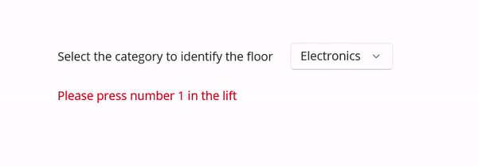

## Equal converter

The `EqualConverter` checks whether the input binding value is equal to the converter parameter and returns the corresponding Boolean value.

Refer to the following code example. Here, if the input value is matched with the converter parameter value, the label will be visible. Otherwise, the label will not be visible.





<?xml version="1.0" encoding="utf-8" ?>
<ContentPage xmlns="http://schemas.microsoft.com/dotnet/2021/maui"
            xmlns:x="http://schemas.microsoft.com/winfx/2009/xaml"
            xmlns:syncfusionConverters="clr-namespace:Syncfusion.Maui.Core.Converters;assembly=Syncfusion.Maui.Core"
            x:Class="MAUIValueConverters.EqualConverterPage"
            xmlns:local="clr-namespace:MAUIValueConverters">

    <ContentPage.Resources>
        <syncfusionConverters:EqualConverter x:Key="EqualConverter"/>
        
    </ContentPage.Resources>

    <VerticalStackLayout HorizontalOptions="Center" VerticalOptions="Center" WidthRequest="400">
        <Grid RowDefinitions="*,*,*" ColumnDefinitions=".3*,*" RowSpacing="20" ColumnSpacing="20" HorizontalOptions="Center">

            <Label Text="Trivia" FontSize="Medium" HorizontalOptions="End" />
            <Label Text="The sun rises in the east" Grid.Row="1" Grid.Column="0"/>
            <HorizontalStackLayout Grid.Row="1" Grid.Column="1" Spacing="10">
                <Entry x:Name="questionOne"/>
                <Label BindingContext="{Reference questionOne}"
                Text="Correct"
                TextColor="LimeGreen"
                IsVisible="{Binding Text, Converter={StaticResource EqualConverter},ConverterParameter=True}"/>
            </HorizontalStackLayout>

            <Label Text="What is the value of pi" Grid.Row="2" Grid.Column="0"/>
            <HorizontalStackLayout Grid.Row="2" Grid.Column="2" Spacing="10">
                <Entry x:Name="questionTwo"/>
                <Label BindingContext="{Reference questionTwo}"
                Text="Correct"
                TextColor="LimeGreen"
                IsVisible="{Binding Text, Converter={StaticResource EqualConverter},ConverterParameter=3.14}"/>
            </HorizontalStackLayout>
        </Grid>
    </VerticalStackLayout>
</ContentPage>





The following gif image illustrates the result of the above code.

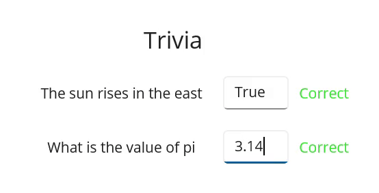

## Format string converter

The `FormatStringConverter` allows users to convert the incoming string type binding into the user-defined format. Users can define the format by using the command parameter.





<?xml version="1.0" encoding="utf-8" ?>
<ContentPage xmlns="http://schemas.microsoft.com/dotnet/2021/maui"
            xmlns:x="http://schemas.microsoft.com/winfx/2009/xaml"
            xmlns:syncfusionConverters="clr-namespace:Syncfusion.Maui.Core.Converters;assembly=Syncfusion.Maui.Core"
            x:Class="MAUIValueConverters.FormatStringConverterPage"
            xmlns:local="clr-namespace:MAUIValueConverters">

    <ContentPage.Resources>
        <syncfusionConverters:FormatStringConverter x:Key="formatStringConverter" />
    </ContentPage.Resources>
    <VerticalStackLayout HorizontalOptions="Center" VerticalOptions="Center" WidthRequest="400">
        <Grid  ColumnDefinitions="*,*,*">
            <DatePicker x:Name="inputEntry" />
            <Label Text="Selected date is :" VerticalOptions="Center" VerticalTextAlignment="Center"
                Grid.Column="1"/>
            <HorizontalStackLayout Spacing="10" Grid.Column="2" VerticalOptions="Center">
                <Label BindingContext="{x:Reference inputEntry}" TextColor="Red" FontAttributes="Bold"
                Text="{Binding Date, Converter={StaticResource formatStringConverter},ConverterParameter='yyyy'}"/>
                <Label BindingContext="{x:Reference inputEntry}" TextColor="Blue" FontAttributes="Bold"
                Text="{Binding Date, Converter={StaticResource formatStringConverter},ConverterParameter='MM'}"/>
                <Label BindingContext="{x:Reference inputEntry}" TextColor="Green" FontAttributes="Bold"
                Text="{Binding Date, Converter={StaticResource formatStringConverter},ConverterParameter='dd'}"/>
            </HorizontalStackLayout>

        </Grid>
    </VerticalStackLayout>
</ContentPage>





The following gif image illustrates the result of the above code.

## Index to array item converter

The `IndexToArrayItemConverter` is used to convert a number value into an array item. The `ConverterParameter` is used to pass the array value.

Refer to the following code example. Here, we will get the Country name based on the `Value` property of the `Stepper` control.





<?xml version="1.0" encoding="utf-8" ?>
<ContentPage xmlns="http://schemas.microsoft.com/dotnet/2021/maui"
            xmlns:x="http://schemas.microsoft.com/winfx/2009/xaml"
            xmlns:syncfusionConverters="clr-namespace:Syncfusion.Maui.Core.Converters;assembly=Syncfusion.Maui.Core"
            x:Class="MAUIValueConverters.IndexToArrayItemConverterPage">
    <ContentPage.Resources>
        <syncfusionConverters:IndexToArrayItemConverter x:Key="indexToArrayItemConverter"/>
        <x:Array x:Key="Country" Type="{x:Type x:String}">
            <x:String>India</x:String>
            <x:String>England</x:String>
            <x:String>America</x:String>
            <x:String>Russia</x:String>
            <x:String>Africa</x:String>
        </x:Array>
    </ContentPage.Resources>
    <VerticalStackLayout Spacing="20" HorizontalOptions="Center" VerticalOptions="Center">

        <Label Text="Index To Array Item" FontSize="18" HorizontalOptions="Center"/>
        <HorizontalStackLayout Spacing="20">
            <StackLayout Orientation="Horizontal" VerticalOptions="Center" Spacing="10">
                <Label Text="Index Value : "/>
                <Label Text="{Binding Value, Source={x:Reference Stepper}}"/>
            </StackLayout>
            <Picker x:Name="picker" BindingContext="{x:Reference Stepper}"
                ItemsSource="{StaticResource Country}"
                SelectedItem="{Binding Value, Converter={StaticResource indexToArrayItemConverter},ConverterParameter={StaticResource Country}}">
            </Picker>
        </HorizontalStackLayout>
        <HorizontalStackLayout Spacing="20">
            <Label Text="Change Index Value : " VerticalOptions="Center"/>
            <Stepper x:Name="Stepper"
                Minimum="0"
                Maximum="4"
                Increment="1" />
        </HorizontalStackLayout>
    </VerticalStackLayout>
</ContentPage>





The following gif image illustrates the result of the above code.

## Inverse opacity converter

The `InverseOpacityConverter` can convert a Boolean value into an inverted opacity.

Refer to the following code example. Here, the image visibility is inversely proportional to the slider value.





<?xml version="1.0" encoding="utf-8" ?>
<ContentPage xmlns="http://schemas.microsoft.com/dotnet/2021/maui"
            xmlns:x="http://schemas.microsoft.com/winfx/2009/xaml"
            xmlns:syncfusionConverters="clr-namespace:Syncfusion.Maui.Core.Converters;assembly=Syncfusion.Maui.Core"
            x:Class="MAUIValueConverters.InverseOpacityConverterPage">
<ContentPage.Resources>
    <syncfusionConverters:InverseOpacityConverter x:Key="InverseOpacityConverter"/>
</ContentPage.Resources>
<VerticalStackLayout WidthRequest="400">
    <Grid HeightRequest="300">
        <Image BindingContext="{x:Reference opacitySlider}"
        Opacity="{Binding Value,Converter={StaticResource InverseOpacityConverter}}"
        Source="dotnet_bot.png"
        SemanticProperties.Description="Cute dot net bot waving hi to you!"
        HeightRequest="200"
        HorizontalOptions="Center" />
    </Grid>
    <Label Text="Invert opacity value based on slider value"/>
    <Slider x:Name="opacitySlider" Minimum="0" Maximum="1"/>
</VerticalStackLayout>
</ContentPage>





The following gif image illustrates the result of the above code.

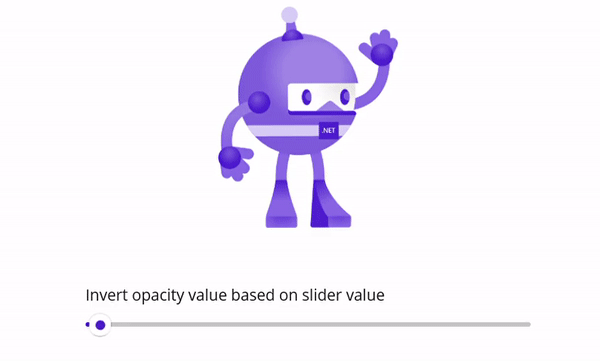

## Inverted bool converter

The `InvertedBoolConverter` is used to convert the true value to false and the false value to true.

Refer to the following code example. Here, the image `IsVisible` property is set to an inverse value of the switch' `IsToggled` property.





<?xml version="1.0" encoding="utf-8" ?>
<ContentPage xmlns="http://schemas.microsoft.com/dotnet/2021/maui"
            xmlns:x="http://schemas.microsoft.com/winfx/2009/xaml"
            xmlns:syncfusionConverters="clr-namespace:Syncfusion.Maui.Core.Converters;assembly=Syncfusion.Maui.Core"
            x:Class="MAUIValueConverters.InvertedBoolConverterPage">
    <ContentPage.Resources>
        <syncfusionConverters:InvertedBoolConverter x:Key="invertedBoolConverter"/>
    </ContentPage.Resources>
    <VerticalStackLayout WidthRequest="400">
        <Grid HeightRequest="300">
        <Image BindingContext="{x:Reference visibilitySwitch}"
            IsVisible="{Binding IsToggled, Converter={StaticResource invertedBoolConverter}}"
                Source="dotnet_bot.png"
                SemanticProperties.Description="Cute dot net bot waving hi to you!"
                HeightRequest="200"
                HorizontalOptions="Center" />
        </Grid>
        <Label Text="Show / Hide image with inverted bool value"/>
        <Switch x:Name="visibilitySwitch"/>
    </VerticalStackLayout>
</ContentPage>





The following gif image illustrates the result of the above code.

## Is list not null or empty converter

The `IsListNotNullOrEmptyConverter` can convert a `List` into a `Boolean` value. It returns true when the list is not null or empty.

Refer to the following code example. Here, the "Book Ticket" button will be visible only when the number of people is equal to or greater than one, i.e. the list should not be null or empty.





<?xml version="1.0" encoding="utf-8" ?>
<ContentPage xmlns="http://schemas.microsoft.com/dotnet/2021/maui"
            xmlns:x="http://schemas.microsoft.com/winfx/2009/xaml"
            xmlns:ViewModel="clr-namespace:MAUIValueConverters"
            xmlns:syncfusionConverters="clr-namespace:Syncfusion.Maui.Core.Converters;assembly=Syncfusion.Maui.Core"
            x:Class="MAUIValueConverters.IsListNotNullOrEmptyConverterPage">
    <ContentPage.Resources>
        <syncfusionConverters:IsListNotNullOrEmptyConverter x:Key="isListNotNullOrEmptyConverter"/>
    </ContentPage.Resources>
    <ContentPage.BindingContext>
        <ViewModel:IsListNotNullOrEmptyViewModel x:Name="isListNotNullOrEmptyViewModel"/>
    </ContentPage.BindingContext>

    <VerticalStackLayout HorizontalOptions="Center" VerticalOptions="Center" Spacing="20">
        <Label Text="Ticket Booking System" HorizontalOptions="Center" FontSize="Medium"/>
        <HorizontalStackLayout HorizontalOptions="Center" Spacing="5">
        <Label Text="Total Number Of Persons:"/>
        <Label Text="{Binding ListOfItems.Count}"/>
        </HorizontalStackLayout>
        <StackLayout Orientation="Horizontal" Spacing="20">
            <Button Text="Clear Person" Command="{Binding ClearCollectionCommand}"/>
            <Button Text="Add Person" Command="{Binding AddCollectionCommand}"/>
        </StackLayout>
        <StackLayout HeightRequest="200" WidthRequest="200">
            <Label Text="* Booking can be allowed when number of persons is equal to one or more than one." FontSize="10"/>
            <Button Text="Book Ticket" IsVisible="{Binding ListOfItems,Converter={StaticResource isListNotNullOrEmptyConverter}}" BackgroundColor="Green" TextColor="White"/>
        </StackLayout>
    </VerticalStackLayout>
</ContentPage>





internal class IsListNotNullOrEmptyViewModel : INotifyPropertyChanged
{
    private string newItem = "Person";
    public IsListNotNullOrEmptyViewModel()
    {
        AddCollectionCommand = new Command(() => ListOfItems.Add(newItem));
        ClearCollectionCommand = new Command(ListOfItems.Clear);
        ListOfItems.CollectionChanged += HandleCollectionChanged;
    }
    private ObservableCollection<string> listOfItems = new ObservableCollection<string>()
            {
            "Person",
            "Person",
            "Person",
            };

    public ObservableCollection<string> ListOfItems
    {
        get { return listOfItems; }
        set { listOfItems = value; }
    }

    public ICommand ClearCollectionCommand { get; }
    public ICommand AddCollectionCommand { get; }

    public event PropertyChangedEventHandler PropertyChanged;

    private void HandleCollectionChanged(object sender, NotifyCollectionChangedEventArgs e)
    {
        OnPropertyChanged(nameof(ListOfItems));
    }

    private void OnPropertyChanged([CallerMemberName] string propertyName = "")
    {
        if (propertyName != null)
        {
            PropertyChanged?.Invoke(this, new PropertyChangedEventArgs(propertyName));
        }
    }
}





The following gif image illustrates the result of the above code.

## Is string not null or empty converter

The `IsStringNotNullOrEmptyConverter` can convert a `String` to a `Boolean` value. It returns true when the string is not null or empty.

Refer to the following code example. Here, we will set the visibility of the "Submit" button based on the text entered by the user.





<?xml version="1.0" encoding="utf-8" ?>
<ContentPage xmlns="http://schemas.microsoft.com/dotnet/2021/maui"
            xmlns:x="http://schemas.microsoft.com/winfx/2009/xaml"
            xmlns:syncfusionConverters="clr-namespace:Syncfusion.Maui.Core.Converters;assembly=Syncfusion.Maui.Core"
            x:Class="MAUIValueConverters.IsStringNotNullOrEmptyConverterPage">
    <ContentPage.Resources>
        <syncfusionConverters:IsStringNotNullOrEmptyConverter x:Key="isStringNotNullOrEmptyConverter"/>
    </ContentPage.Resources>
    <VerticalStackLayout HeightRequest="200" HorizontalOptions="Center" VerticalOptions="Center" Spacing="10">
        <Label Text="Name"/>
        <Entry x:Name="Entry" Placeholder="Enter name here" WidthRequest="400"/>
        <Label Text="* Submit button appears when entered string is not null or empty " FontSize="12"/>
        <Button Text="Submit" WidthRequest="100"
                BindingContext="{x:Reference Entry}"
                IsVisible="{Binding Text, Converter={StaticResource isStringNotNullOrEmptyConverter}}"/>
    </VerticalStackLayout>
</ContentPage>





The following gif image illustrates the result of the above code.

## Is string not null or whitespace converter

The `IsStringNotNullOrWhitespaceConverter` can convert a `String` to a `Boolean` value. It returns true when the string is not null or white space.

Refer to the following code example. Here, we will set the visibility of the "Submit" button based on the text entered by the user.





<?xml version="1.0" encoding="utf-8" ?>
<ContentPage xmlns="http://schemas.microsoft.com/dotnet/2021/maui"
            xmlns:x="http://schemas.microsoft.com/winfx/2009/xaml"
            xmlns:syncfusionConverters="clr-namespace:Syncfusion.Maui.Core.Converters;assembly=Syncfusion.Maui.Core"
            x:Class="MAUIValueConverters.IsStringNotNullOrWhitespaceConverterPage">
    <ContentPage.Resources>
        <syncfusionConverters:IsStringNotNullOrWhitespaceConverter x:Key="isStringNotNullOrWhitespaceConverter"/>
    </ContentPage.Resources>
    <VerticalStackLayout HeightRequest="200" HorizontalOptions="Center" VerticalOptions="Center" Spacing="10">
        <Label Text="Name"/>        
        <Entry x:Name="Entry" Placeholder="Enter name here" WidthRequest="400"/>
        <Label Text="* Submit button appears when entered string is not null or whitespace " FontSize="12"/>
        <Button Text="Submit" WidthRequest="100"
                BindingContext="{x:Reference Entry}"
                IsVisible="{Binding Text, Converter={StaticResource isStringNotNullOrWhitespaceConverter}}"/>
    </VerticalStackLayout>
</ContentPage>





The following gif image illustrates the result of the above code.

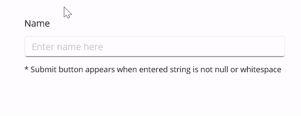

## List to string converter

The `ListToStringConverter` is a value converter that converts the incoming `IEnumerable` value into a `String.`

Refer to the following code example. Here, the items in the list are converted into strings separated by a comma.





<?xml version="1.0" encoding="utf-8" ?>
<ContentPage xmlns="http://schemas.microsoft.com/dotnet/2021/maui"
            xmlns:x="http://schemas.microsoft.com/winfx/2009/xaml"
            xmlns:syncfusionConverters="clr-namespace:Syncfusion.Maui.Core.Converters;assembly=Syncfusion.Maui.Core"
            x:Class="MAUIValueConverters.ListToStringConverterPage"
            xmlns:local="clr-namespace:MAUIValueConverters">

    <ContentPage.Resources>
        <ResourceDictionary>
            <syncfusionConverters:ListToStringConverter x:Key="ListToStringConverter" Separator=","/>
            
        </ResourceDictionary>
    </ContentPage.Resources>

    <ContentPage.BindingContext>
        <local:ListToStringViewModel/>
    </ContentPage.BindingContext>

    <StackLayout Spacing="15"
                HorizontalOptions="Center"
                VerticalOptions="Center">
        <Grid RowDefinitions="*,*,*,*" ColumnDefinitions="*" HorizontalOptions="Center"
            RowSpacing="20">
            <HorizontalStackLayout Grid.Row="0" Spacing="20">
                <Label Text="Enter the items to be added to cart"/>
                <Entry Text="{Binding Item,Mode=TwoWay}" WidthRequest="150"/>
            </HorizontalStackLayout>
            <HorizontalStackLayout Grid.Row="2" Spacing="100">
                <Label Text="{Binding ItemsCount,StringFormat='No of items in cart {0:F2}'}" WidthRequest="150"/>
                <Button Text="Add to cart" Command="{Binding AddCommand}"
                HorizontalOptions="Center" VerticalOptions="Center"/>
            </HorizontalStackLayout>
            <Label Text="{Binding CartList, Converter={StaticResource ListToStringConverter},StringFormat='Your cart contains {0:F2}'}" Grid.Row="3"
                FontSize="18"/>
        </Grid>
    </StackLayout>
</ContentPage>





public class ListToStringViewModel : INotifyPropertyChanged
{
    public ListToStringViewModel()
    {
        CartList = new ObservableCollection<string>();

        CartList.CollectionChanged += HandleCollectionChanged;

        AddCommand = new Command(() =>
        {
            CartList.Add(Item);
            ItemsCount = CartList.Count().ToString();
        });
    }

    private string item;

    public string Item
    {
        get
        {
            return item;
        }
        set
        {
            item = value;
            NotifyPropertyChanged();
        }
    }

    private string itemsCount;

    public string ItemsCount
    {
        get { return itemsCount; }
        set 
        { 
            itemsCount = value;
            NotifyPropertyChanged();
        }
    }

    public ObservableCollection<string> CartList { get; set; }

    public event PropertyChangedEventHandler PropertyChanged;

    protected virtual void NotifyPropertyChanged([CallerMemberName] string propertyName = "")
    {
        PropertyChanged?.Invoke(this, new PropertyChangedEventArgs(propertyName));
    }

    private void HandleCollectionChanged(object sender, NotifyCollectionChangedEventArgs e)
    {
        NotifyPropertyChanged(nameof(CartList));
    }
    public ICommand AddCommand { get; set; }
}





The following gif image illustrates the result of the above code.

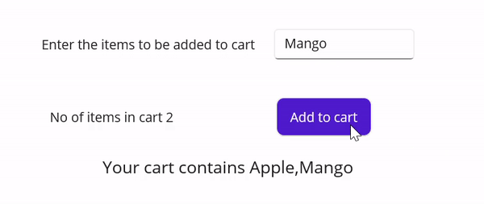

## Multi converter

The `MultiConverter` is a value converter that allows users to bind multiple converters together.

Refer to the following code example. Here, the `TextCaseConverter` converts the casing to uppercase and returns the value. After that, the `EqualConverter` checks whether the value is equal and returns the Boolean value.





<?xml version="1.0" encoding="utf-8" ?>
<ContentPage xmlns="http://schemas.microsoft.com/dotnet/2021/maui"
            xmlns:x="http://schemas.microsoft.com/winfx/2009/xaml"
            xmlns:syncfusionConverters="clr-namespace:Syncfusion.Maui.Core.Converters;assembly=Syncfusion.Maui.Core"
            x:Class="MAUIValueConverters.MultiConverterPage"
            xmlns:local="clr-namespace:MAUIValueConverters">

    <ContentPage.BindingContext>
        <local:MultiConverterViewModel/>
    </ContentPage.BindingContext>
    <ContentPage.Resources>
        <ResourceDictionary>
            <syncfusionConverters:MultiConverter x:Key="MultiConverter">
                <syncfusionConverters:TextCaseConverter />
                <syncfusionConverters:EqualConverter />
            </syncfusionConverters:MultiConverter>
            <x:Array x:Key="ParameterOfMultiConverter" Type="{x:Type syncfusionConverters:ParametersOfMultiConverter}">
                <syncfusionConverters:ParametersOfMultiConverter TypeOfConverter="{x:Type syncfusionConverters:TextCaseConverter}" ValueOfConverter="{x:Static syncfusionConverters:CasingMode.UpperCase}" />
                <syncfusionConverters:ParametersOfMultiConverter TypeOfConverter="{x:Type syncfusionConverters:EqualConverter}" ValueOfConverter="RED" />
            </x:Array>
        </ResourceDictionary>
    </ContentPage.Resources>

    <StackLayout HorizontalOptions="Center"
                VerticalOptions="Center">
        <Grid RowDefinitions="*,*" ColumnDefinitions="*,*" RowSpacing="20">
            <Label Text="Trivia" FontSize="Medium" HorizontalTextAlignment="Center" VerticalTextAlignment="Center"/>
            <Label Text="Which color in the traffic signal stops the vehicle?" Grid.Row="1" Grid.Column="0" HorizontalTextAlignment="Center" VerticalTextAlignment="Center"/>
            <HorizontalStackLayout Grid.Row="1" Grid.Column="1" Spacing="20">
                <Entry Text="{Binding EnteredAnswer}"/>
                <Label Text="Correct"
                TextColor="LimeGreen" HorizontalTextAlignment="Center" VerticalTextAlignment="Center"
                IsVisible="{Binding EnteredAnswer, Converter={StaticResource MultiConverter}, ConverterParameter={StaticResource ParameterOfMultiConverter}}"/>
            </HorizontalStackLayout>
        </Grid>
    </StackLayout>
</ContentPage>
	




public class MultiConverterViewModel : INotifyPropertyChanged
{
    private string enteredAnswer =String.Empty;

    public string EnteredAnswer
    {
        get => enteredAnswer;
        set
        {
        enteredAnswer = value;
        OnPropertyChanged();
        }
    }

    public event PropertyChangedEventHandler PropertyChanged;

    private void OnPropertyChanged([CallerMemberName] string propertyName = "")
    {
        if (PropertyChanged != null)
        {
            PropertyChanged?.Invoke(this, new PropertyChangedEventArgs(propertyName));
        }
    }
}





The following gif image illustrates the result of the above code.

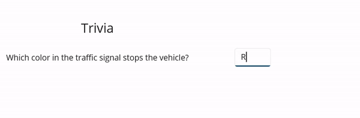

## Number to bool converter

The `NumberToBoolConverter` is used to convert a numeric value into a Boolean.

Refer to the following code example. Here, the "Proceed" button will be visible when the input number value is at least 1.





<?xml version="1.0" encoding="utf-8" ?>
<ContentPage xmlns="http://schemas.microsoft.com/dotnet/2021/maui"
            xmlns:x="http://schemas.microsoft.com/winfx/2009/xaml"
            xmlns:syncfusionConverters="clr-namespace:Syncfusion.Maui.Core.Converters;assembly=Syncfusion.Maui.Core"
            x:Class="MAUIValueConverters.NumberToBoolConverterPage"
            xmlns:local="clr-namespace:MAUIValueConverters">

    <ContentPage.BindingContext>
        <local:NumberToBoolViewModel/>
    </ContentPage.BindingContext>

    <ContentPage.Resources>
        <syncfusionConverters:NumberToBoolConverter x:Key="NumberToBoolConverter"/>
    </ContentPage.Resources>
    
    <StackLayout HorizontalOptions="Center" VerticalOptions="Center">
        <Grid RowDefinitions="*,*,50"
            ColumnDefinitions="200,200"
            HorizontalOptions="Center"
            RowSpacing="20">

            <Label Text="Family Chicken Combo" HorizontalTextAlignment="Center" VerticalTextAlignment="Center"/>

            <HorizontalStackLayout Grid.Column="1" Spacing="20">
                <Label Text="Add" VerticalTextAlignment="Center" HorizontalTextAlignment="Center"/>
                <CheckBox IsChecked="{Binding EntryValue,Converter={StaticResource NumberToBoolConverter},Mode=TwoWay}"/>
            </HorizontalStackLayout>

            <Label Text="Select quantity" Grid.Row="1" HorizontalTextAlignment="Center" VerticalTextAlignment="Center"/>
            <HorizontalStackLayout Grid.Row="1" Grid.Column="1" Spacing="10">
                <Stepper x:Name="StepperValue" Minimum="0" Maximum="100" Value="{Binding EntryValue}"/>
                <Label BindingContext="{x:Reference StepperValue}"
                    Text="{Binding Value}" HorizontalTextAlignment="Center" VerticalTextAlignment="Center"/>
            </HorizontalStackLayout>
            
            <Label Text="* Proceed appears only if the quantity is at least one" FontAttributes="Italic" Grid.Row="2" FontSize="12"/>
            <Button Text="Proceed" BackgroundColor="YellowGreen" IsVisible="{Binding EntryValue,Converter={StaticResource NumberToBoolConverter}}"
                    Grid.Row="2"
                    Grid.Column="1"
                    WidthRequest="200"
                    HorizontalOptions="Start"/>
        </Grid>
    </StackLayout>
</ContentPage>





public class NumberToBoolViewModel : INotifyPropertyChanged
{
    private double entryValue;

    public double EntryValue
    {
        get { return entryValue; }
        set { entryValue = value; OnPropertyChanged(); }
    }

    public event PropertyChangedEventHandler PropertyChanged;

    public void OnPropertyChanged([CallerMemberName] string propertyName = null)
    {
        PropertyChanged?.Invoke(this, new PropertyChangedEventArgs(propertyName));
    }
}





The following gif image illustrates the result of the above code.

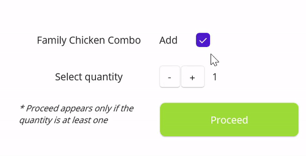

## String to list converter

The `StringToListConverter` is a value converter that converts the string value into a list based on the separator provided by the user.

Refer to the following code example. Here, the string will be added to the list if a comma is included in the entry.





<?xml version="1.0" encoding="utf-8" ?>
<ContentPage xmlns="http://schemas.microsoft.com/dotnet/2021/maui"
            xmlns:x="http://schemas.microsoft.com/winfx/2009/xaml"
            xmlns:syncfusionConverters="clr-namespace:Syncfusion.Maui.Core.Converters;assembly=Syncfusion.Maui.Core"
            x:Class="MAUIValueConverters.StringToListConverterPage">

    <ContentPage.Resources>
        <ResourceDictionary>
            <syncfusionConverters:StringToListConverter x:Key="StringToListConverter" SplitOptions="RemoveEmptyEntries">
                <syncfusionConverters:StringToListConverter.Separators>
                    <x:String>,</x:String>
                    <x:String>.</x:String>
                    <x:String>;</x:String>
                </syncfusionConverters:StringToListConverter.Separators>
            </syncfusionConverters:StringToListConverter>
        </ResourceDictionary>
    </ContentPage.Resources>

    <ContentPage.Content>
        <StackLayout HorizontalOptions="Center"
                    VerticalOptions="Center">

            <Grid Margin="20,0" RowDefinitions="Auto,Auto,Auto,*" RowSpacing="20" HeightRequest="300">

                <HorizontalStackLayout>
                    <Label Text="Enter the products to add in the cart" />
                    <Label Text=" (seperated by ' , ' or ' . ' or ' ; ')" FontAttributes="Italic"/>
                </HorizontalStackLayout>

                <Entry x:Name="ProductItem"
                Grid.Row="1"
                FontSize="Medium"
                Placeholder="Enter here"
                Text="Apple ,Orange " 
                TextColor="Black"/>
                
                <Label Text="Products in your cart"
                    Grid.Row="2"
                    BackgroundColor="DarkViolet"
                    TextColor="White"
                    WidthRequest="140"
                    HorizontalOptions="Start"
                    HorizontalTextAlignment="Center"/>

                <ListView
                HeightRequest="300"
                Grid.Row="3"
                BindingContext="{x:Reference Name=ProductItem}"
                ItemsSource="{Binding Path=Text, Converter={StaticResource StringToListConverter}}">
                    <ListView.ItemTemplate>
                        <DataTemplate>
                            <ViewCell>
                                <Label FontSize="Medium" Text="{Binding .}" />
                            </ViewCell>
                        </DataTemplate>
                    </ListView.ItemTemplate>
                </ListView>
            </Grid>
        </StackLayout>
    </ContentPage.Content>
</ContentPage>





The following gif image illustrates the result of the above code.

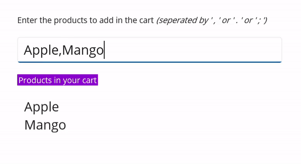

## Text case converter

The `TextCaseConverter` is used to convert the input string to the desired casing.

Refer to the following code example. Here, we will convert the input string into upper, lower, Pascal, and paragraph casings. 





<?xml version="1.0" encoding="utf-8" ?>
<ContentPage xmlns="http://schemas.microsoft.com/dotnet/2021/maui"
            xmlns:x="http://schemas.microsoft.com/winfx/2009/xaml"
            xmlns:syncfusionConverters="clr-namespace:Syncfusion.Maui.Core.Converters;assembly=Syncfusion.Maui.Core"
            x:Class="MAUIValueConverters.TextCaseConverterPage"
            xmlns:local="clr-namespace:MAUIValueConverters">

    <ContentPage.Resources>
        <ResourceDictionary>
            <syncfusionConverters:TextCaseConverter x:Key="UpperCaseTextCaseConverter" CasingMode="UpperCase"></syncfusionConverters:TextCaseConverter>
            <syncfusionConverters:TextCaseConverter x:Key="LowerCaseTextCaseConverter" CasingMode="LowerCase"></syncfusionConverters:TextCaseConverter>
            <syncfusionConverters:TextCaseConverter x:Key="PascalCaseTextCaseConverter" CasingMode="PascalCase"></syncfusionConverters:TextCaseConverter>
            <syncfusionConverters:TextCaseConverter x:Key="ParagraphCaseTextCaseConverter" CasingMode="ParagraphCase"></syncfusionConverters:TextCaseConverter>
            
        </ResourceDictionary>
    </ContentPage.Resources>

    <StackLayout HorizontalOptions="Center" VerticalOptions="Center" Margin="20">
        <Grid RowSpacing="20" RowDefinitions="*,*,*,*,*" ColumnDefinitions="*,*">

            <Label Grid.Row="0" Grid.Column="0"
                Text="Enter a text"/>

            <Entry x:Name="entry" Grid.Row="0" Grid.Column="1" Text=" "/>

            <Label Grid.Row="1" Grid.Column="0" Text="Text in upper case"/>
            <Label Grid.Row="1" Grid.Column="1" BindingContext="{x:Reference entry}"
                Text="{Binding Text, Converter={StaticResource UpperCaseTextCaseConverter}}"/>

            <Label Grid.Row="2" Grid.Column="0" Text="Text in lower case"/>
            <Label Grid.Row="2" Grid.Column="1"
                BindingContext="{x:Reference entry}"
                Text="{Binding Text, Converter={StaticResource LowerCaseTextCaseConverter}}"/>

            <Label Grid.Row="3" Grid.Column="0" Text="Text in Pascal case"/>
            <Label Grid.Row="3" Grid.Column="1"
                BindingContext="{x:Reference entry}"
                Text="{Binding Text, Converter={StaticResource PascalCaseTextCaseConverter}}"/>

            <Label Grid.Row="4" Grid.Column="0"
                Text="Text in paragraph case"
                HorizontalTextAlignment="Center" VerticalTextAlignment="Center"/>
            <Label Grid.Row="4" Grid.Column="1"
                BindingContext="{x:Reference entry}"
                Text="{Binding Text, Converter={StaticResource ParagraphCaseTextCaseConverter}}"/>

        </Grid>
    </StackLayout>
</ContentPage>





The following gif image illustrates the result of the above code.

N> You can find the complete converters sample from this [link](https://github.com/SyncfusionExamples/maui-converters-samples).

