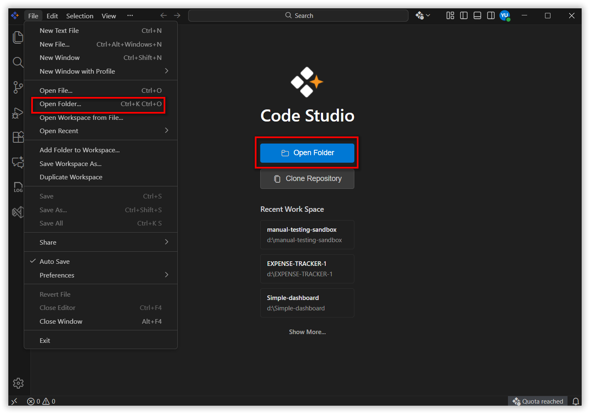

# Creating a .NET MAUI Project with Syncfusion® Controls

This section explains how to create a .NET MAUI project in Syncfusion® Code Studio and integrate Syncfusion® controls using NuGet packages.

Due to Code Studio being a standalone IDE, Syncfusion® templates are not available through extensions. Instead, you can create a standard .NET MAUI project and add Syncfusion® controls via NuGet package installation.

---

## Prerequisites

Before getting started, make sure that:

1. **Syncfusion Code Studio is installed**  
   If it’s not installed, refer to the [installation guide](code-studio-integration/DownloadandInstallation.md) to set it up properly.

2. **A local project folder is ready**  
   Code Studio works best with an existing project or a fresh folder for coding.

3. **Basic familiarity with writing code**  
   You don’t need to be an expert, just comfortable editing files and understanding simple programming concepts.

## Step 1 - Create a New .NET MAUI Project

Follow the steps below to open your project and start working inside the Code Studio environment.

1. Open the application based on your OS
    * **Windows:** Go to the Start Menu, search for Syncfusion Code Studio, and launch it.
    * **macOS:** Open Applications or Launchpad, find Syncfusion Code Studio, and open it.
2. Access the File Menu - At the top menu bar, click “File”.

3. Select “Open Folder”

4. Choose your project folder

5. Or you can directly open your project folder using ‘Open Folder’ button under the Code Studio logo

---

### Result

Your selected project will open in the editor where you can:

* Browse files in the Explorer sidebar
* Edit and create source files
* Use AI-powered features like Chat, Autocomplete, Agent, Edit, and Quick Fix



## Step 2 - Add Syncfusion® NuGet Packages

1. Open the **Solution Explorer**.  

2. Right-click on the project and select **Manage NuGet Packages**.  

3. Browse for required Syncfusion® packages (for example, `Syncfusion.Maui.Controls`).  

4. Select the required package and click **Install**.  

5. Wait for the installation to complete successfully.  

---

## Step 3 - Register Syncfusion® License

After adding the NuGet package, register your Syncfusion® license.

1. Open the `MauiProgram.cs` file.  

2. Add the following code inside the `CreateMauiApp` method:

```csharp
Syncfusion.Licensing.SyncfusionLicenseProvider.RegisterLicense("YOUR LICENSE KEY");
```

Replace "YOUR LICENSE KEY" with your valid license key.

N> For more details on generating and registering the license key, refer to:
[License Page](https://help.syncfusion.com/common/essential-studio/licensing/overview)

---

## Step 4 - Add a Syncfusion® Control

1. Open the MainPage.xaml file.

2. Declare the Syncfusion namespace:

```csharp
xmlns:syncfusion="clr-namespace:Syncfusion.Maui.DataGrid;assembly=Syncfusion.Maui.DataGrid"
```
3. Add your control

```xml
<syncfusion:SfDataGrid x:Name="dataGrid"
                       ItemsSource="{Binding OrderInfoCollection}" />
```
For more information about this, refer [UG](https://help.syncfusion.com/maui/datagrid/overview)

### Step 5 - Build and Run the Application

1. Build the project.

2. Run the application using Run > Start Debugging or press F5.

3. Verify that the Syncfusion® control is rendered correctly.


You have successfully created a .NET MAUI project using Syncfusion® Code Studio and added Syncfusion® controls via NuGet. You can continue enhancing your application by adding more controls and features as needed.
