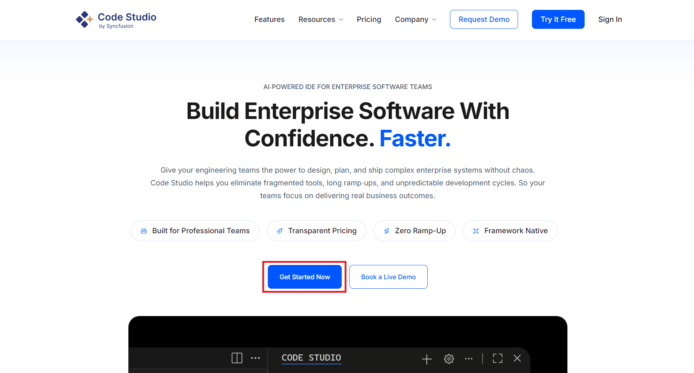
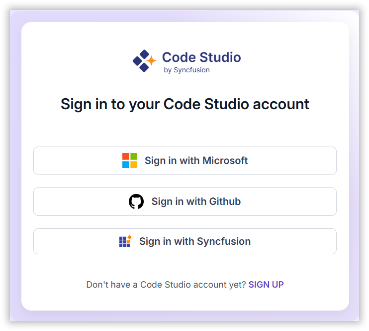
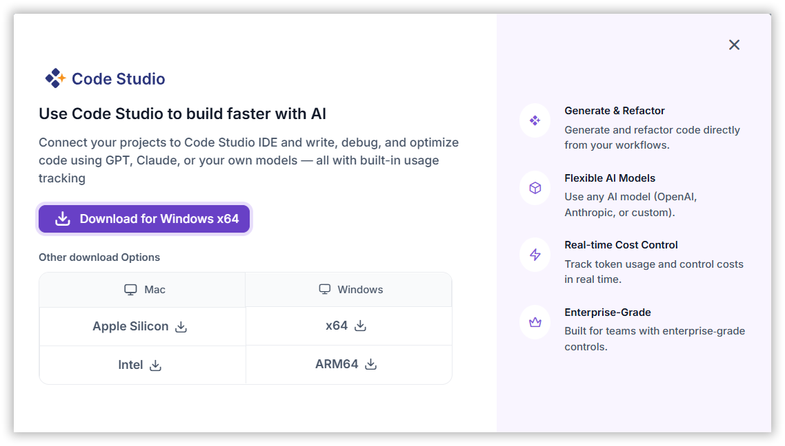
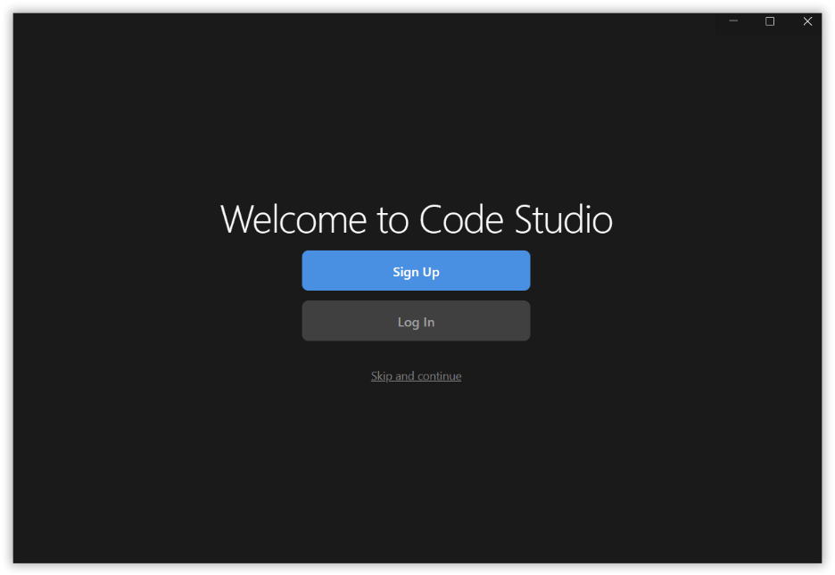
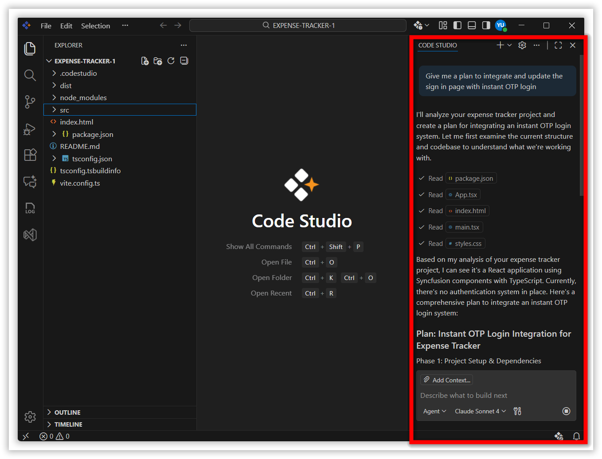
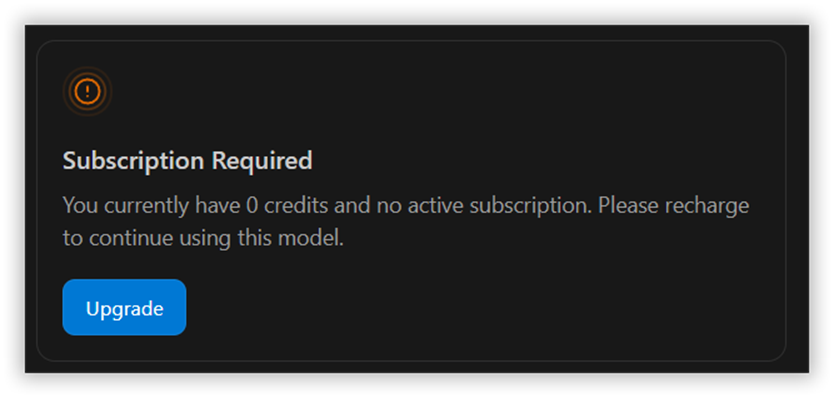
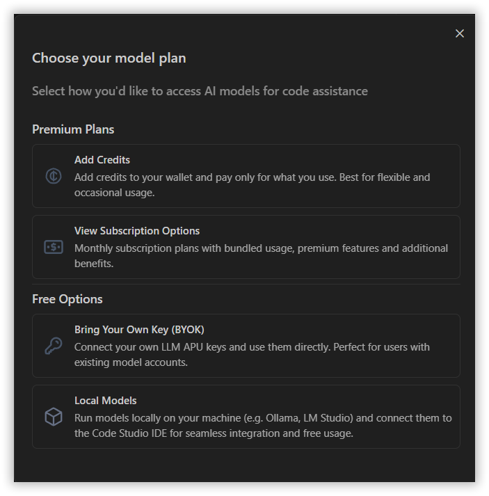

# Download and Installation Guide

This section provides step-by-step instructions to download, install, and configure the Syncfusion® Code Studio integration for .NET MAUI development.

## Prerequisites

Ensure the following software is installed before proceeding with the integration:

- [Code Studio](https://www.syncfusion.com/code-studio/)  
- [.NET SDK with MAUI workload](https://dotnet.microsoft.com/en-us/download)  
- [C# Language Support Extension](https://marketplace.visualstudio.com/items?itemName=ms-dotnettools.csharp)  

These prerequisites are required to enable development, project creation, and UI customization features within Code Studio.

---

## Install Code Studio

### Step 1 - Download the installer

Follow these steps to install the Syncfusion® Code Studio integration from within the IDE:

1. Visit the official [Syncfusion Code Studio website](https://www.syncfusion.com/code-studio/). 
2. Click “**Get Started Now**” to open the Code Studio enterprise page.

    

3. If you already have Syncfusion Code Studio account, choose one of these sign in options to sign in with Code Studio Enterprise server or else click “SIGN UP” to create one:
     * Microsoft Account: Use your personal, work, or school Microsoft credentials.
     * GitHub Account: Sign in with your GitHub credentials.
     * Syncfusion Account: Create a new account using your email and password.

    

4. Click Download Code Studio.

    
   
5. Download your preferred operating system.

    

The setup file will be downloaded to your local system.

### Step 2 - Install the Application

1. Double-click the .exe setup file.
2. Standard UAC prompt → Click Yes.
3. Accept the License Agreement.
4. Choose installation folder path (default: Program Files).
5. Click Install and wait for completion.

   

### Step 3 - Sign In with Code Studio IDE

After installing Syncfusion Code Studio IDE, the Welcome Page will appear.

   

To activate your account and enable all features, you’ll need to sign in inside the IDE. Choose one of these sign in options:

   * Microsoft Account: Use your personal, work, or school Microsoft credentials.
   * GitHub Account: Sign in with your GitHub credentials.
   * Syncfusion Account: Create a new account using your email and password.

### Step 4 - Start Using Code Studio

After installing Code Studio, you can start using it immediately.

Open the Code Studio IDE and access the Code Studio chat box, which acts as your built-in AI assistant for coding tasks.

Type your first query in the chat panel.

   

If Code Studio responds, your subscription is active.
If the Code Studio IDE chat box does not respond, you will see a message prompting you to subscribe to a plan for full access to features.

Select Upgrade.

   

Choose the subscription plan you prefer.

   

To know more about the Code Studio Subscription plans, click on View Subscription Options.

---