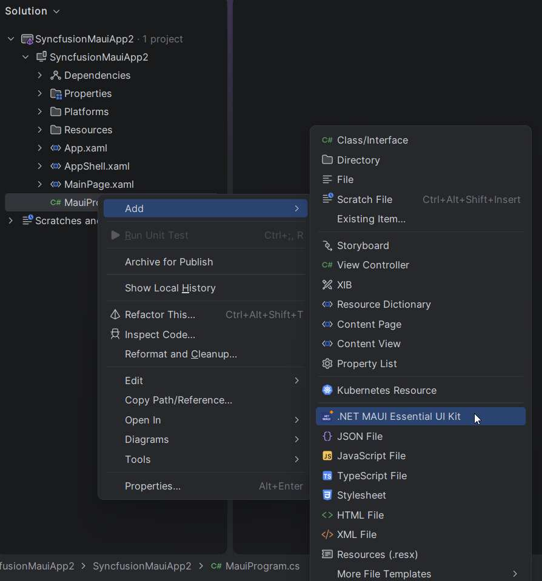
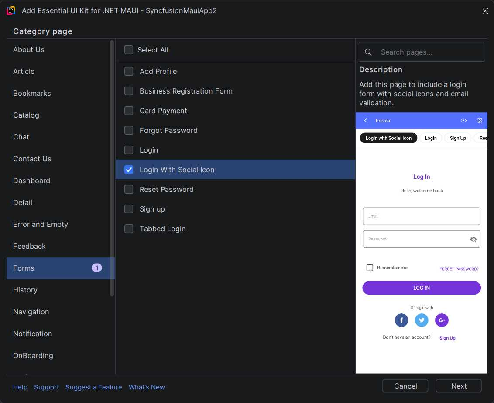
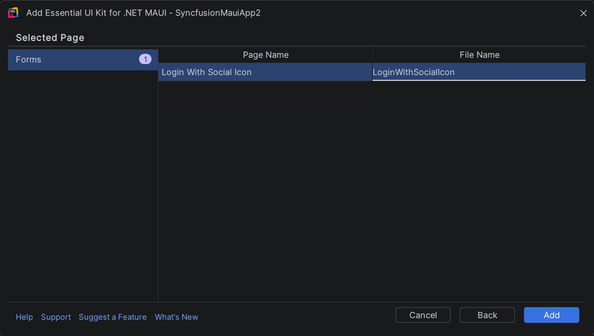
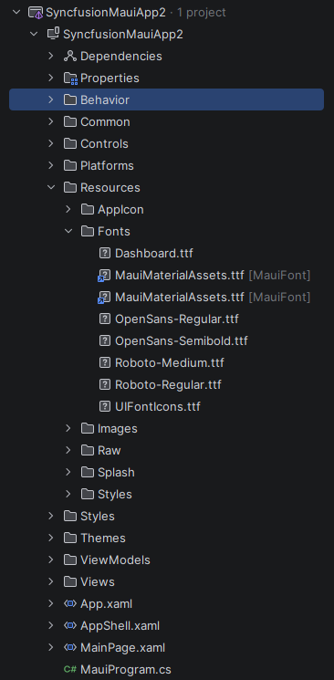
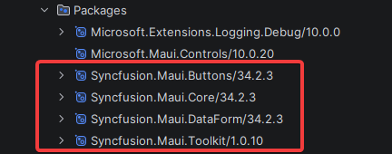
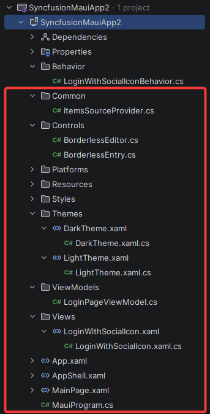

# Essential® UI Kit for .NET MAUI with JetBrains Rider

The Essential® UI Kit for .NET MAUI provides ready-to-use XAML templates, making it easy to design user interfaces for cross-platform applications in JetBrains Rider. It follows a structured separation of View, ViewModel, and Model classes, simplifying the integration of business logic and the modification of existing views.

## Installation of Essential® UI Kit for .NET MAUI in JetBrains Rider

To get started with Essential® UI Kit for .NET MAUI in JetBrains Rider, install the required Syncfusion® integration, if available, from the JetBrains Marketplace through Rider's plugin management system. Once installed, it enables access to Syncfusion® features and resources within Rider for .NET MAUI application development.

## Include XAML templates in MAUI apps

1. Launch a new or existing MAUI application.

2. In the Rider project view, right-click on your MAUI project's **.csproj** file and select **Essential® UI Kit for .NET MAUI - Syncfusion®**. If the project is not fully loaded yet, wait until Rider finishes indexing and project sync before using the action.

    

3. The Category dialogue box will then appear, with its pre-defined templates.

    

4. Now, select the required pages from any of the specified categories then click ‘Next’.

5. Now add a name for the page, then click ‘Add’ to add the page and the necessary class files, resources, and NuGet package references to your project.

    

6. The selected pages will be added, including **View, ViewModel, Model** classes, resource files, and the **Syncfusion® NuGet package** reference.

    

    

    

7. Then, Syncfusion® licensing registration required message box will be shown if you installed the trial setup or NuGet packages since Syncfusion® introduced the licensing system from 2018 Volume 2 (v16.2.0.41) Essential Studio® release. Navigate to the [help topic](https://help.syncfusion.com/common/essential-studio/licensing/overview#how-to-generate-syncfusion-license-key), which is shown in the licensing message box to generate and register the Syncfusion® license key to your project. Refer to this [blog](https://www.syncfusion.com/blogs/post/whats-new-in-2018-volume-2.aspx) post for understanding the licensing changes introduced in Essential Studio®.

## Run the UI Template Item

To set your preferred UI template as the start page of your application, open the App.xaml.cs file in your .NET MAUI project and apply the following changes.

Example: If you added Login With Social Icon Page,




// For .NET 8, use the below code snippet.

MainPage = new LoginWithSocialIcon();







// For .NET 9 or later, use the below code snippet.

protected override Window CreateWindow(IActivationState? activationState)
{
    return new Window(new LoginWithSocialIcon());
}



