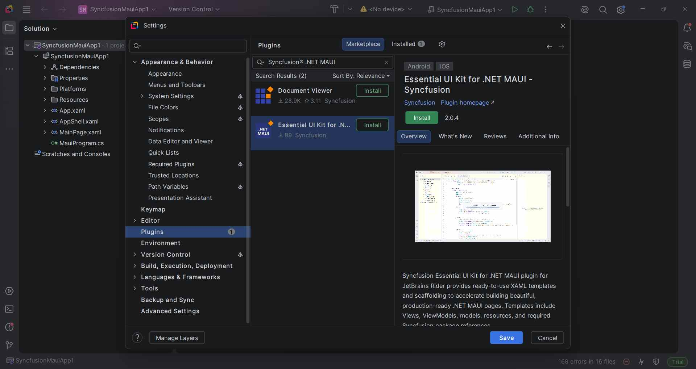
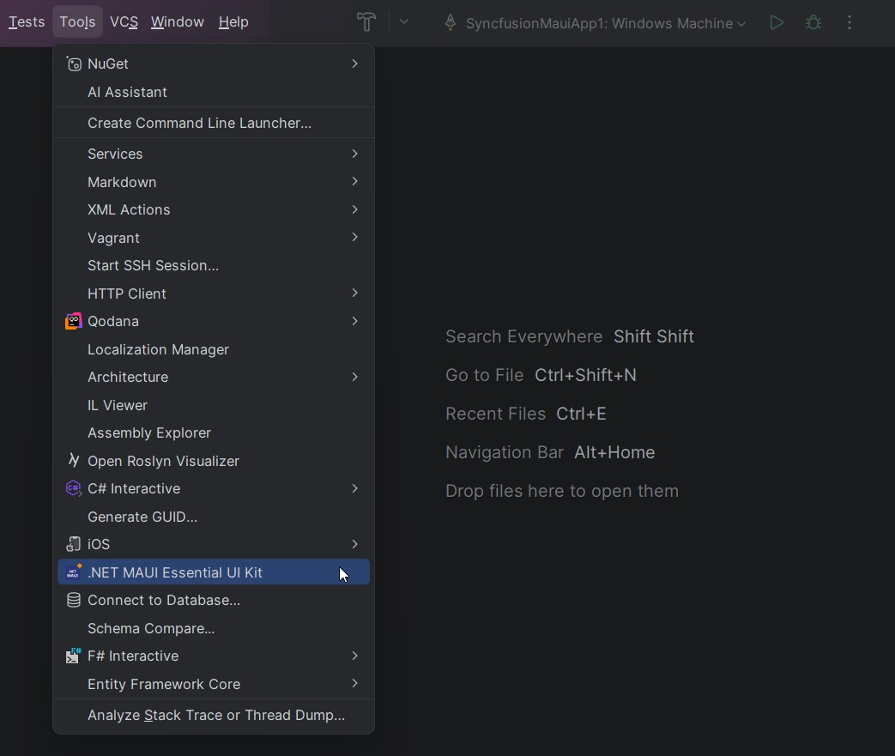
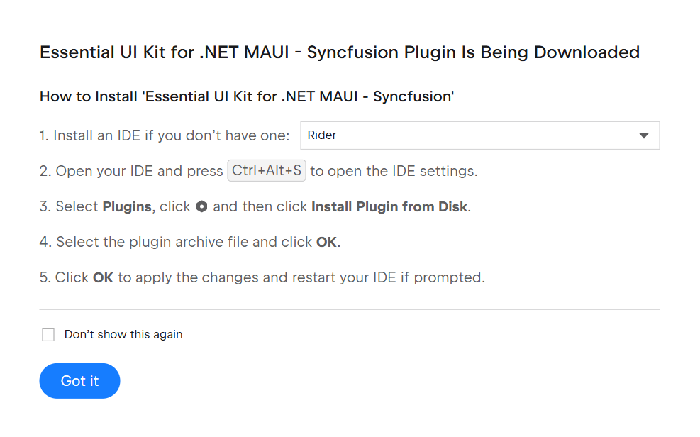
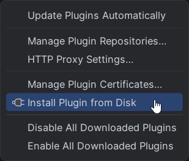

# Download and Setup Guide 

[Essential UI Kit](#essential-ui-kit)

## Essential UI Kit
Syncfusion® publishes the JetBrains Rider extension through the JetBrains Marketplace. You can install it directly from JetBrains Rider or download and install it from the marketplace package.

## Install the Essential UI Kit Extension through JetBrains Rider
The following instructions outline the process of installing the Essential UI Kit for .NET MAUI - Syncfusion® extension from JetBrains Rider.

1. Open JetBrains Rider.

2. Open the Plugin dialog from **Settings/Preferences > Plugin**.

3. Search for **Syncfusion® .NET MAUI UI Kit** in the JetBrains Marketplace tab.

4. Install the **Essential UI Kit for .NET MAUI - Syncfusion®** extension by clicking the Install button.

     

5. Restart JetBrains Rider after installation.

     

## Install the Essential UI Kit Extension from the JetBrains Marketplace

The following instructions outline the process of downloading and installing Essential® UI Kit for .NET MAUI applications from the JetBrains Marketplace.

1. Open the [JetBrains Marketplace](https://plugins.jetbrains.com/) and locate the Essential UI Kit for .NET MAUI - Syncfusion® extension.

2. Select **Install** from the marketplace. If prompted, choose **Open JetBrains Rider** to continue the installation.

3. Install the **Essential UI Kit for .NET MAUI - Syncfusion®** extension by clicking the Install button.

     

4. Restart JetBrains Rider after installation.

     

## Manually Installing the Essential UI Kit Extension in JetBrains Rider

The following instructions detail the manual installation process of the Essential UI Kit for .NET MAUI - Syncfusion® extension in JetBrains Rider.

1. Download the plugin package from the JetBrains Marketplace.

     

2. In JetBrains Rider, open **Settings/Preferences > Plugin**.

3. Click the gear icon and choose **Install Plugin from Disk**.

     

4. Browse to the downloaded plugin package and install it.

5. Restart JetBrains Rider after installation.
