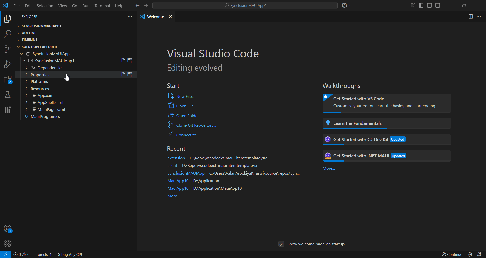

# Essential® UI Kit for .NET MAUI

The Essential® UI Kit for .NET MAUI provides pre-built XAML templates, making it easy to create user interfaces for cross-platform applications. It follows a well-structured separation of View, ViewModel, and Model classes, simplifying the integration of business logic and the modification of existing views.

N> Before using the **Essential® UI Kit for .NET MAUI - Syncfusion®**, ensure that the extension is installed in Visual Studio Code. To check, go to **View > Extensions** in the Extension Manager. If the extension is not installed, follow the steps in the [download and installation](https://help.syncfusion.com/maui/visual-studio-code-integration/download-and-installation#essential-ui-kit) help guide to install it.

## Include XAML templates in MAUI apps

1.	Open a new or existing MAUI application.

2.	In File Explorer, right-click on your MAUI project's **.csproj** file and select **Essential®  UI Kit for .NET MAUI - Syncfusion®**. Alternatively, in **Solution Explorer**, right-click on your MAUI project's file, then select the same option for your MAUI project. Before launching the UI, ensure that the project is fully loaded, as this option will only be available if the project is fully loaded.

3.	Choose the pages you want to add, enter a name for the page, and then click **Add**.

4.	The selected pages will be added, including **View, ViewModel, Model** classes, resource files, and the **Syncfusion® NuGet package** reference.

	

5.	Then, Syncfusion® licensing registration required message box will be shown if you installed the trial setup or NuGet packages since Syncfusion® introduced the licensing system from 2018 Volume 2 (v16.2.0.41) Essential Studio® release. Navigate to the [help topic](https://help.syncfusion.com/common/essential-studio/licensing/overview#how-to-generate-syncfusion-license-key), which is shown in the licensing message box to generate and register the Syncfusion® license key to your project. Refer to this [blog](https://www.syncfusion.com/blogs/post/whats-new-in-2018-volume-2.aspx) post for understanding the licensing changes introduced in Essential Studio®. 

## Run the UI template item

To set your desired UI template as the startup page of your application, open the App.xaml.cs file in your MAUI project and update it accordingly.

Example: If you added a Login Page, make the necessary changes.




// For NET 8 Use this Below Code Snippet

MainPage = new Login();

// For NET 9 Use this Below Code Snippet

protected override Window CreateWindow(IActivationState? activationState)
{
    return new Window(new Login());
}




