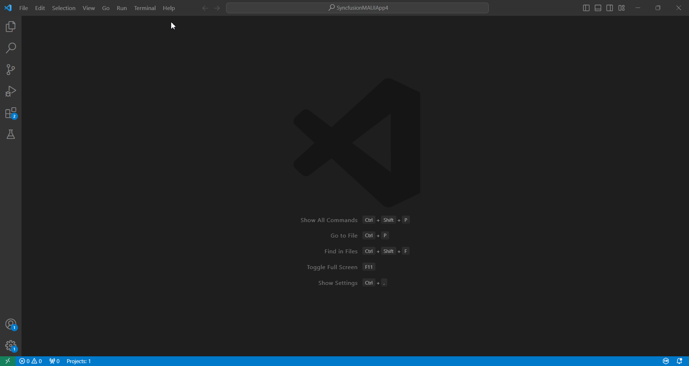
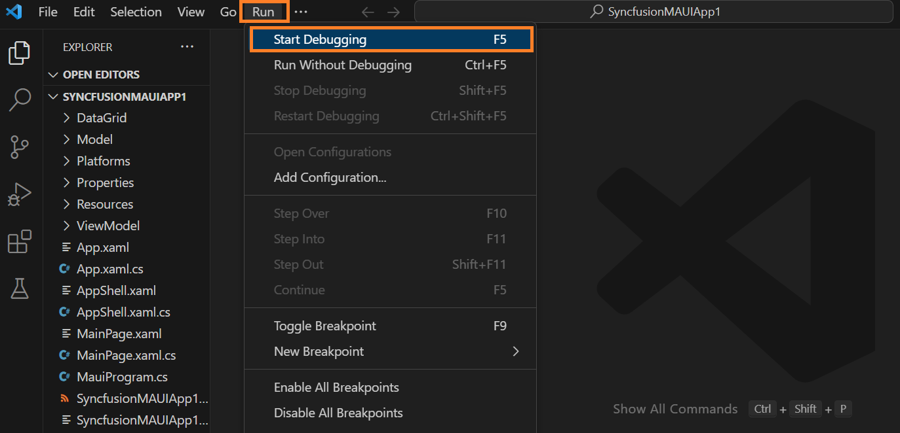

# Creating a Syncfusion .NET MAUI application

Syncfusion offers the .NET MAUI Project Template for building .NET MAUI applications using Syncfusion components in Visual Studio Code. This template includes all the necessary Syncfusion components, NuGet references, namespaces, and code snippets required for developing .NET MAUI applications with Syncfusion. The **.NET MAUI Project Template** comes with a project wizard to streamline the application creation process using Syncfusion components.

N> Syncfusion Visual Studio Code project templates now support .NET MAUI project templates starting from `v25.1.35`.

The following steps below will assist you to create your **Syncfusion .NET MAUI Application** through **Visual Studio Code:**

1.	To create a Syncfusion .NET MAUI application in Visual Studio Code, open the command palette by pressing **Ctrl+Shift+P**. Then, search for **Syncfusion** in the Visual Studio Code palette to access the templates provided by Syncfusion.

    

2.	Select **Syncfusion .NET MAUI Template Studio: Launch** and press **Enter**. This will launch the Template Studio wizard for configuring the Syncfusion .NET MAUI app. Enter the Project Name and Project Path as required.

    

3.	To select a control, click on the **Next** button or the **Controls** tab. You can then add the following Syncfusion .NET MAUI components to the application. Choose the required Syncfusion .NET MAUI components.

    

    Select the required control(s) by clicking on the corresponding checkbox.

    To unselect a control that has been added, click on the checkbox of the selected control.

    N> **Note:** Select at least one control to enable the **Create** button.

    **Project details section**

    In the Project Details section, you can modify the Project Name, Project Path, and their configurations. You can also choose the desired .NET Core Version (.NET 7.0 or .NET 8.0).

4.	Click the **Create** button to generate the Syncfusion .NET MAUI application. The created application includes the necessary Syncfusion NuGet packages and rendering code for the selected Syncfusion components.

5.  You can run the application to see the Syncfusion components. Click **F5** or go to **Run>Start Debugging**.

       

6.	The Syncfusion .NET MAUI application is configured with the latest Syncfusion .NET MAUI NuGet packages version, namespaces, and component rendering code for Syncfusion components.

7.	If you installed the trial setup or NuGet packages from nuget.org you must register the Syncfusion license key to your application since Syncfusion introduced the licensing system from 2018 Volume 2 (v16.2.0.41) Essential Studio release. Navigate to the [help topic](https://help.syncfusion.com/common/essential-studio/licensing/overview#how-to-generate-syncfusion-license-key) to generate and register the Syncfusion license key to your application. Refer to this [blog](https://www.syncfusion.com/blogs/post/whats-new-in-2018-volume-2.aspx?_ga=2.11237684.1233358434.1587355730-230058891.1567654773) post for understanding the licensing changes introduced in Essential Studio.

