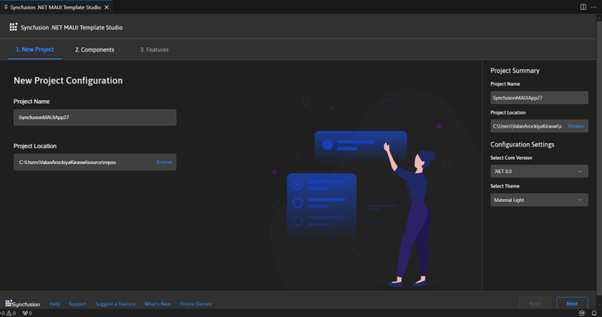
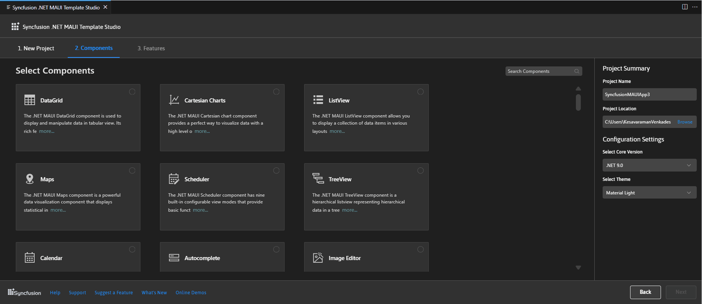
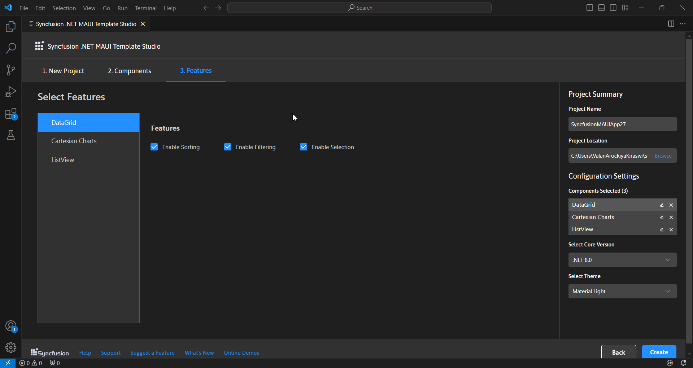
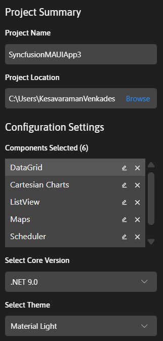
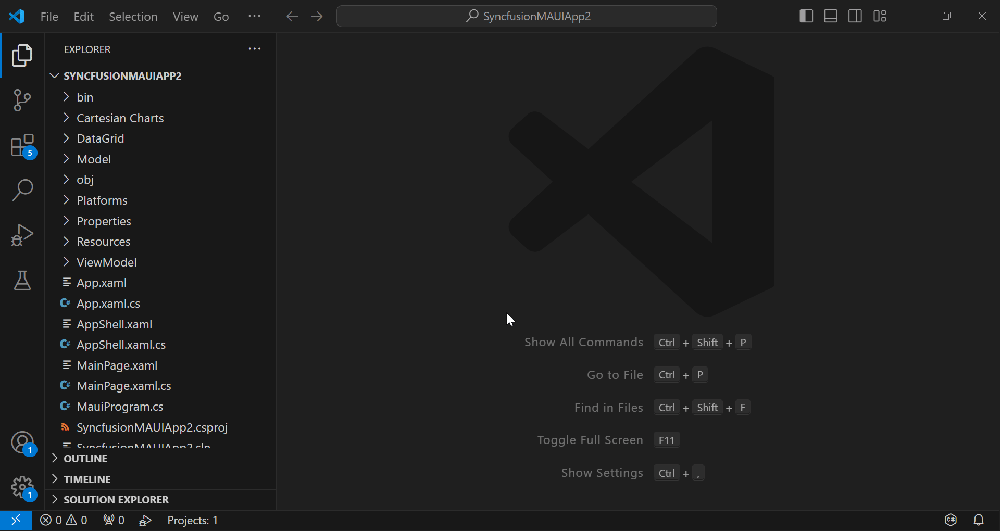

# Creating a Syncfusion® .NET MAUI application

Syncfusion® offers the .NET MAUI Project Template for building .NET MAUI applications using Syncfusion® components in Visual Studio Code. This template includes all the necessary Syncfusion® components, NuGet references, namespaces, and code snippets required for developing .NET MAUI applications with Syncfusion®. The **.NET MAUI Project Template** comes with a project wizard to streamline the application creation process using Syncfusion® components.

N> Syncfusion® Visual Studio Code project templates now support .NET MAUI project templates starting from `v25.1.35`.

The following steps below will assist you to create your **Syncfusion® .NET MAUI Application** through **Visual Studio Code:**

1.	To create a Syncfusion® .NET MAUI application in Visual Studio Code, open the command palette by pressing **Ctrl+Shift+P**. Then, search for **Syncfusion** in the Visual Studio Code palette to access the templates provided by Syncfusion®.

    

2.	Select **Syncfusion® .NET MAUI Template Studio: Launch** and press **Enter**. This will launch the Template Studio wizard for configuring the Syncfusion® .NET MAUI application. Enter a unique **Project Name** to identify your application, and then specify the **Project Location**, which is the directory where your project files will be saved. Ensure that the chosen location meets your project's needs.

    

3.	To select a component, click the **Next** button or the **Components** tab. From there, you can add the desired Syncfusion® .NET MAUI components to your application. Simply choose the necessary Syncfusion® .NET MAUI components for your project.

    

    Select the required component(s) by clicking on the corresponding checkbox.

    Choose the required component(s) by clicking the corresponding component box.

    To unselect the added component(s), use either one of the following options:

    **Option 1:** Click the corresponding selected component checkbox.

    **Option 2:** Click **‘x’** button for the corresponding component in the component list from **Components Selected**.

    N> **Note:** Select at least one control to enable the **Features** tab.

4. The features for the selected controls will be displayed when you click the **Next** button or the **Features** tab. From there, you can select or unselect the desired features for your selected components.

    

    **Project Summary section**

    In the **Project Summary** section, you can customize the **Project Name** to uniquely identify your application and specify the **Project Location**, which is the directory where your project files will be saved. You can also adjust the **Configuration Settings** by removing one or more controls from the **Components Selected** list. Additionally, choose your preferred **Core Version** (.NET 8.0 or .NET 9.0) and **Theme** (Material Light or Material Dark).

    

5.	Click the **Create** button to generate the Syncfusion® .NET MAUI application. The created application includes the necessary Syncfusion® NuGet packages and rendering code for the selected Syncfusion®components.

6.  To view the Syncfusion® components in your application, run it by pressing **F5** or selecting **Run > Start Debugging**. Then, search for **.NET MAUI** and select it to launch the application.

    

    N> **Note:** If the .NET MAUI extension is a preview version, the debugger will be listed as **.NET MAUI**. However, if the .NET MAUI extension is stable, this configuration will be replaced with **C#**.

7.	The Syncfusion® .NET MAUI application is configured with the latest Syncfusion® .NET MAUI NuGet packages version, namespaces, and component rendering code for Syncfusion® components.

8.	If you installed the trial setup or NuGet packages from nuget.org you must register the Syncfusion® license key to your application since Syncfusion® introduced the licensing system from 2018 Volume 2 (v16.2.0.41) Essential Studio® release. Navigate to the [help topic](https://help.syncfusion.com/common/essential-studio/licensing/overview#how-to-generate-syncfusion-license-key) to generate and register the Syncfusion® license key to your application. Refer to this [blog](https://www.syncfusion.com/blogs/post/whats-new-in-2018-volume-2.aspx?_ga=2.11237684.1233358434.1587355730-230058891.1567654773) post for understanding the licensing changes introduced in Essential Studio®.

