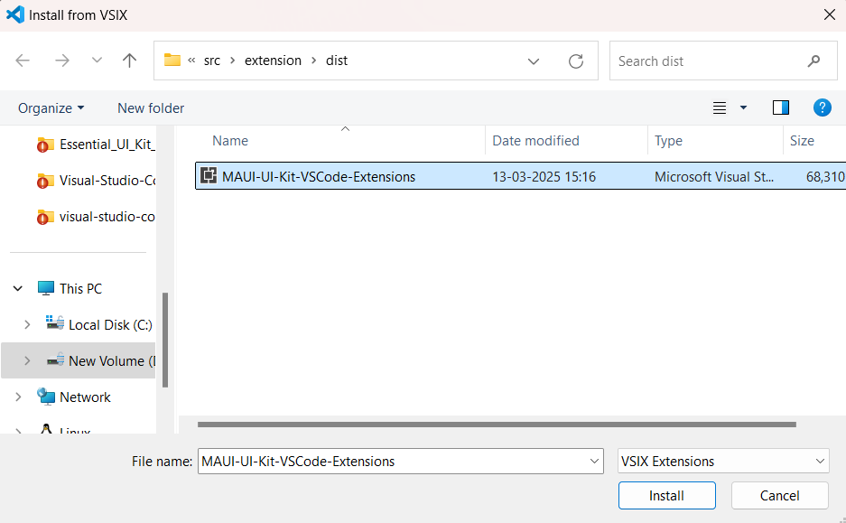

# Download and Installation

[Essential MAUI](#essential-maui)

[Essential UI Kit](#essential-ui-kit)

## Essential MAUI
Syncfusion® publishes the Visual Studio Code extension on the [Visual Studio Code marketplace](https://marketplace.visualstudio.com/items?itemName=SyncfusionInc.MAUI-VSCode-Extensions). You can install it directly from Visual Studio Code or download and install it from the Visual Studio Code marketplace.

**Prerequisites**
The following software prerequisites must be installed to install the Syncfusion® .NET MAUI extension, as well as for creating and adding snippets in Syncfusion® .NET MAUI applications.

* [Visual Studio Code 1.87.1 or later](https://code.visualstudio.com/download)

* [C# Extension ](https://marketplace.visualstudio.com/items?itemName=ms-dotnettools.csharp) 

* [C# Dev Kit](https://marketplace.visualstudio.com/items?itemName=ms-dotnettools.csdevkit)

## Install through the Visual Studio Code Extensions
The following instructions outline the process of installing the Syncfusion® .NET MAUI extensions from Visual Studio Code Extensions.

1.	Open Visual Studio Code.

2.	Navigate to **View > Extensions**, and the Manage Extensions option will appear on the left side of the window.

3.	By entering the keyword **Syncfusion® .NET MAUI** in the search box, you can find the Syncfusion® .NET MAUI Visual Studio Code extension in the Visual Studio Code Marketplace.

4.	Install the **.NET MAUI VSCode Extensions - Syncfusion®** extension by clicking the Install button.

5.	After installation, reload Visual Studio Code using the **Reload Window** command in the Visual Studio Code palette. You can access the command palette by pressing **Ctrl+Shift+P** and searching for Reload Window among the Visual Studio Code commands.

    

6.	You can now create a new Syncfusion® .NET MAUI application using the Syncfusion® .NET MAUI extensions from the Visual Studio Code Palette. Find the **Syncfusion® .NET MAUI Template Studio: Launch** option among the Visual Studio Code commands to open the Syncfusion® .NET MAUI Template Studio wizard.

    

## Install from the Visual Studio Code Marketplace

The following instructions outline the process of downloading and installing Syncfusion® .NET MAUI applications from the Visual Studio Code Marketplace.

1.	Open [Syncfusion® .NET MAUI Code Extensions](https://marketplace.visualstudio.com/items?itemName=SyncfusionInc.MAUI-VSCode-Extensions) in Visual Studio Code Marketplace.

2.	Select **Install** from the Visual Studio Code Marketplace. A popup window appears in your browser with information like **Open Visual Studio Code**. Clicking **Open Visual Studio Code** will launch the Syncfusion® .NET MAUI Extension in Visual Studio Code.

3.	Install the **.NET MAUI VSCode Extensions - Syncfusion®** extension by clicking the Install button.

4.	After installation, reload Visual Studio Code by executing the **Reload Window** command from the Visual Studio Code palette. Access the command palette by pressing **Ctrl+Shift+P** and locating the Reload Window command among the Visual Studio Code commands.

    
5.	You can now initiate the creation of a new Syncfusion® .NET MAUI application using the Syncfusion® .NET MAUI extensions from the Visual Studio Code Palette. Locate the **Syncfusion® .NET MAUI Template Studio: Launch** option among the Visual Studio Code commands to open the Syncfusion® .NET MAUI Template Studio wizard.

    

## Manually Installing an Extension in Visual Studio Code

The following instructions detail the manual installation process of the Syncfusion® .NET MAUI extensions in Visual Studio Code.

1.	To install the extension manually, download the **Syncfusion®Inc..NET-MAUI-VSCode-Extensions.vsix** file from the [Visual Studio Code Marketplace](https://marketplace.visualstudio.com/items?itemName=SyncfusionInc.MAUI-VSCode-Extensions). Then, install it from a local file within VS Code.

2.	In VS Code, navigate to the Extensions view by clicking on the Extensions icon located in the Activity Bar.

    

3.	Click on the three dots (ellipsis) located in the top-right corner, then select "Install from VSIX."
  
    

4.	Navigate to the location where you downloaded the Syncfusion®Inc..NET-MAUI-VSCode-Extensions.vsix file, then select and install it.

    
    

## Essential UI Kit
Syncfusion® publishes the Visual Studio Code extension on the [Visual Studio Code marketplace](https://marketplace.visualstudio.com/items?itemName=SyncfusionInc.MAUI-UI-Kit-VSCode-Extensions). You can install it directly from Visual Studio Code or download and install it from the Visual Studio Code marketplace.

## Install through the Visual Studio Code Extensions
The following instructions outline the process of installing the Essential® UI Kit for .NET MAUI - Syncfusion® extensions from Visual Studio Code Extensions.

1.	Open Visual Studio Code.

2.	Navigate to **View > Extensions**, and the Manage Extensions option will appear on the left side of the window.

3.	By entering the keyword **Syncfusion® .NET MAUI UI Kit** in the search box, you can find the Essential® UI Kit for .NET MAUI - Syncfusion® Visual Studio Code extension in the Visual Studio Code Marketplace.

4.	Install the **Essential® UI Kit for .NET MAUI - Syncfusion®** extension by clicking the Install button.

5.	After installation, reload Visual Studio Code using the **Reload Window** command in the Visual Studio Code palette. You can access the command palette by pressing **Ctrl+Shift+P** and searching for Reload Window among the Visual Studio Code commands.

    

## Install from the Visual Studio Code Marketplace

The following instructions outline the process of downloading and installing Essential® UI Kit for .NET MAUI applications from the Visual Studio Code Marketplace.

1.	Open [Essential® UI Kit for .NET MAUI - Syncfusion®](https://marketplace.visualstudio.com/items?itemName=SyncfusionInc.MAUI-UI-Kit-VSCode-Extensions) in Visual Studio Code Marketplace.

2.	Select **Install** from the Visual Studio Code Marketplace. A popup window appears in your browser with information like **Open Visual Studio Code**. Clicking **Open Visual Studio Code** will launch the Essential® UI Kit for .NET MAUI - Syncfusion® Extension in Visual Studio Code.

3.	Install the **Essential® UI Kit for .NET MAUI - Syncfusion®** extension by clicking the Install button.

4.	After installation, reload Visual Studio Code by executing the **Reload Window** command from the Visual Studio Code palette. Access the command palette by pressing **Ctrl+Shift+P** and locating the Reload Window command among the Visual Studio Code commands.

    

## Manually Installing an Extension in Visual Studio Code

The following instructions detail the manual installation process of the Essential® UI Kit for .NET MAUI - Syncfusion® extensions in Visual Studio Code.

1.	To install the extension manually, download the **MAUI-UI-Kit-VSCode-Extensions.vsix** file from the [Visual Studio Code Marketplace](https://marketplace.visualstudio.com/items?itemName=SyncfusionInc.MAUI-UI-Kit-VSCode-Extensions). Then, install it from a local file within VS Code.

2.	In VS Code, navigate to the Extensions view by clicking on the Extensions icon located in the Activity Bar.

    

3.	Click on the three dots (ellipsis) located in the top-right corner, then select "Install from VSIX."
  
    

4.	Navigate to the location where you downloaded the MAUI-UI-Kit-VSCode-Extensions.vsix file, then select and install it.

    