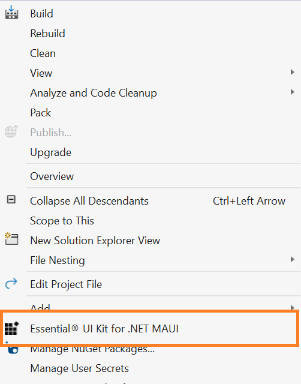
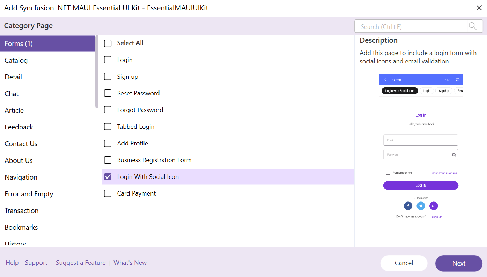
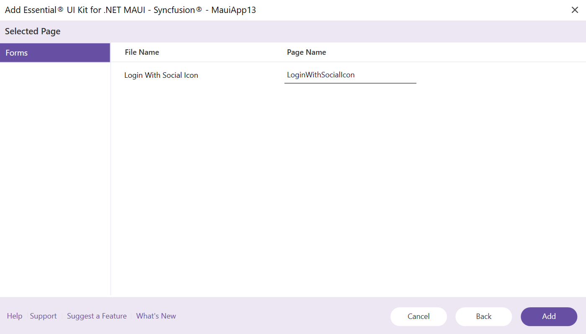
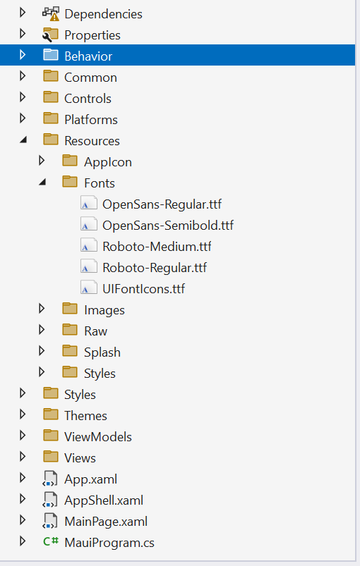
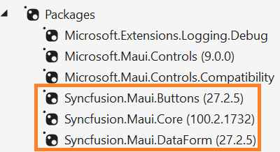
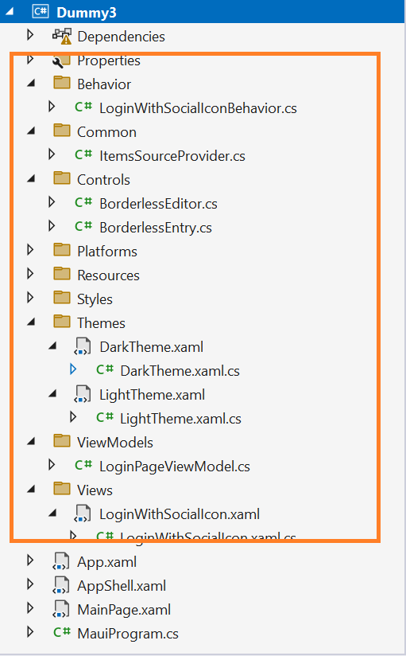

# Essential® UI Kit for .NET MAUI

Essential® UI Kit for .NET MAUI for MAUI comes with ready-to-use XAML templates, enabling you to effortlessly design user interfaces for cross-platform applications. With a clear separation of the View, View Model, and Model classes, which makes the integration of your business logic and making changes to existing views simple.

## Installation of Essential® UI Kit for .NET MAUI Extension

To get started with the Essential® UI Kit for .NET MAUI, first install the appropriate extension in Visual Studio by downloading it from the marketplace. As a result, you’ll be able to access and utilize the Syncfusion® Extension directly from the Syncfusion® menu within your project

[Visual Studio 2022]()

## Include XAML templates in MAUI apps

1.	Launch a new or existing MAUI application.

2.	Select the **Essential® UI Kit for .NET MAUI** from the **Solution Explorer** by right-clicking on your **MAUI** project

	

	N> The .NET MAUI Essential® UI Kit add-in will be shown when the project has the MAUI NuGet package as a reference and also, MAUI project should be a NET Standard project.

3.	The Category dialogue box will then appear, with its pre-defined templates.

	

4.	Now, select the required pages from any of the specified categories then click 'Next'.

5.	Now add an name for the page, then click 'Add' to add the page and The necessary class files, resources, and NuGet package references to your project.

	

6.	The selected pages will be added along with View, View Model, Model classes, resource files and Syncfusion NuGet package reference,

	

	

	

7.	Then, Syncfusion® licensing registration required message box will be shown if you installed the trial setup or NuGet packages since Syncfusion® introduced the licensing system from 2018 Volume 2 (v16.2.0.41) Essential Studio release. Navigate to the [help topic](https://help.syncfusion.com/common/essential-studio/licensing/overview#how-to-generate-syncfusion-license-key), which is shown in the licensing message box to generate and register the Syncfusion® license key to your project. Refer to this [blog](https://www.syncfusion.com/blogs/post/whats-new-in-2018-volume-2.aspx) post for understanding the licensing changes introduced in Essential Studio. 

## Run the UI template item

To set your preferred UI Template as the start page of your application, simply open the App.xaml.cs file in your MAUI project and make the following changes.

Example: If you added Login With Social Icon Page,




// For NET 8 Use this Below Code Snippet

MainPage = new LoginWithSocialIcon();

// For NET 9 Use this Below Code Snippet

protected override Window CreateWindow(IActivationState? activationState)
{
    return new Window(new LoginWithSocialIcon());
}



