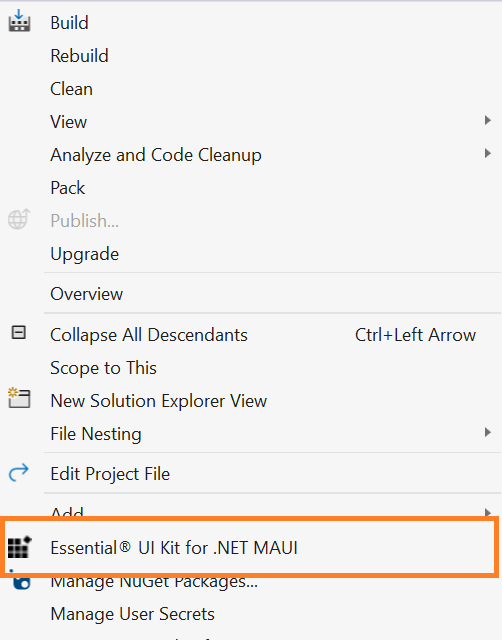
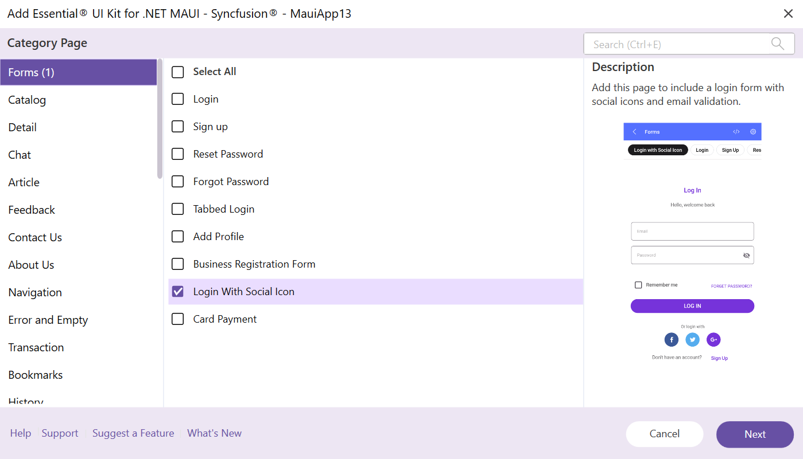
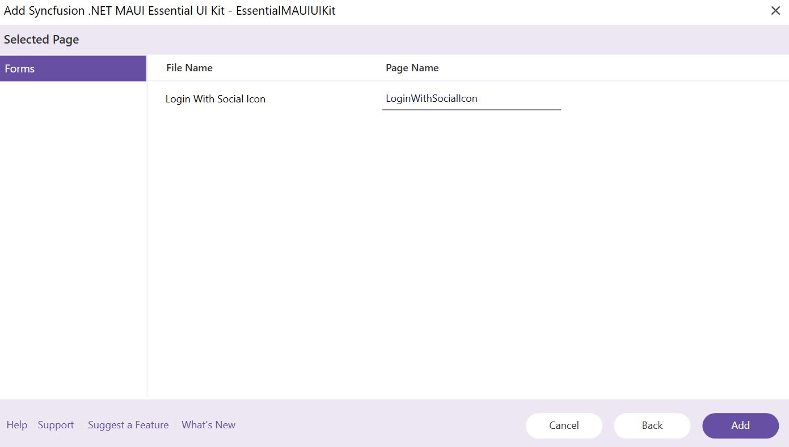
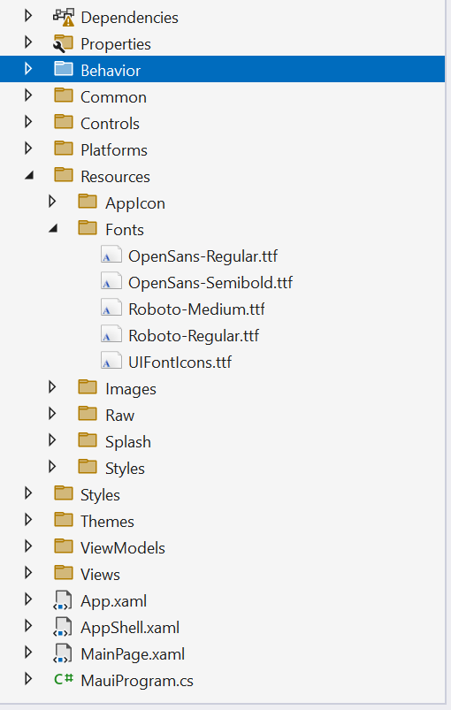
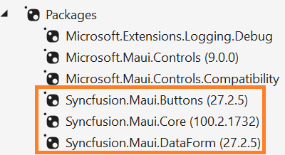
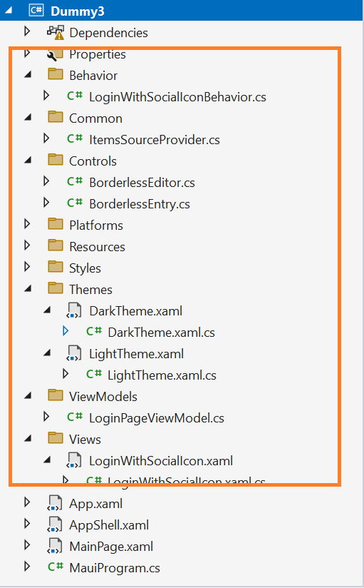

# Essential® UI Kit for .NET MAUI

Essential® UI Kit for .NET MAUI comes with ready-to-use XAML templates, enabling you to effortlessly design user interfaces for cross-platform applications. It follows a clear separation of the View, ViewModel, and Model classes, making it easy to integrate your business logic and modify existing views.

## Installation of Essential® UI Kit for .NET MAUI Extension

To get started with the Essential® UI Kit for .NET MAUI, first install the appropriate extension in Visual Studio by downloading it from the marketplace. This will allow you to access and use the Syncfusion® Extension directly from the Syncfusion® menu within your project.

[Visual Studio 2022 or later](https://marketplace.visualstudio.com/items?itemName=SyncfusionInc.MAUIVSExtension)

## Include XAML templates in MAUI apps

1.	Launch a new or existing MAUI application.

2.	Select the **Essential® UI Kit for .NET MAUI** option from the **Solution Explorer** by right-clicking on your **MAUI** project.

	

	N> The .NET MAUI Essential® UI Kit add-in will be shown in the context menu when the project has the .NET MAUI workload and references the Syncfusion .NET MAUI NuGet packages.

3.	The Category dialogue box will then appear, with its pre-defined templates.

	

4.	Now, select the required pages from any of the specified categories then click 'Next'.

5.	Now add a name for the page, then click 'Add' to add the page and the necessary class files, resources, and NuGet package references to your project.

	

6.	The selected pages will be added along with View, ViewModel, Model classes, resource files and Syncfusion® NuGet package reference.

	

	

	

7.	Then, Syncfusion® licensing registration required message box will be shown if you installed the trial setup or NuGet packages since Syncfusion® introduced the licensing system from 2018 Volume 2 (v16.2.0.41) Essential Studio® release. Navigate to the [help topic](https://help.syncfusion.com/common/essential-studio/licensing/overview#how-to-generate-syncfusion-license-key), which is shown in the licensing message box to generate and register the Syncfusion® license key to your project. Refer to this [blog](https://www.syncfusion.com/blogs/post/whats-new-in-2018-volume-2.aspx) post for understanding the licensing changes introduced in Essential Studio®. 

## Run the UI template item

To set your preferred UI template as the start page of your application, open the **App.xaml.cs** file in your .NET MAUI project and apply the following changes.

Example: If you added Login With Social Icon Page,




// For .NET 8, use the below code snippet.

MainPage = new LoginWithSocialIcon();




// For .NET 9 or later, use the below code snippet.

protected override Window CreateWindow(IActivationState? activationState)
{
    return new Window(new LoginWithSocialIcon());
}



