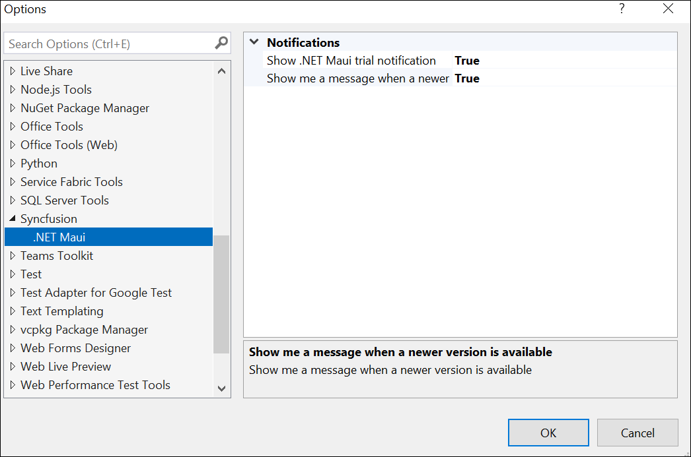
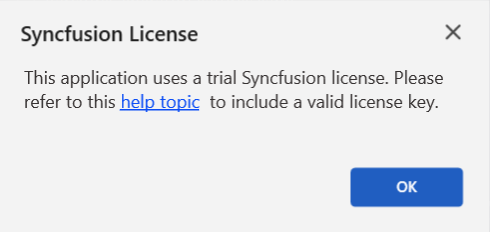
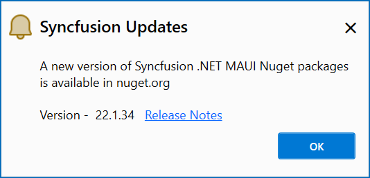
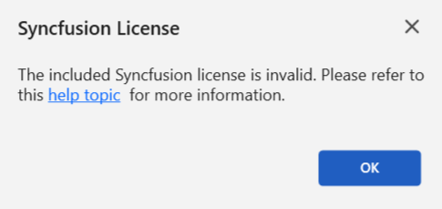

# Syncfusion Notifications

Syncfusion enhances the user experience in .NET MAUI applications through notification messages. These notifications cover various aspects, including alerts for trial applications when utilizing Syncfusion trial assemblies, updates regarding the availability of the latest Syncfusion NuGet package, and notifications regarding newer releases of Essential Studio®. By keeping users informed, Syncfusion ensures that developers stay updated with Syncfusion latest features and enhancements.

N> The Syncfusion Notification feature is available from Essential Studio® v22.1.34.

## Notification Configuration

The Syncfusion Options page allows you to configure notification settings. Customize trial and newer version notifications with a simple true or false toggle.

It can be accessed by clicking **Tools -> Options -> Syncfusion -> .NET MAUI**

   

## Notification Types

**1. Syncfusion Trial Application Notification**

When you utilize Syncfusion trial assemblies in your .NET MAUI application, you will receive a notification stating, **This application uses a trial Syncfusion license.** This notification encourages you to obtain a valid license key, enabling you to fully explore and experience the extensive features and capabilities offered by Syncfusion.

   

**2. Newer Syncfusion NuGet Package Notification**

If you have installed lower versions of Syncfusion NuGet packages in your application, you will be notified about the availability of higher versions of Syncfusion NuGet packages on nuget.org. This empowers you to easily identify opportunities to upgrade and gain access to new features, performance enhancements, and bug fixes.

   

**3. Newer Essential Studio® Build Notification**

If you use older versions of Syncfusion assemblies or NuGet packages from **Essential Studio® .NET MAUI,** Syncfusion will notify you about new releases for the latest Essential Studio® build. Updating to the newest version ensures access to recent features, enhancements, and important updates, maximizing the capabilities of Syncfusion in your .NET MAUI development projects.

   

**4. Invalid License Key Notification**

If you have mistakenly used an incorrect license key or used a license from another version or platform in your .NET MAUI application, Syncfusion will display a notification message stating, **The provided Syncfusion license key is invalid.** This message serves as a reminder to obtain a valid license key and ensure proper licensing for Syncfusion components.

   

  

