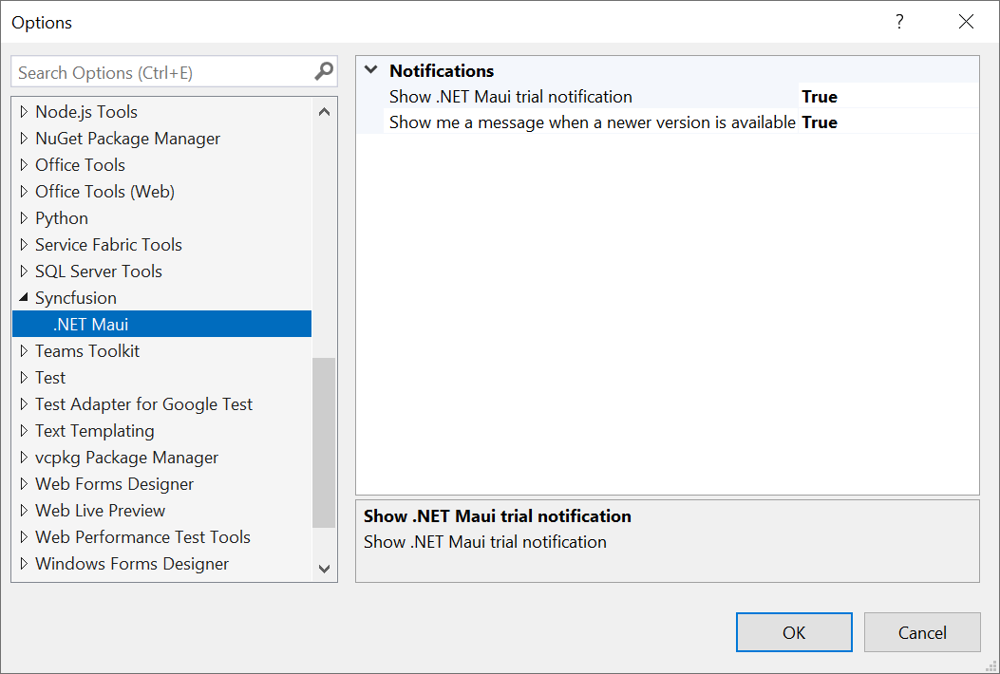
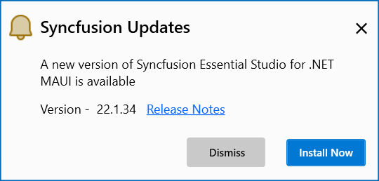

# Syncfusion® Notifications

Syncfusion® enhances the user experience in .NET MAUI applications by providing informative notifications. These include alerts for trial applications using Syncfusion® trial assemblies, updates about the latest Syncfusion® NuGet packages, and notifications about new releases of Essential Studio®. By keeping developers informed, Syncfusion® ensures they stay up to date with the latest features and enhancements.

N> The Syncfusion® Notification feature is available from Essential Studio® v22.1.34.

## Notification Configuration

The Syncfusion® Options page allows you to configure notification settings. Customize trial and newer version notifications with a simple true or false toggle.

It can be accessed by clicking **Tools -> Options -> Syncfusion® -> .NET MAUI**

   

## Notification Types

**1. Syncfusion® Trial Application Notification**

When you utilize Syncfusion® trial assemblies in your .NET MAUI application, you will receive a notification stating, **This application uses a trial Syncfusion® license.** This notification encourages you to obtain a valid license key, enabling you to fully explore and experience the extensive features and capabilities offered by Syncfusion®.

   

**2. Newer Syncfusion® NuGet Package Notification**

If your application uses older versions of Syncfusion® NuGet packages, you’ll receive notifications about newer versions available on nuget.org. This helps you easily identify upgrade opportunities and take advantage of new features, performance improvements, and bug fixes.

   

**3. Newer Essential Studio® Build Notification**

If you're using older versions of Syncfusion® assemblies or NuGet packages from Essential Studio® .NET MAUI, Syncfusion® will notify you about new releases. Updating to the latest version ensures access to the newest features, enhancements, and critical updates—maximizing the capabilities of Syncfusion® in your .NET MAUI projects.

   

**4. Invalid License Key Notification**

If you have mistakenly used an incorrect license key or used a license from another version or platform in your .NET MAUI application, Syncfusion® will display a notification message stating, **The provided Syncfusion® license key is invalid.** This message serves as a reminder to obtain a valid license key and ensure proper licensing for Syncfusion® components.

   

  

