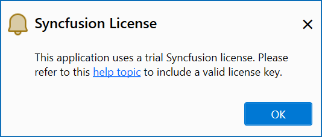
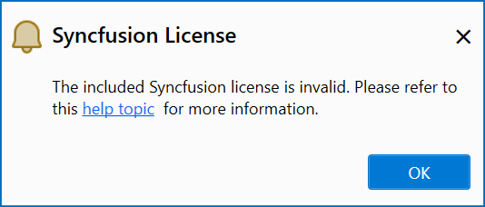

# Syncfusion® Notifications

Syncfusion® enhances the user experience in .NET MAUI applications through notification messages. These notifications cover various aspects, including alerts for trial applications when utilizing Syncfusion® trial assemblies, updates regarding the availability of the latest Syncfusion® NuGet package, and notifications regarding newer releases of Essential Studio®. By keeping users informed, Syncfusion® ensures that developers stay updated with Syncfusion® latest features and enhancements.

N> The Syncfusion® Notification feature is available from Essential Studio® v22.1.34.

## Notification configuration

The Syncfusion® Options page allows you to configure notification settings. Customize trial and newer version notifications with a simple true or false toggle.

It can be accessed by clicking **Tools -> Options -> Syncfusion® -> .NET MAUI**

   

## Notification types

**1. Syncfusion® trial application notification**

When you utilize Syncfusion® trial assemblies in your .NET MAUI application, you will receive a notification stating, **This application uses a trial Syncfusion® license.** This notification encourages you to obtain a valid license key, enabling you to fully explore and experience the extensive features and capabilities offered by Syncfusion®.

   

**2. Newer Syncfusion® NuGet package notification**

If you have installed lower versions of Syncfusion® NuGet packages in your application, you will be notified about the availability of higher versions of Syncfusion® NuGet packages on nuget.org. This empowers you to easily identify opportunities to upgrade and gain access to new features, performance enhancements, and bug fixes.

   

**3. Newer Essential Studio® build notification**

If you use older versions of Syncfusion® assemblies or NuGet packages from **Essential Studio® .NET MAUI**, Syncfusion® will notify you about new releases for the latest Essential Studio® build. Updating to the newest version ensures access to recent features, enhancements, and important updates, maximizing the capabilities of Syncfusion® in your .NET MAUI development projects.

   

**4. Invalid license key notification**

If you have mistakenly used an incorrect license key or used a license from another version or platform in your .NET MAUI application, Syncfusion® will display a notification message stating, **The provided Syncfusion® license key is invalid**. This message serves as a reminder to obtain a valid license key and ensure proper licensing for Syncfusion® components.

   

  

