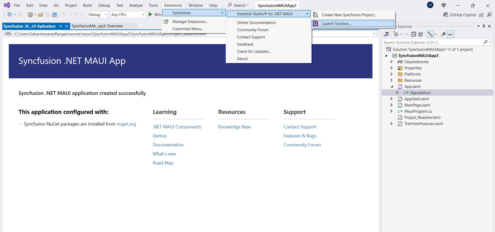
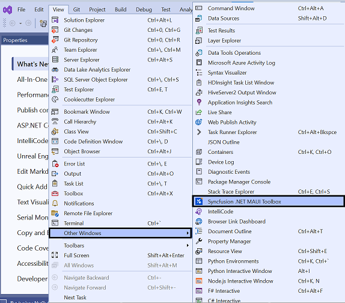
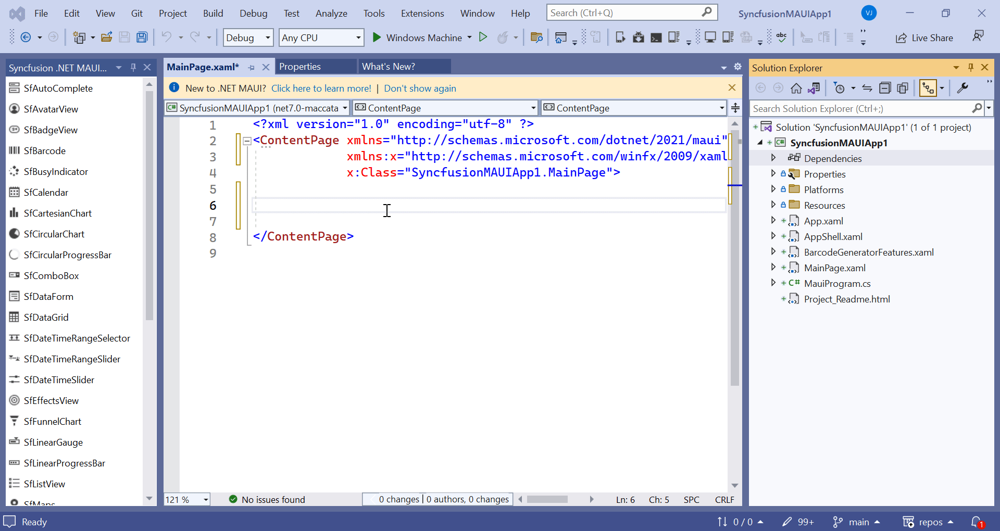

# Syncfusion Toolbox for .NET MAUI 

The Syncfusion Visual Studio Toolbox for the .NET MAUI platform is a valuable resource for developers seeking to seamlessly incorporate the Syncfusion .NET MAUI components into their applications. Designed to be compatible with Visual Studio 2022, this toolbox offers a streamlined workflow, simplifying the integration and configuration process of Syncfusion components.

I> The Syncfusion .NET MAUI Toolbox supports Visual Studio 2022 and is available from Essential Studio 2023 Volume 2(version) onwards.

> To check whether the **.NET MAUI Extensions - Syncfusion** extension is installed or not in Visual Studio Extension Manager by navigating to **Extension > Manage Extensions > Installed** for Visual Studio 2022. If this extension is not installed, follow the steps outlined in the [download and installation](download-and-installation) help topic to install the extension.

## Launching Syncfusion .NET MAUI Toolbox from the Syncfusion menu

To launch the Syncfusion .NET MAUI Toolbox from the Syncfusion menu in Visual Studio 2022, follow these steps: 
1. Open Visual Studio 2022. 
2. Go to the **Extensions** menu at the top of the Visual Studio window. 
3. Click on **Syncfusion** within the **Extensions** menu. 
4. In the Syncfusion submenu, locate and click on **Essential Studio for .NET MAUI**. 
5. From the **Essential Studio for .NET MAUI** submenu, select **Launch .NET MAUI Toolbox**.
This toolbox provides a set of tools and features to easily incorporate Syncfusion .NET MAUI components into your .NET MAUI application.

   

## Launching Syncfusion .NET MAUI Toolbox from the View menu

To launch the Syncfusion .NET MAUI Toolbox from the View menu in Visual Studio 2022, simply follow these steps:
1. Open Visual Studio 2022.
2. At the top menu, click on **View**.
3. From the drop-down menu, select **Other Windows**.
4. In the sub-menu that appears, click on **Syncfusion .NET MAUI Toolbox**.
This toolbox provides a set of tools and features to easily incorporate Syncfusion .NET MAUI components into your .NET MAUI application.

   

## Add Syncfusion .NET MAUI Toolbox Components
   
To incorporate Syncfusion .NET MAUI components into your XAML design file, you can easily add them by dragging and dropping them from the toolbox. This intuitive approach automatically inserts the component's code sample and namespace into your XAML file, while also taking care of installing necessary NuGet packages.

   

Then, Syncfusion licensing registration required message box will be shown if you installed the trial setup or NuGet packages since Syncfusion introduced the licensing system from 2018 Volume 2 (v16.2.0.41) Essential Studio release. Navigate to the [help topic](https://help.syncfusion.com/common/essential-studio/licensing/license-key#how-to-generate-syncfusion-license-key), which is shown in the licensing message box to generate and register the Syncfusion license key to your project. Refer to this [blog](https://blog.syncfusion.com/post/Whats-New-in-2018-Volume-2-Licensing-Changes-in-the-1620x-Version-of-Essential-Studio.aspx) post for understanding the licensing changes introduced in Essential Studio.