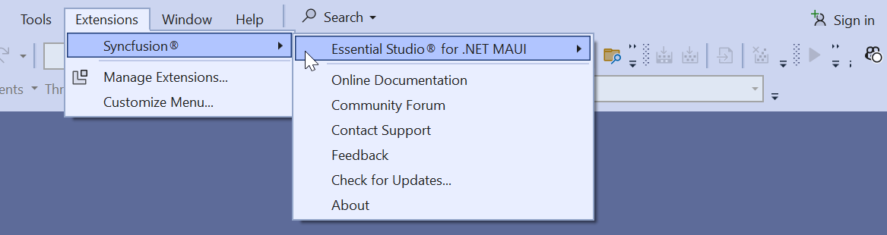

# Download and Installation

Syncfusion publishes the Visual Studio extension in the given Visual Studio marketplace link. You can either install it directly from Visual Studio or download and install it from the Visual Studio marketplace.

[Visual Studio 2022](https://marketplace.visualstudio.com/items?itemName=SyncfusionInc.MAUIVSExtension)

## Prerequisites

The following software prerequisites must be installed to install the Syncfusion .NET MAUI extension, as well as for creating, adding snippet in Syncfusion .NET MAUI applications.

* [Visual Studio 2022 17.3 or later](https://visualstudio.microsoft.com/downloads).

* [.NET Core 6.0 or later](https://dotnet.microsoft.com/download/dotnet-core).

## Install through the Visual Studio Manage Extensions

The following steps will guide you on how to install the Syncfusion .NET MAUI extensions using **Visual Studio Manage Extensions**.

1. Open Visual Studio 2022.

2. Navigate to **Extension ->Manage Extensions** and open the Manage Extensions.

3. Click on the **Online** tab located on the left and enter **"Syncfusion .NET MAUI"** into the **search box**.             

     

4. Click on the **Download** button in the **“.NET MAUI Extensions - Syncfusion”** extensions.

5. After downloading the extensions, close all running instances of Visual Studio to start the installation process. The following VSIX installation prompt will appear.

     

6. Click the **Modify** button.

7. After the installation is complete, open the Visual Studio.

8. You can utilize the Syncfusion extensions under the **Extensions** menu in Visual Studio

     

## Install from the Visual Studio Marketplace

The following steps illustrate how to download and install the Syncfusion .NET MAUI extension from the Visual Studio Marketplace.

1. Download the Syncfusion .NET MAUI Extensions from the below Visual Studio Marketplace.

   [Visual Studio 2022](https://marketplace.visualstudio.com/items?itemName=SyncfusionInc.MAUIVSExtension)

2. Close all running instances of Visual Studio if you have them.

3. To install the VSIX file that was downloaded, double-click it. You will see the VSIX installation prompts with the corresponding installed Visual Studio version checkbox for select the Visual Studio to install the extension.

     

4. Click the **Modify** button.

5. Launch Visual Studio after the installation is complete. You can utilize the Syncfusion extensions under the **Extensions** menu in Visual Studio

     