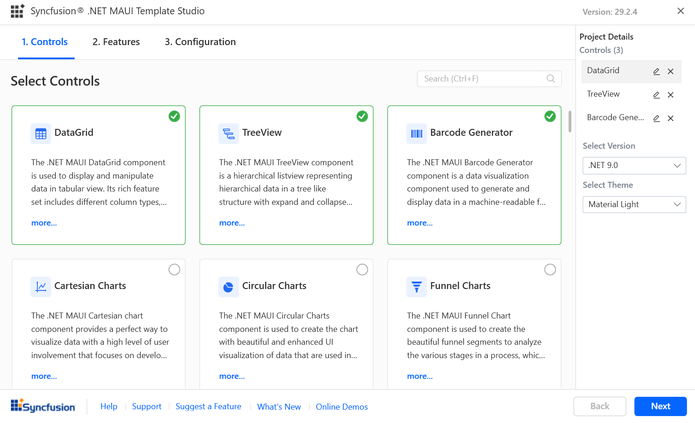

# Syncfusion .NET MAUI Template Studio

The.NET MAUI Template Studio is provided by Syncfusion and is used to build the Syncfusion .NET MAUI applications using Syncfusion components. The required Syncfusion components, NuGet references, namespace, and component render code are all used to develop the Syncfusion.NET MAUI applications. The Syncfusion .NET MAUI Template Studio providing a project wizard to simplify the process for you to create an application using Syncfusion components.

The following steps below will assist you to create your **Syncfusion .NET MAUI Application** through **Visual Studio 2022**:

N> Before use the Syncfusion .NET MAUI Project Template, check whether the Syncfusion .NET MAUI Template Studio Extension installed or not in Visual Studio Extension Manager by clicking on the Extensions -> Manage Extensions -> Installed. If this extension not installed, install the extension by follow the steps from the [download and installation](download-and-installation) help topic.

1. Open the Visual Studio 2022.

2. To develop the Syncfusion.NET MAUI application, select one of the following options:

     **Option 1**

     Choose **Extension -> Syncfusion -> Essential Studio for .NET MAUI -> Create New Syncfusion Project...** from the **Visual Studio menu**.

     

     **Option 2**

     Choose **File -> New -> Project** from the menu. This launches a new dialogue for creating a new application. Filtering the application type by **Syncfusion** or typing **Syncfusion** as a keyword in the search option can help you to find the Syncfusion templates for .NET MAUI.

     

3. Select the **Syncfusion .NET MAUI Template Studio** and click **Next**.

     

4. After launching the Syncfusion.NET MAUI Template Studio, the wizard for configuring the Syncfusion.NET MAUI application will appear. You can add the following Syncfusion .NET MAUI components to the application. Choose the required Syncfusion .NET MAUI components 

    

    Choose the required control(s) by clicking the corresponding control box.

    To unselect the added control(s), use either one of the following options:

    **Option 1:** Click the corresponding selected control box.

    **Option 2:** Click ‘x’ button for the corresponding control in the control list from **Project Details**. 

    N> **Note:** Choose at least one control to enable the Features and Configuration tab.

5. The features for the selected controls are listed when you click on the **Next** or the **Features tab**. You can choose the required features for the selected controls.

        

    By unchecking the features checkboxes, you can unselect the features from the selected controls.

6. The Configuration section will load if you choose to click the **Next** button or the **Configuration tab**. You can select the required .NET Core Version (.NET 6.0 or .NET 7.0)

     

     **Project details section**

     Under the Project Details section, you can modify the configurations and remove a control or controls from the selected controls.

     

7. Click the **Create** button to create the Syncfusion .NET MAUI application The created Syncfusion .NET MAUI application has the Syncfusion NuGet packages,and the rendering code for the selected Syncfusion components.

     

8. The Syncfusion .NET MAUI application configures with most recent Syncfusion .NET MAUI NuGet packages version, namespaces , and component render code for Syncfusion components.

9. If you installed the trial setup or NuGet packages from nuget.org you must register the Syncfusion license key to your application since Syncfusion introduced the licensing system from 2018 Volume 2 (v16.2.0.41) Essential Studio release. Navigate to the [help topic](https://help.syncfusion.com/common/essential-studio/licensing/license-key#how-to-generate-syncfusion-license-key) to generate and register the Syncfusion license key to your application. Refer to this [blog](https://blog.syncfusion.com/post/Whats-New-in-2018-Volume-2-Licensing-Changes-in-the-1620x-Version-of-Essential-Studio.aspx?_ga=2.11237684.1233358434.1587355730-230058891.1567654773) post for understanding the licensing changes introduced in Essential Studio.
